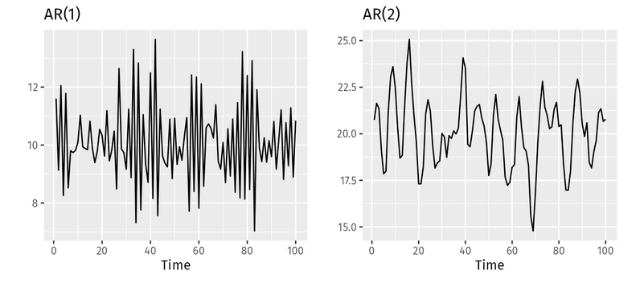

# Modelos Autorregressivos e Aplicação em World Foundation Models (WFMs)

## O que é um Modelo Autorregressivo?

Um modelo autorregressivo (AR) é um tipo de modelo estatístico que prevê valores futuros em uma sequência com base em seus próprios valores passados. O termo "autorregressivo" reflete a ideia de que o modelo "faz regressão sobre si mesmo", ou seja, as previsões são feitas a partir das observações anteriores. Nele, temos a relação:
  
- **Entrada**: Observações passadas (ex: palavras anteriores em uma frase, quadros em um vídeo).

- **Saída**: Previsão do próximo valor na sequência (ex: próxima palavra, próximo quadro).

A fórmula que descreve os modelos autoregressivos é expressa como

$$
X_t = \sum_{i=1}^{p} \phi_i X_{t-i} + \varepsilon_t
$$.

Onde:

- $ X_t $ é o valor da série temporal no tempo $ t $,
- $ \phi_i $ são os coeficientes autoregressivos,
- $ p $ é a ordem do modelo autoregressivo,
- $ X_{t-i} $ são os valores passados da série temporal
- $ \varepsilon_t $ é o erro ou ruído, considerado como uma variável aleatória com média zero e variância constante

> Comparação entre 2 modelos autoregressivos com parâmetros diferentes. A imagem mostra a flexibilidade dos modelos em tratar diferentes padrões de séries temporais.

### Exemplos de uso

Modelos autoregressivos são muito usados em áreas como processamento de linguagem natural (PLN) e séries temporais, devido à sua capacidade de capturar dependências sequenciais e temporais. Alguns exemplos de modelos autoregressivos são:

- **Séries temporais**: usados para prever dados sequenciais, como preços de ações, previsão do tempo ou tráfego de dados

- **PLN**: modelos como o GPT funcionam com abordagem autoregressiva, gerando a próxima palavra com base nas palavras anteriores, sequencialmente. A dependência entre palavras anteriores é importante para a geração de contexto e de frases coerentes.

- **Áudio e Sinais**: O modelo AR é uma base clássica na análise de sinais de áudio, como na codificação de áudio, reconhecimento de fala e processamento de sinais de música. A autocorrelação entre os dados de áudio em diferentes tempos pode ser modelada para prever sons ou identificar padrões temporais.

> Exemplo de aplicação autoregressiva para previsão da próxima palavra em um contexto. Percebe-se a sequencialidade das previsões, em que apenas uma palavra é predita de cada vez. Além disso, cada palavra depende das palavras previamente geradas, demonstrando o caráter autoregressivo dos modelos de linguagem.

## O que são World Foundation Models (WFMs)?

World Foundation Models (WFMs) são modelos de IA que simulam ou geram ambientes dinâmicos que simulam o mundo real em algum aspecto. Esses modelos são fundamentais para sistemas que possuem um impacto físico no mundo real, como robôs ou veículos autônomos. Para que essas IAs possam operar no mundo físico, elas primeiro precisam de ambientes de treinamento seguros, de forma a aprender como as condições do mundo real atuam na sua área de atuação específica antes de poderem agir de fato no mundo real. Dessa forma, WFMs proporcionam esses ambientes de treinamento, agindo como intermediário importante para o treinamento de modelos de IA com atuação no mundo físico.

Na construção de WFMs, usamos uma abordagem em duas etapas, de pré-treinamento e pós-treinamento, que equilibra a capacidade de generalização com a especialização. Na primeira fase, o modelo é exposto a uma grande variedade de dados de vídeo, absorvendo padrões do mundo real em larga escala. Isso cria uma base capaz de entender diversos contextos. Depois, refinamos esse conhecimento geral com dados específicos de uma área de atuação, como a robótica ou direção autônoma. Assim, o modelo se adapta às nuances do ambiente real de atuação, sem perder sua versatilidade.

## WFM baseado em modelo autoregressivo

WFMs que utilizam abordagens autoregressivas aplicam os mesmos princípios dos modelos de linguagem à geração de ambientes simulados. Nesta arquitetura, a simulação de mundo é gerada por meio da previsão do próximo token, onde cada frame de vídeo é convertido em uma sequência de tokens que são processados sequencialmente pelo modelo. O caráter autoregressivo vem justamente da previsão dos próximos tokens com base na sequência de frames já vista.

Esses tokens podem representar pixels, patches visuais (como no Vision Transformer), embeddings de texto, comandos ou ações. O modelo é treinado para prever o próximo token a partir de um contexto acumulado, respeitando a ordem causal dos dados: cada predição é condicionada apenas pelos valores presentes e passados de entrada, mas nunca de valores futuros.

> Frequentemente usa-se a combinação de imagens e texto para gerar as ações que a IA física realizará. A combinação de frames de imagens com inputs textuais, proporcionados pela arquitetura transformer do modelo, permite um controle mais fino das ações realizadas pelo agente no mundo real.

Essa integração multimodal (combinação de várias modalidades de dados), permite que o modelo funcione como um agente geral que observa o ambiente (por vídeo ou imagens), entende comandos (por texto) e gera sequências de ações com base nessas entradas. O modelo aprende a simular e antecipar estados do mundo, funcionando como um planejador autoregressivo que age com base em observações contínuas do ambiente.

### Arquitetura do Sistema

A arquitetura das WFMs autoregressivas segue três componentes principais:

1. **Tokenização de Vídeo**:
   - Os vídeos são inicialmente passados por um tokenizador visual, que transforma cada frame em uma sequência de tokens discretos. Esses tokens são representações compactas dos frames. Nessa arquitetura ele gera um tensor de (8x16x16).

2. **Núcleo Autoregressivo**:
   - O núcleo do modelo é um Transformer decoder, treinado para prever o próximo token com base na sequência anterior (aqui está o caráter autoregressivo). Para lidar com a estrutura tridimensional dos vídeos (tempo, altura e largura), são utilizados embeddings posicionais espaciais e temporais. Ele também pode receber informações adicionais, como instruções em linguagem natural, por meio de mecanismos de atenção cruzada.
   - **Positional Embedding:**  Modelos baseados em atenção (Transformers) não entendem ordem ou posição por padrão. Para que o modelo processe vídeos (ou qualquer dado sequencial), é essencial dizer onde e quando cada token ocorre.  
   É aqui que entram os positional embeddings, e neste caso, temos dois tipos combinados:
      - **Absolute Positional Embedding:**
         Para cada posição no vídeo, o modelo atribui um vetor fixo. Em seguida esse vetor é somado diretamente ao embedding do token de vocabulário:
         $$embedding\_vocabulário + embedding\_posicional = embedding\_final$$
      - **3D Rope:** RoPE (Rotary Positional Embedding) é um tipo de embedding que incorpora posição no vetor via rotação trigonométrica, ao invés de somar um vetor fixo. Ao aplicar a rotação trigonométrica no vetor 3D ele é consegue inferir, dimensões relativas entre tokens, direções de movimento, ritmos e padrões espacias e temporais.
   - **T5 text encoder:** O T5 Text Encoder é a parte codificadora do modelo T5 (Text-to-Text Transfer Transformer), projetado para transformar qualquer tarefa de linguagem natural em uma tarefa de texto para texto. Nesse encoder, o texto de entrada (como um prompt descritivo) é tokenizado e processado por uma pilha de camadas Transformer, gerando uma sequência de vetores contextuais densos que capturam o significado semântico de cada palavra no contexto da frase. Esses embeddings são então usados na cross-attention com os tokens do vídeo, permitindo que o modelo condicione a reconstrução ou geração de vídeo com base no conteúdo textual. O uso do T5 encoder permite que o sistema compreenda comandos em linguagem natural com profundidade semântica, guiando o processamento multimodal de forma flexível e expressiva.
   - **Cross Attention:** A cross-attention permite que os tokens do vídeo sejam guiados pelos tokens do texto, combinando as duas modalidades de forma inteligente para interpretar ou gerar vídeo com base em linguagem natural.  
   A equação usada tanto no **self-attention** quanto no **cross-attention** é:
   $$
   \text{Attention}(Q, K, V) = \text{softmax}\left(\frac{QK^T}{\sqrt{d_k}}\right) V
   $$
   - Onde:
      - $ Q $ = matriz de **queries**  
      - $ K $ = matriz de **keys**  
      - $ V $ = matriz de **values**  
      - $ d_k $ = dimensão dos vetores de chave (normalizador de escala)  
      - $ QK^T $ = produto escalar entre queries e keys  
      - $ \text{softmax} $ = transforma os pesos em probabilidades

3. **Decodificação**:
   - A geração acontece de forma sequencial, token por token, até que um novo frame seja reconstruído. Há a possibilidade dos tokens gerados serem passados por um decoder de difusão para melhorar a qualidade visual

### Vantagens da Abordagem

Entre os principais pontos positivos dessa arquitetura está sua **escalabilidade**: por herdar a estrutura dos grandes modelos de linguagem (LLMs), ela se adapta bem ao uso de grandes volumes de dados. Outro aspecto importante é a **flexibilidade**: o modelo pode lidar com diferentes tipos de entrada (texto, vídeo, imagem), gerar sequências de comprimentos variados e ser controlado de maneira precisa por prompts

### Limitações

Apesar das vantagens, há desafios inerentes à abordagem. A **geração sequencial** faz com que o processo seja naturalmente mais lento e custoso do ponto de vista computacional, principalmente em vídeos longos. Além disso, como cada passo depende do anterior, **pequenos erros tendem a se propagar** e se amplificar ao longo da sequência, o que pode comprometer a coerência do vídeo gerado. Por fim, o processo de tokenização agressiva, necessário para reduzir o custo computacional, pode introduzir **objetos inesperados** que afetam a fidelidade da simulação, motivo pelo qual, muitas vezes, é necessário aplicar um pós-processamento com modelos de difusão.