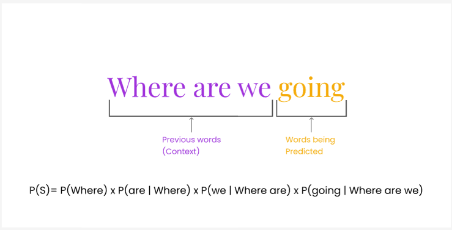

# Autoregressive models and application on World Foundation Models (WFMs)

**_Authors / Autores: [@gibi177](http://github.com/gibi177), [@DaniloCTM](http://github.com/DaniloCTM)_**

## What is an Autoregressive Model?

An autoregressive (AR) model is a type of statistical model that predicts future values in a sequence based on its own past values. The term “autoregressive” reflects the idea that the model “regresses on itself", that is, predictions are made from previous observations. In it, we have the relationship:

- **Input**: Past observations (e.g., previous words in a sentence, frames in a video).
- **Output**: Prediction of the next value in the sequence (e.g., next word, next frame).

The formula that describes autoregressive models is expressed as

$$X_t = \sum_{i=1}^{p} \phi_i X_{t-i} + \varepsilon_t$$

Where:

- $X_t$ is the value of the time series at time $t$,
- $\phi_i$ are the autoregressive coefficients,
- $p$ is the order of the autoregressive model,
- $X_{t-i}$ are the past values of the time series
- $\varepsilon_t$ is the error or noise, considered a random variable with zero mean and constant variance

_Comparison between 2 autoregressive models with different parameters. The image shows the flexibility of the models in handling different time series patterns._

### Usage examples

Autoregressive models are widely used in areas such as natural language processing (NLP) and time series due to their ability to capture sequential and temporal dependencies. Some examples of autoregressive models are:

- **Time series**: used to predict sequential data, such as stock prices, weather forecasting, or data traffic.

- **NLP**: models like GPT operate with an autoregressive approach, generating the next word based on the previous words, sequentially. Dependence among previous words is important for generating context and coherent sentences.

- **Audio and Signal**s: The AR model is a classical foundation in audio signal analysis, such as in audio coding, speech recognition, and music signal processing. Autocorrelation among audio data at different times can be modeled to predict sounds or identify temporal patterns.

_Example of an autoregressive application for next-word prediction in a context. The sequential nature of predictions is evident, where only one word is predicted at a time. Furthermore, each word depends on previously generated words, demonstrating the autoregressive nature of language models._

## WFM based on an autoregressive model

WFMs that use autoregressive approaches apply the same principles of language models to the generation of simulated environments. In this architecture, world simulation is generated by predicting the next token, where each video frame is converted into a sequence of tokens that are processed sequentially by the model. The autoregressive nature comes precisely from predicting the next tokens based on the sequence of frames already seen.

These tokens can represent pixels, visual patches (as in the Vision Transformer), text embeddings, commands, or actions. The model is trained to predict the next token from an accumulated context, respecting the causal order of the data: each prediction is conditioned only on present and past input values, but never on future values.

_The combination of images and text is often used to generate the actions that the physical AI will perform. The combination of image frames with textual inputs, enabled by the model’s transformer architecture, allows finer control over the actions performed by the agent in the real world._

This multimodal integration (combination of multiple data modalities) allows the model to function as a general agent that observes the environment (via video or images), understands commands (via text), and generates sequences of actions based on these inputs. The model learns to simulate and anticipate world states, acting as an autoregressive planner that operates based on continuous observations of the environment.

### System Architecture

The architecture of autoregressive WFMs follows three main components:

1. **Video Tokenization**:

   - Videos are initially passed through a visual tokenizer, which transforms each frame into a sequence of discrete tokens. These tokens are compact representations of the frames. In this architecture it produces a tensor of (8x16x16).

2. **Autoregressive Core**:

   - The core of the model is a Transformer decoder, trained to predict the next token based on the previous sequence (this is where the autoregressive nature lies). To handle the three-dimensional structure of videos (time, height, and width), spatial and temporal positional embeddings are used. It can also receive additional information, such as natural language instructions, through cross-attention mechanisms.

   - **Positional Embedding:** Attention-based models (Transformers) do not understand order or position by default. For the model to process videos (or any sequential data), it is essential to specify where and when each token occurs. This is where positional embeddings come in, and in this case, we have two combined types:

     - **Absolute Positional Embedding:** For each position in the video, the model assigns a fixed vector. This vector is then added directly to the vocabulary token embedding:

       - $\text{vocabulary\_embedding} + \text{positional\_embedding} = \text{final\_embedding}$

     - **3D RoPE:** RoPE (Rotary Positional Embedding) is a type of embedding that incorporates position into the vector via trigonometric rotation, rather than adding a fixed vector. By applying trigonometric rotation to the 3D vector, it is able to infer relative dimensions among tokens, directions of movement, rhythms, and spatial and temporal patterns.

   - **T5 text encoder:** The T5 Text Encoder is the encoder component of the T5 (Text-to-Text Transfer Transformer) model, designed to transform any natural language task into a text-to-text task. In this encoder, the input text (such as a descriptive prompt) is tokenized and processed by a stack of Transformer layers, generating a sequence of dense contextual vectors that capture the semantic meaning of each word in the context of the sentence. These embeddings are then used in cross-attention with the video tokens, allowing the model to condition video reconstruction or generation based on textual content. The use of the T5 encoder enables the system to understand natural language commands with semantic depth, guiding multimodal processing in a flexible and expressive way.
   - **Cross Attention:** Cross-attention allows video tokens to be guided by text tokens, combining the two modalities intelligently to interpret or generate video based on natural language. The equation used in both self-attention and cross-attention is:
     - $\text{Attention}(Q, K, V) = \text{softmax}\left(\frac{QK^T}{\sqrt{d_k}}\right) V$
     - Where:
       - $Q$ = query matrix
       - $K$ = key matrix
       - $V$ = value matrix
       - $d_k$ = dimension of the key vectors (scaling normalizer)
       - $QK^T$ = dot product between queries and keys
       - $\text{softmax}$ = transforms weights into probabilities

3. **Decoding**:

   - Generation happens sequentially, token by token, until a new frame is reconstructed. There is the possibility that the generated tokens are passed through a diffusion decoder to improve visual quality

### Advantages of the Approach

Among the main strengths of this architecture is its **scalability**: by inheriting the structure of large language models (LLMs), it adapts well to the use of large volumes of data.
Another important aspect is **flexibility**: the model can handle different types of input (text, video, image), generate sequences of varying lengths, and be controlled precisely by prompts

### Limitations

Despite the advantages, there are inherent challenges to the approach. The **sequential generation** makes the process naturally slower and more computationally expensive, especially in long videos.
In addition, since each step depends on the previous one, **small errors tend to propagate** and amplify along the sequence, which can compromise the coherence of the generated video.
Finally, the aggressive tokenization process, necessary to reduce computational cost, can introduce **unexpected objects** that affect the fidelity of the simulation, which is why it is often necessary to apply post-processing with diffusion models.

## O que é um Modelo Autorregressivo?

Um modelo autorregressivo (AR) é um tipo de modelo estatístico que prevê valores futuros em uma sequência com base em seus próprios valores passados. O termo "autorregressivo" reflete a ideia de que o modelo "faz regressão sobre si mesmo", ou seja, as previsões são feitas a partir das observações anteriores. Nele, temos a relação:

- **Entrada**: Observações passadas (ex: palavras anteriores em uma frase, quadros em um vídeo).

- **Saída**: Previsão do próximo valor na sequência (ex: próxima palavra, próximo quadro).

A fórmula que descreve os modelos autorregressivos é expressa como

$$X_t = \sum_{i=1}^{p} \phi_i X_{t-i} + \varepsilon_t$$

Onde:

- $X_t$ é o valor da série temporal no tempo $t$,
- $\phi_i$ são os coeficientes autorregressivos,
- $p$ é a ordem do modelo autorregressivo,
- $X_{t-i}$ são os valores passados da série temporal
- $\varepsilon_t$ é o erro ou ruído, considerado como uma variável aleatória com média zero e variância constante

_Comparação entre 2 modelos autorregressivos com parâmetros diferentes. A imagem mostra a flexibilidade dos modelos em tratar diferentes padrões de séries temporais._

### Exemplos de uso

Modelos autorregressivos são muito usados em áreas como processamento de linguagem natural (PLN) e séries temporais, devido à sua capacidade de capturar dependências sequenciais e temporais. Alguns exemplos de modelos autorregressivos são:

- **Séries temporais**: usados para prever dados sequenciais, como preços de ações, previsão do tempo ou tráfego de dados.

- **PLN**: modelos como o GPT funcionam com abordagem autorregressiva, gerando a próxima palavra com base nas palavras anteriores, sequencialmente. A dependência entre palavras anteriores é importante para a geração de contexto e de frases coerentes.

- **Áudio e Sinais**: O modelo AR é uma base clássica na análise de sinais de áudio, como na codificação de áudio, reconhecimento de fala e processamento de sinais de música. A autocorrelação entre os dados de áudio em diferentes tempos pode ser modelada para prever sons ou identificar padrões temporais.

_Exemplo de aplicação autoregressiva para previsão da próxima palavra em um contexto. Percebe-se a sequencialidade das previsões, em que apenas uma palavra é predita de cada vez. Além disso, cada palavra depende das palavras previamente geradas, demonstrando o caráter autorregressivo dos modelos de linguagem._

## WFM baseado em modelo autorregressivo

WFMs que utilizam abordagens autorregressivas aplicam os mesmos princípios dos modelos de linguagem à geração de ambientes simulados. Nesta arquitetura, a simulação de mundo é gerada por meio da previsão do próximo token, onde cada frame de vídeo é convertido em uma sequência de tokens que são processados sequencialmente pelo modelo. O caráter autorregressivo vem justamente da previsão dos próximos tokens com base na sequência de frames já vista.

Esses tokens podem representar pixels, patches visuais (como no Vision Transformer), embeddings de texto, comandos ou ações. O modelo é treinado para prever o próximo token a partir de um contexto acumulado, respeitando a ordem causal dos dados: cada predição é condicionada apenas pelos valores presentes e passados de entrada, mas nunca de valores futuros.

_Frequentemente usa-se a combinação de imagens e texto para gerar as ações que a IA física realizará. A combinação de frames de imagens com inputs textuais, proporcionados pela arquitetura transformer do modelo, permite um controle mais fino das ações realizadas pelo agente no mundo real._

Essa integração multimodal (combinação de várias modalidades de dados), permite que o modelo funcione como um agente geral que observa o ambiente (por vídeo ou imagens), entende comandos (por texto) e gera sequências de ações com base nessas entradas. O modelo aprende a simular e antecipar estados do mundo, funcionando como um planejador autorregressivo que age com base em observações contínuas do ambiente.

### Arquitetura do Sistema

A arquitetura das WFMs autorregressivas segue três componentes principais:

1.  **Tokenização de Vídeo**:

    - Os vídeos são inicialmente passados por um tokenizador visual, que transforma cada frame em uma sequência de tokens discretos. Esses tokens são representações compactas dos frames. Nessa arquitetura ele gera um tensor de (8x16x16).

2.  **Núcleo Autorregressivo**:

    - O núcleo do modelo é um Transformer decoder, treinado para prever o próximo token com base na sequência anterior (aqui está o caráter autorregressivo). Para lidar com a estrutura tridimensional dos vídeos (tempo, altura e largura), são utilizados embeddings posicionais espaciais e temporais. Ele também pode receber informações adicionais, como instruções em linguagem natural, por meio de mecanismos de atenção cruzada.

    - **Positional Embedding:** Modelos baseados em atenção (Transformers) não entendem ordem ou posição por padrão. Para que o modelo processe vídeos (ou qualquer dado sequencial), é essencial dizer onde e quando cada token ocorre. É aqui que entram os positional embeddings, e neste caso, temos dois tipos combinados:

      - **Absolute Positional Embedding:** Para cada posição no vídeo, o modelo atribui um vetor fixo. Em seguida esse vetor é somado diretamente ao embedding do token de vocabulário:

        - $$embedding\_vocabulário + embedding\_posicional = embedding\_final$$

      - **3D Rope:** RoPE (Rotary Positional Embedding) é um tipo de embedding que incorpora posição no vetor via rotação trigonométrica, ao invés de somar um vetor fixo. Ao aplicar a rotação trigonométrica no vetor 3D ele é consegue inferir, dimensões relativas entre tokens, direções de movimento, ritmos e padrões espacias e temporais.

    - **T5 text encoder:** O T5 Text Encoder é a parte codificadora do modelo T5 (Text-to-Text Transfer Transformer), projetado para transformar qualquer tarefa de linguagem natural em uma tarefa de texto para texto. Nesse encoder, o texto de entrada (como um prompt descritivo) é tokenizado e processado por uma pilha de camadas Transformer, gerando uma sequência de vetores contextuais densos que capturam o significado semântico de cada palavra no contexto da frase. Esses embeddings são então usados na cross-attention com os tokens do vídeo, permitindo que o modelo condicione a reconstrução ou geração de vídeo com base no conteúdo textual. O uso do T5 encoder permite que o sistema compreenda comandos em linguagem natural com profundidade semântica, guiando o processamento multimodal de forma flexível e expressiva.

    - **Cross Attention:** A cross-attention permite que os tokens do vídeo sejam guiados pelos tokens do texto, combinando as duas modalidades de forma inteligente para interpretar ou gerar vídeo com base em linguagem natural. A equação usada tanto no **self-attention** quanto no **cross-attention** é:

      - $$\text{Attention}(Q, K, V) = \text{softmax}\left(\frac{QK^T}{\sqrt{d_k}}\right) V$$

      - Onde:
        - $Q$ = matriz de **queries**
        - $K$ = matriz de **keys**
        - $V$ = matriz de **values**
        - $d_k$ = dimensão dos vetores de chave (normalizador de escala)
        - $QK^T$ = produto escalar entre queries e keys
        - $\text{softmax}$ = transforma os pesos em probabilidades

3.  **Decodificação**:

    - A geração acontece de forma sequencial, token por token, até que um novo frame seja reconstruído. Há a possibilidade dos tokens gerados serem passados por um decoder de difusão para melhorar a qualidade visual

### Vantagens da Abordagem

Entre os principais pontos positivos dessa arquitetura está sua **escalabilidade**: por herdar a estrutura dos grandes modelos de linguagem (LLMs), ela se adapta bem ao uso de grandes volumes de dados.
Outro aspecto importante é a **flexibilidade**: o modelo pode lidar com diferentes tipos de entrada (texto, vídeo, imagem), gerar sequências de comprimentos variados e ser controlado de maneira precisa por prompts

### Limitações

Apesar das vantagens, há desafios inerentes à abordagem. A **geração sequencial** faz com que o processo seja naturalmente mais lento e custoso do ponto de vista computacional, principalmente em vídeos longos.
Além disso, como cada passo depende do anterior, **pequenos erros tendem a se propagar** e se amplificar ao longo da sequência, o que pode comprometer a coerência do vídeo gerado.
Por fim, o processo de tokenização agressiva, necessário para reduzir o custo computacional, pode introduzir **objetos inesperados** que afetam a fidelidade da simulação, motivo pelo qual, muitas vezes, é necessário aplicar um pós-processamento com modelos de difusão.
