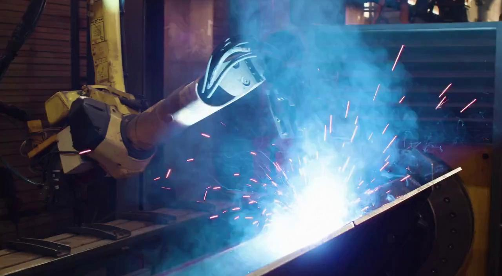

## English

**_Authors / Autores: [@gibi177](http://github.com/gibi177), [@figredos](http://github.com/figredos)_**

### Introduction

[The Cosmos paper](https://arxiv.org/html/2501.03575v1) suggests a series of possible applications of the World Foundation Models platform. Here, some of these possible applications are discussed, along with the different models available for such applications.

### Different Cosmos WFM Models

NVIDIA, through the NVIDIA Developer site [NVIDIA Developer](https://developer.nvidia.com/cosmos?hitsPerPage=6), provides a set of pre-trained models for download. They vary in function for world generation and the acceleration of Physical AI. Below are the different models and their functions.

#### Cosmos Predict-2

Our best world foundation model so far—higher fidelity, flexible frame rates and resolutions, fewer hallucinations, and better control over text, objects, and motion in the video.

Generate previews from text in under 4 seconds and up to 30 seconds of future-world video from a reference image or preview. Below is an example of using the model in `Python`:

```python
import torch
from imaginaire.utils.io import save_image_or_video
from cosmos_predict2.configs.base.config_video2world import PREDICT2_VIDEO2WORLD_PIPELINE_2B
from cosmos_predict2.pipelines.video2world import Video2WorldPipeline

# Create the video generation pipeline.

pipe = Video2WorldPipeline.from_config(
config=PREDICT2_VIDEO2WORLD_PIPELINE_2B,
dit_path="checkpoints/nvidia/Cosmos-Predict2-2B-Video2World/model-720p-16fps.pt",
text_encoder_path="checkpoints/google-t5/t5-11b",
)

# Specify the input image path and text prompt.

image_path = "assets/video2world/example_input.jpg"
prompt = """
A high-definition video captures the precision of robotic welding in an industrial setting.
The first frame showcases a robotic arm, equipped with a welding torch, positioned over a large metal structure.
The welding process is in full swing, with bright sparks and intense light illuminating the scene, creating a vivid display of blue and white hues.
A significant amount of smoke billows around the welding area, partially obscuring the view but emphasizing the heat and activity.
The background reveals parts of the workshop environment, including a ventilation system and various pieces of machinery,
indicating a busy and functional industrial workspace.
As the video progresses, the robotic arm maintains its steady position, continuing the welding process and moving to its left.
The welding torch consistently emits sparks and light, and the smoke continues to rise, diffusing slightly as it moves upward.
The metal surface beneath the torch shows ongoing signs of heating and melting. The scene retains its industrial ambiance,
with the welding sparks and smoke dominating the visual field, underscoring the ongoing nature of the welding operation.
"""

# Run the video generation pipeline.

video = pipe(input_path=image_path, prompt=prompt)

# Save the resulting output video.

save_image_or_video(video, "output/test.mp4", fps=16)
```

For more information on using the model, see the [Cosmos Predict GitHub](https://github.com/nvidia-cosmos/cosmos-predict2?tab=readme-ov-file).

This [article](https://developer.nvidia.com/blog/develop-custom-physical-ai-foundation-models-with-nvidia-cosmos-predict-2/) explains a possible usage pipeline for the model.

#### Cosmos Transfer

A family of highly performant, pre-trained world foundation models designed to generate videos aligned with input control conditions.

The Cosmos Transfer1 models are a collection of diffusion-based world foundation models capable of generating dynamic, high-quality videos from text and control video inputs. They can serve as a foundation for various applications or research related to world generation. The models are ready for commercial use.

For more information on using the model, see the [Cosmos Transfer1 GitHub](https://github.com/nvidia-cosmos/cosmos-transfer1).

#### Cosmos Reason

Physical AI models understand physical common sense and generate appropriate embodied decisions in natural language through long chain-of-thought reasoning processes.

The Cosmos-Reason1 models are tuned with physical common sense and embodied reasoning data, using supervised fine-tuning and reinforcement learning. These are Physical AI models capable of understanding space, time, and fundamental principles of physics, and can serve as planning models to reason about an embodied agent’s next steps.

For more information on using the model, see the [Cosmos Reason1 GitHub](https://github.com/nvidia-cosmos/cosmos-reason1).

#### Cosmos Tokenizers

Cosmos Tokenizer is a set of visual tokenizers for images and videos that offers different compression rates while maintaining high reconstruction quality. It serves as an efficient building block for image and video generation models based on diffusion and autoregressive approaches.

There are two types of tokenizers:

- **Continuous (C)**: Encodes visual data into continuous latent embeddings, as in latent diffusion models (e.g., Stable Diffusion). Ideal for models that generate data by sampling from continuous distributions.
- **Discrete (D)**: Encodes visual data into discrete latent codes, mapping to quantized indices, as in autoregressive transformers (e.g., VideoPoet). Essential for models that optimize cross-entropy loss, such as GPT-like models.

Each type has a variant for images (I) and videos (V):

- **Cosmos-Tokenizer-CI**: Continuous for images
- **Cosmos-Tokenizer-DI**: Discrete for images
- **Cosmos-Tokenizer-CV**: Continuous for videos
- **Cosmos-Tokenizer-DV**: Discrete for videos

Given an image or video, Cosmos Tokenizer produces continuous latent or discrete tokens. It achieves spatial compression rates of 8x8 or 16x16 and temporal factors of 4x or 8x, totalling up to a 2048x compression factor (8x16x16). This is 8x more compression than state-of-the-art methods, while maintaining superior image quality and up to 12x speed over the best tokenizers currently available.

In short, Cosmos Tokenizer combines efficiency, high compression, and quality, making it an advanced solution for generative AI applications involving images and videos.

For more information on using the model, see the [Cosmos Tokenizer GitHub](https://github.com/NVIDIA/Cosmos-Tokenizer).

#### Cosmos WFM Post-Training Samples

Cosmos Sample Models for Autonomous Driving are a family of high-performance Cosmos foundation models, post-trained specifically for autonomous driving scenarios.

These models are fine-tuned versions of the Cosmos World foundation models, capable of generating high-quality, multi-view consistent driving videos from text, image, or video inputs. They serve as versatile building blocks for various applications and research related to autonomous driving. Ready for commercial use, the models are available under the NVIDIA Open Model License Agreement.

For more information on using the model, see the [Cosmos Predict GitHub](https://github.com/nvidia-cosmos/cosmos-predict2?tab=readme-ov-file).

#### Cosmos Guardrails

A family of highly performant, pre-trained world foundation models designed to generate videos and world states with physical awareness for the development of Physical AI. Cosmos Guardrail is a content safety model composed of three components that ensure content safety:

1. Blocklist: An expert-curated keyword list used to filter edge cases and sensitive terms.

2. Video Content Safety Filter: A multi-class classifier trained to distinguish between safe and unsafe frames in generated videos, using SigLIP embeddings for high-accuracy detection of inappropriate content.

3. Face Blur Filter: A pixelation filter based on RetinaFace that identifies facial regions with high confidence and applies pixelation to any detections larger than 20x20 pixels, promoting anonymization and privacy in generated scenes.

These components work together to ensure that both text prompts and generated video content meet the content safety standards required for commercial Physical AI applications.

#### Cosmos Upsampler

Cosmos-1.0-Prompt-Upsampler-Text2World is a large language model (LLM) designed to transform original prompts into more detailed and enriched versions. It enhances prompts by adding information and maintaining a consistent descriptive structure before they are used in a text-to-world model, which typically results in higher-quality outputs. This model is ready for commercial use.

### Uses of Cosmos WFM

Below are some of the different applications of the platform.

#### Training autonomous cars

A number of companies in the transportation sector have adopted the Cosmos WFM platform for **_Autonomous Vehicles (AV)_** solutions.

- **_Waabi_**, a pioneer in generative AI for the physical world, starting with autonomous vehicles, is evaluating Cosmos in the context of data curation for AV software development and simulation.

- **_Wayve_**, a company developing AI foundation models for autonomous driving, is evaluating Cosmos as a tool to research corner-case driving scenarios used for safety and validation.

- **_Uber_**, the global ride-sharing giant, is partnering with NVIDIA to accelerate autonomous mobility. Uber’s joint driving data assets, combined with capabilities from the Cosmos platform and NVIDIA DGX Cloud, can help AV partners build stronger AI models even more efficiently.

This [article](https://developer.nvidia.com/blog/simplify-end-to-end-autonomous-vehicle-development-with-new-nvidia-cosmos-world-foundation-models/) shows a way to simplify end-to-end autonomous vehicle development with the _Cosmos WFM_ platform.

#### Synthetic dataset generation

In recent years, with advances in computer vision and deep learning models, there has been a strong demand for large volumes of data to train these networks. In this context, one of the most promising applications of Cosmos is precisely the generation of synthetic data, especially where collecting real data is costly or unfeasible. Thus, Cosmos acts as an artificial extender of existing datasets, meeting the demand for trainable data mentioned above.


_As an example, based on a short video or image showing a pedestrian crossing at a crosswalk, it is possible to simulate different weather conditions, lighting, times of day, different angles, etc. This diversity is very useful for training autonomous vehicles, for instance, as it greatly reduces the size of the real video training dataset._

In this sense, **Cosmos Predict** proves to be the most suitable model, as its purpose is data generation itself.

Additionally, an important discussion to be had is the **feasibility** of the application. For video generation, one of the simplest models is _Cosmos-Predict2-2B-Video2World_, with 2 billion parameters. Although this model is the simplest released by NVIDIA, it does not run locally on notebooks. Perhaps with a more powerful GPU it is possible to run it with limitations, but in general the computational cost is higher than a typical notebook can support. Thus, the alternative of using cloud computing arises, which also comes with associated financial costs.

| Input image                              | Output video                       |
| ---------------------------------------- | ---------------------------------- |
|  |  |

_Example of how Cosmos-Predict2-2B-Video2World can be used. With an image and text as input, a short video is generated. This strategy can be replicated for different situations and applications, such as the crosswalk example mentioned earlier._

Another relevant point is the quality of **synthetic data**. Although visually realistic, this data may still contain biases or inconsistencies that affect model training. Therefore, it is necessary to use practices for validating generated outputs and comparing them with real reference data. This verification can be done with **Cosmos-Reason**, highlighted earlier for its capability to interpret videos, or even manually, depending on the size of the synthetic dataset.

#### Other Applications

Using the same approach as the previous application—where _Cosmos-Predict2-2B-Video2World_ is used to generate videos from input images or videos combined with a text prompt—opens the door to several other similar applications. Among them, the following stand out:

- **Scene pre-visualization in films and games**: In the creative industry, the production of films, animations, and digital games goes through various stages of visual prototyping. Traditionally, this requires using 3D modeling tools, physical simulation, and rendering—processes that can be expensive and time-consuming. With Cosmos, however, it is possible to create previsualizations of entire scenes using only simple sketches and textual descriptions. For example, an artist can submit a photo of a landscape and add something like “strong wind swaying the trees at dusk.” The model then generates a short clip that shows this scene with movement, lighting, and weather, without needing to go through the modeling stage.

- **Reconstruction of historical scenes for museums**: Cultural centers can also benefit greatly from using Cosmos. With it, it becomes possible to reconstruct scenes from the past from paintings or old photographs, allowing visitors greater engagement with the content on display and expanding their understanding of the historical context.