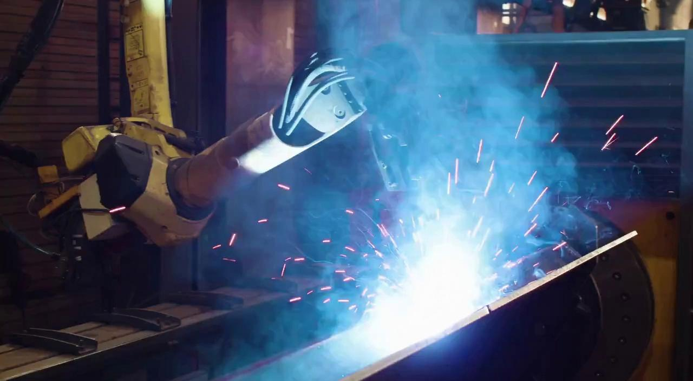

# Aplicações da plataforma Cosmos

O NVIDIA Cosmos é uma plataforma de World Foundation Models criada com o intuito de acelerar o desenvolvimento de sistemas de IA física. Ela possui 3 tipos de modelos:

1. **Cosmos Predict**, que consegue prever como um vídeo vai continuar a partir dos primeiros quadros, sendo útil para gerar dados

2. **Cosmos Transfer**, que pega vídeos de várias modalidades diferentes isoladas (como profundidade, segmentação, cor, etc) e reconstrói vídeos realistas com base nessas informações técnicas

3. **Cosmos Reason**, que entende e responde perguntas sobre vídeos, combinando texto e imagem para ajudar na interpretação de dados.

## 1. Geração de datasets sintéticos

Nos últimos anos, com o avanço dos modelos de visão computacional e deep learning, surgiu uma forte demanda por grandes volumes de dados para o treinamento dessas redes. Nesse cenário, uma das aplicações mais promissoras do Cosmos é justamente a geração de dados sintéticos, especialmente em contextos onde a coleta de dados reais é custosa, ou inviável. Assim, o Cosmos entra como um extensor artificial de datasets já existentes, suprindo a demanda por dados treináveis mencionada.


> Como exemplo, com base em um vídeo curto ou imagem mostrando um pedestre atravessando na faixa, é possível simular diferentes condições climáticas, de iluminação, de horários, com ângulos diferentes, etc. Essa diversidade vem a ser muito útil para o treinamento de veículos autônomos, por exemplo, já que reduz muito o tamanho do dataset de vídeos reais de treinamento.

Nesse sentido, o **Cosmos Predict** se mostra como o modelo mais adequado, já que seu intuito é a própria geração de dados.

Ademais, uma discussão importante a ser feita é sobre a **viabilidade** da aplicação. Para a geração de vídeos, um dos modelos mais simples é o _Cosmos-Predict2-2B-Video2World_, com 2 Bilhões de parâmetros. Esse modelo, embora seja o mais simples disponibilizado pela Nvidia, não roda localmente em notebooks. Talvez com uma GPU mais potente seja possível rodar com limitações, mas de forma geral o custo computacional é mais alto do que um notebook normal suporta. Assim, abre-se a alternativa de usar cloud computing, que também vem com custos financeiros associados.

| Input image                           | Output video                   |
| ------------------------------------- | ------------------------------ |
|  | [Output Video](src/output.mp4) |

> Exemplo de como o _Cosmos-Predict2-2B-Video2World_ pode ser usado. Com uma imagem e texto de input, gera-se um vídeo curto. Essa estratégia pode ser simulada para diferentes situações e aplicações, como por exemplo a da faixa de pedestres mencionada anteriormente.

Outro ponto relevante é a **qualidade dos dados sintéticos**. Embora visualmente realistas, esses dados ainda podem conter vieses ou inconsistências que afetam o treinamento dos modelos. Dessa forma, faz-se necessário o uso de práticas de validação dos outputs gerados e comparação com dados reais de referência. Essa verificação pode ser feita com o **Cosmos-Reason**, destacado anteriormente pela sua capacidade interpretativa de vídeos, ou mesmo manualmente, a depender do tamanho do dataset sintético.

## 2. Pré-visualização de cenas em filmes e jogos

## Modelos Disponíveis

A NVIDIA, através do site [nvidia Developer](https://developer.nvidia.com/cosmos?hitsPerPage=6), disponibiliza uma série de modelos pré-treinados para download. Eles variam em função, para geração de mundo, e aceleração de IA física. Abaixo estão listados os diferentes modelos e suas funções.

### Cosmos Predict-2

Nosso melhor modelo fundamental de mundo até agora—maior fidelidade, taxas de quadros e resoluções flexíveis, menos alucinações e melhor controle de texto, objetos e movimento no vídeo.

Gere prévias a partir de texto em menos de 4 segundos e até 30 segundos de vídeo do mundo futuro a partir de uma imagem de referência ou prévia. Abaixo é mostrada a utilização do modelo em `python`:

```python
  import torch
  from imaginaire.utils.io import save_image_or_video
  from cosmos_predict2.configs.base.config_video2world import PREDICT2_VIDEO2WORLD_PIPELINE_2B
  from cosmos_predict2.pipelines.video2world import Video2WorldPipeline

  # Create the video generation pipeline.

  pipe = Video2WorldPipeline.from_config(
  config=PREDICT2_VIDEO2WORLD_PIPELINE_2B,
  dit_path="checkpoints/nvidia/Cosmos-Predict2-2B-Video2World/model-720p-16fps.pt",
  text_encoder_path="checkpoints/google-t5/t5-11b",
  )

  # Specify the input image path and text prompt.

  image_path = "assets/video2world/example_input.jpg"
  prompt = "A high-definition video captures the precision of robotic welding in an industrial setting. The first frame showcases a robotic arm, equipped with a welding torch, positioned over a large metal structure. The welding process is in full swing, with bright sparks and intense light illuminating the scene, creating a vivid display of blue and white hues. A significant amount of smoke billows around the welding area, partially obscuring the view but emphasizing the heat and activity. The background reveals parts of the workshop environment, including a ventilation system and various pieces of machinery, indicating a busy and functional industrial workspace. As the video progresses, the robotic arm maintains its steady position, continuing the welding process and moving to its left. The welding torch consistently emits sparks and light, and the smoke continues to rise, diffusing slightly as it moves upward. The metal surface beneath the torch shows ongoing signs of heating and melting. The scene retains its industrial ambiance, with the welding sparks and smoke dominating the visual field, underscoring the ongoing nature of the welding operation."

  # Run the video generation pipeline.

  video = pipe(input_path=image_path, prompt=prompt)

  # Save the resulting output video.

  save_image_or_video(video, "output/test.mp4", fps=16)
```

Para mais informações sobre a utilização do modelo, utilizar [github do cosmos predict](https://github.com/nvidia-cosmos/cosmos-predict2?tab=readme-ov-file).

### Cosmos Transfer

Uma família de modelos fundamentais de mundo pré-treinados altamente performáticos, projetados para gerar vídeos alinhados com as condições de controle de entrada.

Os modelos Cosmos Transfer1 são uma coleção de modelos fundamentais de mundo baseados em difusão, capazes de gerar vídeos dinâmicos e de alta qualidade a partir de texto e entradas de vídeo de controle. Eles podem servir como base para diversas aplicações ou pesquisas relacionadas à geração de mundos. Os modelos estão prontos para uso comercial.

Para mais informações sobre a utilização do modelo, utilizar [github do cosmos tranfer1](https://github.com/nvidia-cosmos/cosmos-transfer1).

### Cosmos Reason

Modelos de IA Física compreendem o senso comum físico e geram decisões corporificadas apropriadas em linguagem natural por meio de longos processos de raciocínio em cadeia.

Os modelos **_Cosmos-Reason1_** são ajustados com dados de senso comum físico e raciocínio corporificado, utilizando afinação supervisionada e aprendizado por reforço. Estes são modelos de IA Física capazes de entender espaço, tempo e princípios fundamentais da física, podendo servir como modelos de planejamento para raciocinar sobre os próximos passos de um agente corporificado.

Para mais informações sobre a utilização do modelo, utilizar [github do cosmos reason1](https://github.com/nvidia-cosmos/cosmos-reason1).

### Cosmos Tokenizers

O Cosmos Tokenizer é um conjunto de tokenizadores visuais para imagens e vídeos que oferece diferentes taxas de compressão, mantendo alta qualidade de reconstrução. Ele serve como um bloco eficiente para modelos de geração de imagens e vídeos baseados em difusão e em abordagens autoregressivas.

Existem dois tipos de tokenizadores:

- **Contínuo (C)**: Codifica os dados visuais em embeddings latentes contínuos, como em modelos de difusão latente (exemplo: Stable Diffusion). Ideal para modelos que geram dados amostrando de distribuições contínuas.
- **Discreto (D)**: Codifica os dados visuais em códigos latentes discretos, mapeando para índices quantizados, como em transformadores autoregressivos (exemplo: VideoPoet). Essencial para modelos que otimizam a perda de entropia cruzada, como os modelos GPT.

Cada tipo possui variação para imagens (I) e vídeos (V):

- **Cosmos-Tokenizer-CI**: Contínuo para imagens
- **Cosmos-Tokenizer-DI**: Discreto para imagens
- **Cosmos-Tokenizer-CV**: Contínuo para vídeos
- **Cosmos-Tokenizer-DV**: Discreto para vídeos

Dado uma imagem ou vídeo, o Cosmos Tokenizer gera latentes contínuos ou tokens discretos. Ele atinge taxas espaciais de compressão de 8x8 ou 16x16 e fatores temporais de 4x ou 8x, somando até um fator total de compressão de 2048x (8x16x16). Isso é 8x mais compressão que métodos de ponta, mantendo qualidade superior de imagem e velocidade até 12x maior que os melhores tokenizadores disponíveis atualmente.

Em resumo, Cosmos Tokenizer combina eficiência, alta compressão e qualidade, sendo uma solução avançada para aplicações em inteligência artificial generativa envolvendo imagens e vídeos.

Para mais informações sobre a utilização do modelo, utilizar [github do cosmos tokenizer](https://github.com/NVIDIA/Cosmos-Tokenizer).

### Cosmos WFM Post-Training Samples

Modelos Cosmos Sample para Condução Autônoma são uma família de modelos fundamentais Cosmos de alto desempenho, pós-treinados especialmente para cenários de condução autônoma.

Esses modelos são versões ajustadas dos modelos fundamentais Cosmos World, capazes de gerar vídeos de condução de alta qualidade e consistentes em múltiplas vistas a partir de entradas de texto, imagem ou vídeo. Servem como blocos versáteis para diversas aplicações e pesquisas relacionadas à condução autônoma. Prontos para uso comercial, os modelos estão disponíveis sob o Acordo de Licença de Modelos Abertos da NVIDIA.

Para mais informações sobre a utilização do modelo, utilizar [github do cosmos predict](https://github.com/nvidia-cosmos/cosmos-predict2?tab=readme-ov-file).

### Cosmos Guardrails

Uma família de modelos fundamentais de mundo pré-treinados e altamente performáticos, projetados para gerar vídeos e estados de mundo com consciência física para o desenvolvimento de IA física.
O Cosmos Guardrail é um modelo de segurança de conteúdo composto por três componentes que garantem a segurança do conteúdo:

1. Blocklist: Uma lista de palavras-chave selecionadas por especialistas utilizada para filtrar casos extremos e termos sensíveis.
2. Video Content Safety Filter: Um classificador de múltiplas classes treinado para distinguir entre quadros seguros e inseguros em vídeos gerados, utilizando embeddings SigLIP para alta precisão na detecção de conteúdo inadequado.
3. Face Blur Filter: Um filtro de pixelização baseado no RetinaFace, que identifica com alta confiança regiões faciais e aplica pixelização em quaisquer detecções maiores que 20x20 pixels, promovendo anonimização e privacidade nas cenas geradas.

Esses componentes atuam de forma integrada para garantir que tanto os prompts de texto quanto o conteúdo de vídeo gerado atendam aos padrões de segurança de conteúdo necessários para aplicações comerciais em IA física

### Cosmos Upsampler

O Cosmos-1.0-Prompt-Upsampler-Text2World é um modelo de linguagem de grande porte (LLM) projetado para transformar prompts originais em versões mais detalhadas e enriquecidas. Ele aprimora os prompts adicionando informações e mantendo uma estrutura descritiva consistente antes que sejam utilizados em um modelo text-to-world, o que normalmente resulta em saídas de maior qualidade. Este modelo está pronto para uso comercial.
