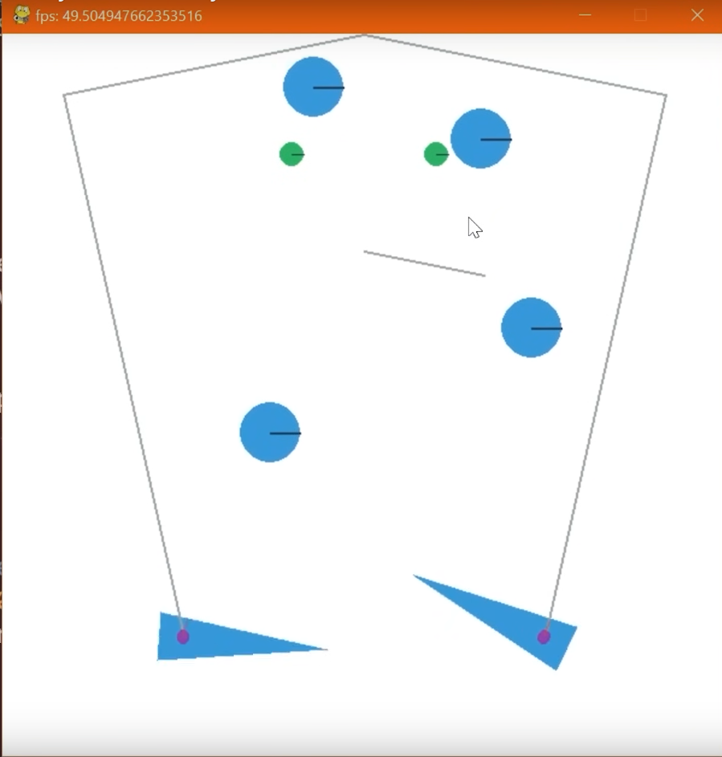
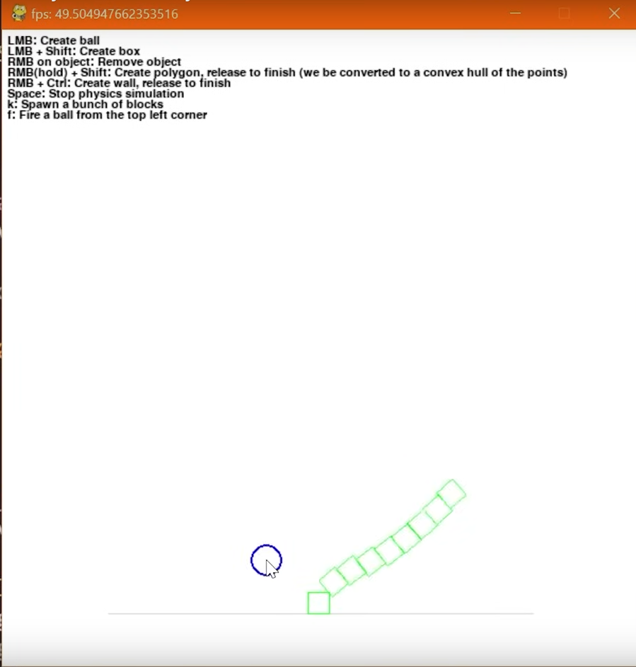
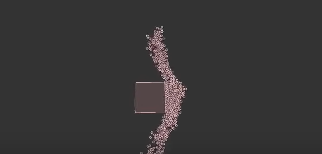
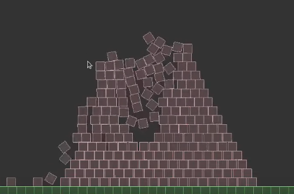

# Coleta de dados

A coleta de dados do projeto é um passo fundamental para o sucesso do mesmo. A qualidade e quantidade dos dados coletados tem impacto direto no modelo final, de forma a definir em parte sua performance. Dessa forma, sugere-se 2 abordagens principais para a coleta desses dados:

## Bibliotecas de física aliadas ao Pygame

A primeira abordagem se trata de aliar bibliotecas de física como o PyMunk ou o Box2D, que fazem todos os cálculos que permitem o realismo da simulação, com a plataforma de criação de jogos Pygame, que permite a visualização dos resultados. Assim, a engine de física se responsabiliza somente pelo cálculo dos fenômenos em si, de forma a facilitar a simulação.

Nesse sentido, a coleta dos dados pode ser feita ao criar simulações e gravar a tela do computador. Embora essa solução pareça ideal, seguem alguns cuidados:

1. A criação de simulações ainda envolve a confecção de código para criação e posicionamento dos corpos físicos presentes nela. Ou seja, para cada simulação, é necessário declarar e posicionar os objetos contidos na simulação da forma desejada, o que adiciona uma complexidade e dificuldade que não está presente na outra abordagem. Aprender as funções da biblioteca de física e implementar o código de cada simulação então se torna um dos desafios.

2. Por outro lado, outra dificuldade óbvia cabe a quantidade de código necessário, dado que para treinar o modelo seriam necessários várias simulações. Para que o modelo generalize bem, seriam necessárias várias simulações, de vários ângulos diferentes, a fim de permitir uma maior generalização do mesmo. Dessa forma, a quantidade de código necessário para coletar todos os dados ficaria, ao meu ver, impraticável.

### Exemplos das bibliotecas

1. **PyMunk**

  
  

> No exemplo da esquerda, mostra-se um jogo de pinball, em que o PyMunk calcula a gravidade e as colisões das bolas com o flipper. Já na segunda, mostra-se um ambiente dinâmico, onde é possível criar objetos que interagem entre si

2. **Box2D**

  
  

> No primeiro exemplo, mostra-se a colisão de um objeto retangular com várias bolinhas que previamente estavam juntas, e o subsequente espalhamento delas. Já no segundo, mostra-se uma pirâmide constituída de blocos, que estavam previamente organizados, mas após a intervenção do usuário, se desmontaram.

Assim, a primeira abordagem consiste em usar ferramentas de simulação física, como o PyMunk ou o Box2D para calcular os fenômenos físicos, bem como o Pygame para a visualização da simulação. Embora envolva os desafios discutidos, ainda assim é válida.

## Uso de um dataset já pronto

A segunda abordagem é a óbvia: usar um dataset pronto com vídeos de simulações físicas de interesse. A única complicação associada com essa abordagem é a de encontrar um dataset que abranja todas as situações de interesse para o treinamento do modelo, e que elas estajam organizadas de forma conveniente, nesse caso no formato de vídeo.

Dessa forma, não consegui encontrar um dataset já pronto que cumpra os requisitos para sugerir nesse documento. A falta de conhecimento em onde procurar tais datasets, somada  à inadequação dos datasets encontrados impediu a exposição e sugestão deles.

Não obstante, essa abordagem continua muito válida e, dadas as complexidades discutidas no método das bibliotecas, o uso de datasets prontos é o meio ideal de treinar o World Foundation Model.
