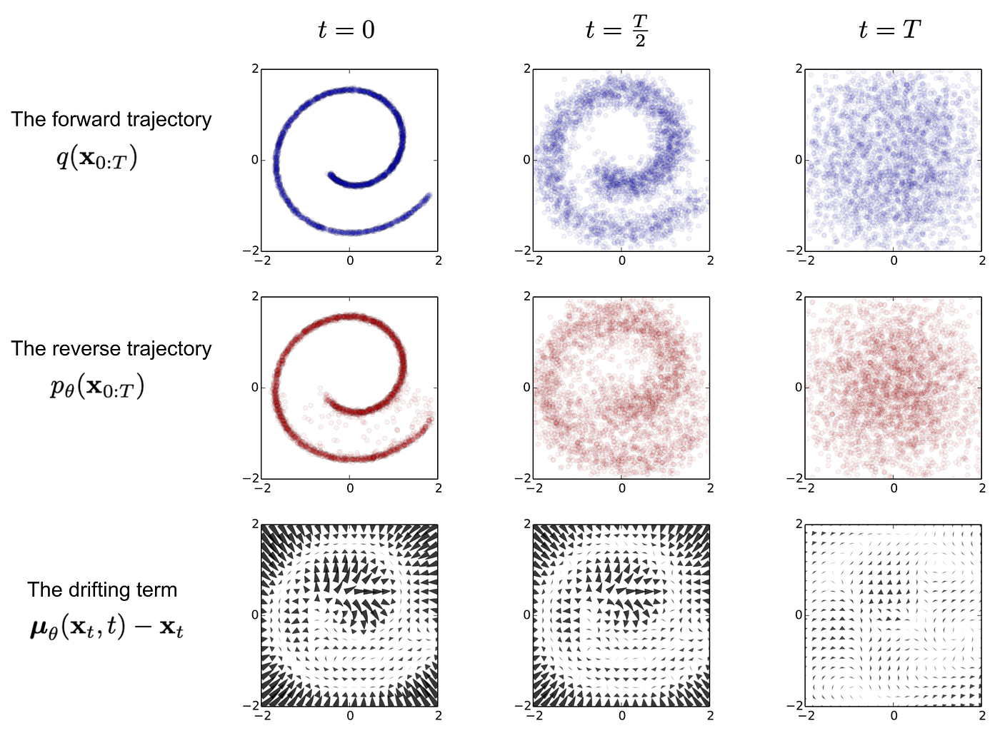

## English

In the context of World Foundation Models (WFMs), it transforms noise into a video simulation of the world.

Analogy: “Think of a diffusion model as an artist who starts with a canvas full of random noise (like old TV ‘static’) and, gradually, step by step, learns to remove that noise, revealing a coherent and meaningful image or video.”

_"Figura S1.1-F2-ENG — Removal of noises"_

### Video Tokenization: Transforming Videos into “Continuous Latents”

Just like autoregressive models, diffusion models need to process videos in a more manageable format for their operation.

- Continuous Tokens: For diffusion models, videos are transformed into continuous latent embeddings (vectors of decimal numbers). Think of them as a compact and fluid representation of the video, as opposed to the “discrete tokens” (integers) used by autoregressive models.
- Cosmos Continuous Tokenizer (Cosmos-1.0-Tokenizer-CV8x8x8): This is the component responsible for this transformation. It compresses the input video into a lower-dimensional latent representation, preserving most of the visual information. This tokenizer has an encoder-decoder architecture that operates in the wavelet space for greater compression and preservation of semantic information, along with a causal temporal design (the encoding of current frames does not depend on future frames, which is crucial for Physical AI applications).

### Formulation: The Denoising Process

The core of the diffusion model is the iterative “denoising” process.

#### Formulation Details

|                **Aspect**                 | **Description**                                                                                                                                                                                                                                                                                                                     |
| :---------------------------------------: | :---------------------------------------------------------------------------------------------------------------------------------------------------------------------------------------------------------------------------------------------------------------------------------------------------------------------------------- |
|        Noise Addition and Removal         | During training, **Gaussian (random) noise** is progressively added to a real video. The model is then trained to invert this process, learning to remove the noise at each step to reconstruct the original video from a noisy version.                                                                                            |
| Denoising Function ($\mathcal{D}_\theta$) | The diffusion model uses a neural network $\mathcal{D}_\theta$ (called the “denoiser”) trained to estimate the noise present in a corrupted sample (noisy video) and, consequently, remove it to arrive at the clean version of the video.                                                                                          |
|               Loss Function               | Training employs a **“denoising score matching”** loss function that penalizes the difference between the noise predicted by the model and the actual added noise. An u**ncertainty-based weighting technique ($\mu(\sigma)$)** is used to manage learning at different noise levels, treating it as a multi-task learning problem. |

### Model Architecture: How Denoising Is Built

The diffusion model’s $\mathcal{D}_\theta$ network is an adaptation of a Transformer architecture, optimized for visual data and control.

#### Key Architectural Components

|             **Component**             | **Description**                                                                                                                                                                                                                                                                                                                                                                                                                                                                                                                                     |
| :-----------------------------------: | :-------------------------------------------------------------------------------------------------------------------------------------------------------------------------------------------------------------------------------------------------------------------------------------------------------------------------------------------------------------------------------------------------------------------------------------------------------------------------------------------------------------------------------------------------- |
|           3D Patchification           | The input latent representations are converted into **three-dimensional “patches” (cubic chunks)**, which are then “flattened” into a one-dimensional sequence. This prepares the data to be processed efficiently by the Transformer.                                                                                                                                                                                                                                                                                                              |
|     Hybrid Positional Embeddings      | Essential for spatial and temporal understanding: - 3**D-Factored Rotary Position Embedding (RoPE)**: Helps the model understand the relative positions of tokens along temporal, height, and width dimensions, enabling the generation of videos of arbitrary sizes and durations, compatible with different frame rates (FPS). - **Absolute (Learnable) Positional Embedding**: An additional embedding used in each Transformer block that, combined with RoPE, improves performance, reduces training loss, and minimizes “morphing” artifacts. |
| Cross-Attention for Text Conditioning | Integrated layers that allow the model to generate videos based on text descriptions by incorporating **text embeddings** (generated by **T5-XXL**) into the denoising process.                                                                                                                                                                                                                                                                                                                                                                     |
|       QK-Normalization (QKNorm)       | Normalizes the query (Q) and key (K) vectors before the attention operation, which increases **training stability**, especially in the early phases, preventing attention saturation.                                                                                                                                                                                                                                                                                                                                                               |
|              AdaLN-LoRA               | An architectural optimization that **significantly reduces parameter count** (e.g., 36% for the 7B-parameter model) without compromising performance, making the model more memory- and compute-efficient.                                                                                                                                                                                                                                                                                                                                          |

### Training Strategy: How the Model Learns to “Paint”

Diffusion models are trained in multiple stages to optimize performance and generalization.

|                 **Aspect**                 | **Description**                                                                                                                                                                                                                                                                                                                     |
| :----------------------------------------: | :---------------------------------------------------------------------------------------------------------------------------------------------------------------------------------------------------------------------------------------------------------------------------------------------------------------------------------- |
|       Joint Image and Video Training       | To leverage the vast amount of image data, an **alternating optimization** strategy interleaves batches of image and video data. A **domain-specific normalization** is used to align latent distributions and encourage a Gaussian isotropic representation. The denoising loss for videos is scaled to handle slower convergence. |
|            Progressive Training            | The model is trained progressively, starting with **lower video resolutions and durations** (e.g., 512p with 57 frames) and advancing to **higher resolutions and durations** (e.g., 720p with 121 frames). A **“cooling-down” phase** with high-quality data and a decaying learning rate further refines the model.               |
|           Multi-Aspect Training            | Data are organized into buckets based on their **aspect ratios** (e.g., 1:1, 16:9) to accommodate content diversity. **Reflection padding** is used for missing pixels during batch processing.                                                                                                                                     |
|          Mixed-Precision Training          | For efficiency, model weights are kept in **BF16 and **FP32. BF16 is used for _forward_ and _backward_ passes, and FP32 for parameter updates, **ensuring numerical stability**.                                                                                                                                                    |
|             Text Conditioning              | Uses **T5-XXL** as the text encoder. **Text2World** models are capable of generating video from a text input.                                                                                                                                                                                                                       |
| Image and Video Conditioning (Video2World) | **Video2World** models extend Text2World models to accept previous frames (image or video) as a condition to generate future frames. Additional noise is introduced into the conditional frames during training to increase robustness.                                                                                             |

### Inference Optimization: Making Generation Fast

Although diffusion models are inherently slower due to their iterative denoising process, significant optimizations are applied to speed up generation.

#### Inference Optimization Techniques

|             **Technique**             | **Description**                                                                                                                                                                                                         |
| :-----------------------------------: | :---------------------------------------------------------------------------------------------------------------------------------------------------------------------------------------------------------------------- |
| FSDP (Fully Sharded Data Parallelism) | Distributes model parameters, gradients, and optimizer states across multiple devices (GPUs), resulting in **significant memory savings** and enabling the use of larger models.                                        |
|       Context Parallelism (CP)        | Splits computation and activations along the sequence dimension, distributing them across GPUs. This technique is crucial for handling **long video contexts**, where the amount of data to be processed is very large. |

### Prompt Upsampler: For User Text Inputs

- To bridge the gap between short and varied user text prompts and the detailed video descriptions used in WFM training, a “Prompt Upsampler” is developed.
- It transforms original prompts into more detailed and richer versions that align with the distribution of training prompts, improving the quality of the generated video. For Text2World models, Mistral-NeMo-12B-Instruct is used; for Video2World, Pixtral-12B is used.

### Diffusion Decoder: Improving Autoregressive Visual Quality

Although this is part of the diffusion model, it has a special post-optimization role for other models:

- For autoregressive models (which can generate blurry videos due to aggressive tokenization), a more powerful diffusion decoder is used as a “post-optimization.”
- This decoder takes the discrete tokens (output of the autoregressive model) and “translates” them back into higher-quality continuous tokens, which are then converted into high-quality RGB videos. It’s like refining a draft into a finished work of art.

### Equations

#### Denoising Loss:

$\mathcal{L}(\mathcal{D}_\theta, \sigma) = \mathbb{E}_{x_0, n} ||\mathcal{D}_\theta(x_0 + n; \sigma) - x_0||_2^2$

Where:

- $x_0$ (read “x zero”): Represents the original, clean video (the “perfect canvas”)

- $n$: Represents the random Gaussian noise that was added to video $x_0$

- $\sigma$ (sigma): Indicates the noise level at that moment. Videos with more noise will have a larger $\sigma$.

- $x_0 + n$: This is the noisy video (the “dirty canvas”) that is given as input to the model

- $\mathcal{D}_\theta$: This is the neural network “denoiser.” The $\theta$ (theta) represents all the parameters (weights) the network needs to learn during training

- $\mathcal{D}_\theta(x_0 + n;\sigma)$: This is what the model $\mathcal{D}_\theta$ predicts the original clean video ($x_0$) to be, given the noisy video ($x_0 + n$) and the noise level ($\sigma$)

- $\mathcal{D}_\theta(x_0 + n;\sigma)− x_0$: This is the difference between what the model predicted and the real, clean video ($x_0$)

- $||...||_2^2$: This means the squared L2 norm, which is a way to measure the “distance” or “error” between the model’s prediction and reality. Basically, we take the difference, square it (so negative and positive values count equally), and sum everything. We want this error to be as small as possible

- $\mathbb{E}_{x_0, n}|| ... ||$: Means the expectation (or average) over different clean videos ($x_0$) and different types of noise ($n$)

#### Total Training Loss:

$\mathcal{L}(\mathcal{D}_\theta) = \mathbb{E}_\sigma [\lambda(\sigma) \cdot \mathcal{L}(\mathcal{D}_0, \sigma) + u(\sigma)]$

Where:

- $\mathbb{E}_\sigma[ ... ]$: Means the expectation (average) over different noise levels ($\sigma$). The model is trained to handle all noise levels, from almost clean to fully noisy.

- $\lambda(\sigma)$ (lambda of sigma): A weighting function. It adjusts the importance of each noise level ($\sigma$) in the total loss so the model pays attention to all of them. Initially, it ensures that all noise levels contribute equally to learning.

- $u(\sigma)$ (u of sigma): A continuous uncertainty function. The model also learns this function. If the model is “uncertain” about how to remove noise at a certain level $\sigma$, it penalizes itself, encouraging it to reduce this uncertainty. This helps optimization across different noise levels, treating them as a multi-task learning problem

#### Weighting Function:

$\lambda(\sigma) = \frac{(\sigma^2 + \sigma_{data}^2)}{\sigma \cdot \sigma_{data}}$

Where:

- $\sigma_{data}$: The standard deviation of the training data. This equation defines how $\lambda(\sigma)$ computes the weight of each noise level, initially aiming for an equal contribution

#### Noise Level Distribution:

$\ln(\sigma) \sim \mathcal{N}(P_{mean}, P_{std}^2)$

Where:

- This describes how the noise levels ($\sigma$) are chosen during training. The natural logarithm ($\ln$) of $\sigma$ follows a normal distribution ($\mathcal{N}$), with a mean ($P_{mean}$) and a standard deviation ($P_{std}$) defined. This ensures the model sees a good variety of noise levels

### Results and Applications

Cosmos-1.0 diffusion models (7B and 14B) are capable of generating videos with high visual quality, motion dynamics, and precise alignment with text. The 14B model demonstrates an enhanced ability to capture finer visual details and more intricate motion patterns.

They are used in various Physical AI applications, such as:

- Camera Control: They enable the generation of navigable virtual worlds based on a reference image and camera trajectories, maintaining 3D and temporal coherence.

- Robotic Manipulation: They can be tuned to predict robot videos following text instructions or action sequences.

- Autonomous Driving: They are adapted to create multi-view world models for driving scenarios, generating videos from six cameras simultaneously and even following vehicle trajectories.

- Transformer-based diffusion models are often capable of incorporating multiple control signals.

- Evaluations show that diffusion-based WFMs deliver better generation quality and greater 3D consistency compared to baselines and autoregressive models under certain conditions.

### Limitations

Despite the advances, diffusion models for world simulation still face challenges common to WFMs:

- Lack of Object Permanence: Objects may disappear or appear unexpectedly.

- Inaccuracies in Contact Dynamics: Complex physical interactions, such as collisions, are still difficult to model accurately.

- Inconsistency in Following Instructions: The model does not always follow text instructions completely accurately.

- Adherence to the Laws of Physics: Gravity, light interactions, and fluid dynamics are not yet perfectly simulated.

## References

- [Cosmos World Foundation Model Platform for Physical AI arXiv:2501.03575](https://arxiv.org/abs/2501.03575)
