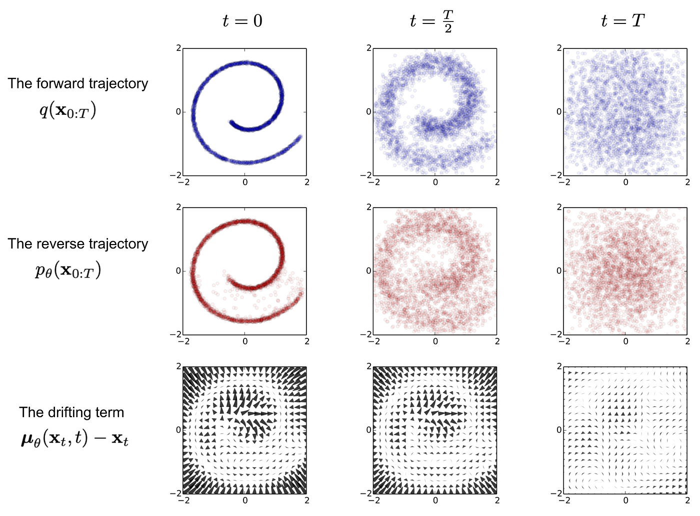
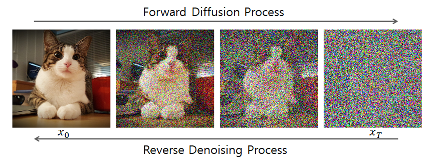

# Diffusion models in World Foundation Models (WFMs)

**_Authors / Autores: [@Nanashii76](http://github.com/Nanashii76)_**

## Português

No contexto dos World Foundation Models (WFMs), **ele transforma ruído em uma simulação de vídeo do mundo.**

Analogia: "Pense em um modelo de difusão como um artista que começa com uma tela cheia de ruído aleatório (como uma "chuva" de TV antiga) e, gradualmente, passo a passo, aprende a remover esse ruído, revelando uma imagem ou vídeo coerente e significativo."

### Tokenização de Vídeo: Transformando Vídeos em "Latentes Contínuos"

Assim como os modelos autoregressivos, os modelos de difusão precisam processar vídeos em um formato mais gerenciável para sua operação.

- Tokens Contínuos: Para modelos de difusão, os vídeos são transformados em embeddings latentes contínuos (vetores de números decimais). Pense neles como uma representação compacta e fluida do vídeo, em oposição aos "tokens discretos" (números inteiros) usados pelos modelos autoregressivos.

- Cosmos Continuous Tokenizer (Cosmos-1.0-Tokenizer-CV8x8x8): Este é o componente responsável por essa transformação. Ele comprime o vídeo de entrada em uma representação latente de menor dimensão, preservando a maior parte da informação visual. Este tokenizer possui uma arquitetura de codificador-decodificador que opera no espaço wavelet para maior compressão e preservação de informações semânticas, além de um design causal temporal (a codificação de quadros atuais não depende de quadros futuros, crucial para aplicações de IA Física).

### Formulação: O Processo de Denoising (Remoção de Ruído)

O cerne do modelo de difusão é o processo iterativo de "denoising" (remoção de ruído).

#### Detalhes da Formulação

|               **Aspecto**               | **Descrição**                                                                                                                                                                                                                                                                                                                                                          |
| :-------------------------------------: | ---------------------------------------------------------------------------------------------------------------------------------------------------------------------------------------------------------------------------------------------------------------------------------------------------------------------------------------------------------------------- |
|        Adição e Remoção de Ruído        | Durante o treinamento, **ruído gaussiano (aleatório)** é progressivamente adicionado a um vídeo real. O modelo é, então, treinado para inverter esse processo, aprendendo a remover o ruído em cada etapa para reconstruir o vídeo original a partir de uma versão ruidosa.                                                                                            |
| Função Denoising ($\mathcal{D}_\theta$) | O modelo de difusão utiliza uma rede neural $\mathcal{D}_\theta$ (chamada "denoiser") treinada para estimar o ruído presente em uma amostra corrompida (vídeo com ruído) e, consequentemente, removê-lo para chegar à versão limpa do vídeo.                                                                                                                           |
|             Função de Perda             | O treinamento emprega uma função de perda de **"denoising score matching"** que penaliza a diferença entre o ruído previsto pelo modelo e o ruído real adicionado. Uma técnica de **ponderação baseada em incerteza ($\mu(\sigma)$)** é utilizada para gerenciar o aprendizado em diferentes níveis de ruído, tratando-o como um problema de aprendizado multi-tarefa. |

### Arquitetura do Modelo: Como o Denoising é Construído

A rede $\mathcal{D}_\theta$ do modelo de difusão é uma adaptação de uma arquitetura Transformer, otimizada para dados visuais e controle.

#### Componentes Arquitetônicos Chave

|                **Componente**                 | **Descrição**                                                                                                                                                                                                                                                                                                                                                                                                                                                                                                                                                              |
| :-------------------------------------------: | -------------------------------------------------------------------------------------------------------------------------------------------------------------------------------------------------------------------------------------------------------------------------------------------------------------------------------------------------------------------------------------------------------------------------------------------------------------------------------------------------------------------------------------------------------------------------- |
|               Patchificação 3D                | As representações latentes de entrada são convertidas em **"patches" (pedaços cúbicos) tridimensionais**, que são então "achatados" em uma sequência unidimensional. Isso prepara os dados para serem processados eficientemente pelo Transformer.                                                                                                                                                                                                                                                                                                                   |
|        Embeddings Posicionais Híbridos        | Essenciais para a compreensão espacial e temporal:  • **Rotary Position Embedding (RoPE) Fatorado em 3D**: Ajuda o modelo a entender as posições relativas dos tokens nas dimensões temporal, de altura e de largura, permitindo a geração de vídeos de tamanhos e durações arbitrárias, compatível com diferentes taxas de quadros (FPS).  • **Embedding Posicional Absoluto (Aprendível)**: Um embedding adicional usado em cada bloco Transformer que, combinado com RoPE, melhora o desempenho, reduz a perda de treinamento e minimiza artefatos de "morphing". |
| Cross-Attention para Condicionamento de Texto | Camadas integradas que permitem ao modelo gerar vídeos com base em descrições de texto, incorporando informações de **embeddings de texto** (gerados pelo **T5-XXL**) no processo de denoising.                                                                                                                                                                                                                                                                                                                                                                            |
|           QK-Normalização (QKNorm)            | Normaliza os vetores de "query" (Q) e "key" (K) antes da operação de atenção, o que aumenta a **estabilidade do treinamento**, especialmente nas fases iniciais, prevenindo a saturação da atenção.                                                                                                                                                                                                                                                                                                                                                                        |
|                  AdaLN-LoRA                   | Uma otimização arquitetônica que **reduz significativamente a contagem de parâmetros** (ex: 36% para o modelo de 7B parâmetros) sem comprometer o desempenho, tornando o modelo mais eficiente em termos de memória e computação.                                                                                                                                                                                                                                                                                                                                          |

### Estratégia de Treinamento: Como o Modelo Aprende a "Pintar"

Os modelos de difusão são treinados em várias etapas para otimizar seu desempenho e generalização.

|                   **Aspecto**                   | **Descrição**                                                                                                                                                                                                                                                                                                                                                                               |
| :---------------------------------------------: | ------------------------------------------------------------------------------------------------------------------------------------------------------------------------------------------------------------------------------------------------------------------------------------------------------------------------------------------------------------------------------------------- |
|       Treinamento Conjunto Imagem e Vídeo       | Para alavancar a vasta quantidade de dados de imagens, uma estratégia de **otimização alternada** intercala lotes de dados de imagem e vídeo. É usada uma **normalização específica de domínio** para alinhar as distribuições latentes e encorajar uma representação isotrópica gaussiana. A perda de denoising para vídeos é escalonada para lidar com a convergência mais lenta.   |
|             Treinamento Progressivo             | O modelo é treinado progressivamente, iniciando com **resoluções e durações de vídeo menores** (ex: 512p com 57 quadros) e avançando para **resoluções e durações maiores** (ex: 720p com 121 quadros). Uma fase de **"resfriamento" (cooling-down)** com dados de alta qualidade e uma taxa de aprendizado decrescente refina ainda mais o modelo.                                   |
|            Treinamento Multi-Aspecto            | Os dados são organizados em "buckets" com base em suas **proporções de aspecto** (ex: 1:1, 16:9) para acomodar a diversidade de conteúdo. **Preenchimento (padding) com reflexão** é usado para pixels ausentes durante o processamento em lote.                                                                                                                                            |
|         Treinamento com Precisão Mista          | Para eficiência, os pesos do modelo são mantidos em **BF16 e FP32**. O BF16 é usado para os passes de _forward_ e _backward_, e o FP32 para as atualizações de parâmetros, garantindo **estabilidade numérica**.                                                                                                                                                                            |
|            Condicionamento de Texto             | Utiliza o **T5-XXL** como codificador de texto. Modelos **Text2World** são capazes de gerar vídeo a partir de uma entrada textual.                                                                                                                                                                                                                                                          |
| Condicionamento de Imagem e Vídeo (Video2World) | Modelos **Video2World** estendem os modelos Text2World para aceitar quadros anteriores (imagem ou vídeo) como condição para gerar quadros futuros. Ruído adicional é introduzido nos quadros condicionais durante o treinamento para aumentar a robustez.                                                                                                                                   |

### Otimização de Inferência: Tornando a Geração Rápida

Embora os modelos de difusão sejam inerentemente mais lentos devido ao seu processo iterativo de denoising, otimizações significativas são aplicadas para acelerar a geração.

#### Técnicas de Otimização de Inferência

|              **Técnica**              | **Descrição**                                                                                                                                                                                                                              |
| :-----------------------------------: | ------------------------------------------------------------------------------------------------------------------------------------------------------------------------------------------------------------------------------------------ |
| FSDP (Fully Sharded Data Parallelism) | Distribui os parâmetros do modelo, gradientes e estados do otimizador por múltiplos dispositivos (GPUs), resultando em significativa **economia de memória** e permitindo o uso de modelos maiores.                                  |
|       Context Parallelism (CP)        | Divide a computação e as ativações ao longo da dimensão da sequência, distribuindo-as entre GPUs. Esta técnica é crucial para lidar com **contextos longos de vídeo**, onde a quantidade de dados a ser processada é muito grande.   |

### Prompt Upsampler: Para Entradas de Texto do Usuário

- Para preencher a lacuna entre as prompts de texto curtas e variadas fornecidas pelos usuários e as descrições de vídeo detalhadas usadas no treinamento dos WFMs, um "Prompt Upsampler" é desenvolvido.

- Ele transforma as prompts originais em versões mais detalhadas e ricas que se alinham com a distribuição das prompts de treinamento, melhorando a qualidade do vídeo gerado. Para modelos Text2World, o Mistral-NeMo-12B-Instruct é usado para isso; para Video2World, o Pixtral-12B é utilizado.

### Decodificador de Difusão: Melhorando a Qualidade Visual do Autoregressivo

Embora este seja uma parte do modelo de difusão, ele tem um papel especial de pós-otimização para outros modelos:

- Para os modelos autoregressivos (que podem gerar vídeos borrados devido à tokenização agressiva), um decodificador de difusão mais poderoso é usado como uma "pós-otimização".

- Este decodificador pega os tokens discretos (saída do modelo autoregressivo) e os "traduz" de volta para tokens contínuos de maior qualidade, que são então convertidos em vídeos RGB de alta qualidade. É como refinar um rascunho em uma obra de arte acabada.

### Equações

#### Perda do Denoising:

$$\mathcal{L}(\mathcal{D}_\theta, \sigma) = \mathbb{E}_{x_0, n} ||\mathcal{D}_\theta(x_0 + n; \sigma) - x_0||_2^2$$

Onde:

- $x_0$ (lê-se "x zero"): Representa o vídeo original, limpo (a "tela perfeita")

- $n$: Representa o ruído gaussiano aleatório que foi adicionado ao vídeo x_0

- $\sigma$ (sigma): Indica o nível de ruído naquele momento. Vídeos com mais ruído terão um \sigma maior.

- $x_0 + n$: É o vídeo com ruído (a "tela suja") que é dado como entrada para o nosso modelo

- $\mathcal{D}_\theta$: É a nossa rede neural "denoiser". O \theta (theta) representa todos os parâmetros (pesos) que a rede precisa aprender durante o treinamento

- $\mathcal{D}_\theta(x_0 + n;\sigma)$: É o que o modelo $\mathcal{D}_\theta$ prevê que seja o vídeo original limpo ($x_0$), dado o vídeo ruidoso ($x_0 + n$) e o nível de ruído ($\sigma$)

- $\mathcal{D}_\theta(x_0 + n;\sigma)− x_0$: Esta é a diferença entre o que o modelo previu e o vídeo real e limpo ($x_0$)

- $||...||_2^2$: Isso significa o quadrado da norma L2, que é uma forma de medir a "distância" ou o "erro" entre a previsão do modelo e a realidade. Basicamente, estamos pegando a diferença, elevando ao quadrado (para que valores negativos e positivos contem igualmente) e somando tudo. Queremos que esse erro seja o menor possível

- $\mathbb{E}_{x_0, n}|| ... ||$: Significa a esperança (ou média) sobre diferentes vídeos limpos ($x_0$) e diferentes tipos de ruído (n)

#### Perda total de Treinamento:

$$\mathcal{L}(\mathcal{D}_\theta) = \mathbb{E}_\sigma [\lambda(\sigma) \cdot \mathcal{L}(\mathcal{D}_0, \sigma) + u(\sigma)]$$

Onde:

- $\mathbb{E}_\sigma[ ... ]$: Significa a esperança (média) sobre diferentes níveis de ruído ($\sigma$). O modelo é treinado para lidar com todos os níveis de ruído, do quase limpo ao totalmente ruidoso.

- $\lambda(\sigma)$ (lambda de sigma): É uma função de ponderação. Ela ajusta a importância de cada nível de ruído ($\sigma$) na perda total, para que o modelo preste atenção a todos eles. Inicialmente, ela garante que todos os níveis de ruído contribuam igualmente para o aprendizado.

- $u(\sigma)$ (u de sigma): É uma função de incerteza contínua. O modelo também aprende essa função. Se o modelo está "incerto" sobre como remover o ruído em um certo nível $\sigma$, ele se penaliza, incentivando-o a reduzir essa incerteza. Isso ajuda a otimização em diferentes níveis de ruído, tratando-os como um problema de aprendizado multi-tarefa

#### Função de Ponderação:

$$\lambda(\sigma) = \frac{(\sigma^2 + \sigma_{data}^2)}{\sigma \cdot \sigma_{data}}$$

Onde:

- $\sigma_{data}$: É o desvio padrão dos dados de treinamento. Essa equação define como o $\lambda(\sigma)$ calcula o peso de cada nível de ruído, inicialmente visando uma contribuição igualitária

#### Distribuição do Nível de Ruído:

$$ln(\sigma) ~ N (P_{mean}, P_{std}^2)$$

Onde:

- Isso descreve como os níveis de ruído ($\sigma$) são escolhidos durante o treinamento. O logaritmo natural ($ln$) de $\sigma$ segue uma distribuição normal ($N$), com uma média ($P_{mean}$) e um desvio padrão ($P_{std}$) definidos. Isso garante que o modelo veja uma boa variedade de níveis de ruído

### Resultados e Aplicações

Os modelos de difusão Cosmos-1.0 (7B e 14B) são capazes de gerar vídeos com alta qualidade visual, dinâmicas de movimento e alinhamento preciso com o texto. O modelo de 14B demonstra uma capacidade aprimorada de capturar detalhes visuais mais finos e padrões de movimento mais intrincados.

Eles são utilizados em diversas aplicações de IA Física, como:

- Controle de Câmera: Permitem gerar mundos virtuais navegáveis com base em uma imagem de referência e trajetórias de câmera, mantendo a coerência 3D e temporal.

- Manipulação Robótica: Podem ser ajustados para prever vídeos de robôs seguindo instruções de texto ou sequências de ações.

- Condução Autônoma: São adaptados para criar modelos de mundo multi-visão para cenários de condução, gerando vídeos de seis câmeras simultaneamente e até seguindo trajetórias de veículos.

- Modelos de difusão baseados em Transformer são frequentemente capazes de incorporar diversos sinais de controle.

- As avaliações mostram que os WFMs baseados em difusão entregam melhor qualidade de geração e maior consistência 3D em comparação com as linhas de base e os modelos autoregressivos em certas condições.

### Limitações

Apesar dos avanços, os modelos de difusão para simulação do mundo ainda enfrentam desafios comuns aos WFMs:

- Falta de Permanência de Objetos: Objetos podem desaparecer ou aparecer inesperadamente.

- Imprecisões em Dinâmicas com Contato: Interações físicas complexas, como colisões, ainda são difíceis de modelar com precisão.

- Inconsistência no Seguimento de Instruções: O modelo nem sempre segue as instruções de texto de forma totalmente precisa.

- Aderência às Leis da Física: A gravidade, interações de luz e dinâmicas de fluidos ainda não são perfeitamente simuladas.

## English

In the context of World Foundation Models (WFMs), it transforms noise into a video simulation of the world.

Analogy: “Think of a diffusion model as an artist who starts with a canvas full of random noise (like old TV ‘static’) and, gradually, step by step, learns to remove that noise, revealing a coherent and meaningful image or video.”

### Video Tokenization: Transforming Videos into “Continuous Latents”

Just like autoregressive models, diffusion models need to process videos in a more manageable format for their operation.

- Continuous Tokens: For diffusion models, videos are transformed into continuous latent embeddings (vectors of decimal numbers). Think of them as a compact and fluid representation of the video, as opposed to the “discrete tokens” (integers) used by autoregressive models.
- Cosmos Continuous Tokenizer (Cosmos-1.0-Tokenizer-CV8x8x8): This is the component responsible for this transformation. It compresses the input video into a lower-dimensional latent representation, preserving most of the visual information. This tokenizer has an encoder-decoder architecture that operates in the wavelet space for greater compression and preservation of semantic information, along with a causal temporal design (the encoding of current frames does not depend on future frames, which is crucial for Physical AI applications).

### Formulation: The Denoising Process

The core of the diffusion model is the iterative “denoising” process.

#### Formulation Details

|                **Aspect**                 | **Description**                                                                                                                                                                                                                                                                                                                     |
| :---------------------------------------: | :---------------------------------------------------------------------------------------------------------------------------------------------------------------------------------------------------------------------------------------------------------------------------------------------------------------------------------- |
|        Noise Addition and Removal         | During training, **Gaussian (random) noise** is progressively added to a real video. The model is then trained to invert this process, learning to remove the noise at each step to reconstruct the original video from a noisy version.                                                                                            |
| Denoising Function ($\mathcal{D}_\theta$) | The diffusion model uses a neural network $\mathcal{D}_\theta$ (called the “denoiser”) trained to estimate the noise present in a corrupted sample (noisy video) and, consequently, remove it to arrive at the clean version of the video.                                                                                          |
|               Loss Function               | Training employs a **“denoising score matching”** loss function that penalizes the difference between the noise predicted by the model and the actual added noise. An u**ncertainty-based weighting technique ($\mu(\sigma)$)** is used to manage learning at different noise levels, treating it as a multi-task learning problem. |

### Model Architecture: How Denoising Is Built

The diffusion model’s $\mathcal{D}_\theta$ network is an adaptation of a Transformer architecture, optimized for visual data and control.

#### Key Architectural Components

|             **Component**             | **Description**                                                                                                                                                                                                                                                                                                                                                                                                                                                                                                                                     |
| :-----------------------------------: | :-------------------------------------------------------------------------------------------------------------------------------------------------------------------------------------------------------------------------------------------------------------------------------------------------------------------------------------------------------------------------------------------------------------------------------------------------------------------------------------------------------------------------------------------------- |
|           3D Patchification           | The input latent representations are converted into **three-dimensional “patches” (cubic chunks)**, which are then “flattened” into a one-dimensional sequence. This prepares the data to be processed efficiently by the Transformer.                                                                                                                                                                                                                                                                                                              |
|     Hybrid Positional Embeddings      | Essential for spatial and temporal understanding: - 3**D-Factored Rotary Position Embedding (RoPE)**: Helps the model understand the relative positions of tokens along temporal, height, and width dimensions, enabling the generation of videos of arbitrary sizes and durations, compatible with different frame rates (FPS). - **Absolute (Learnable) Positional Embedding**: An additional embedding used in each Transformer block that, combined with RoPE, improves performance, reduces training loss, and minimizes “morphing” artifacts. |
| Cross-Attention for Text Conditioning | Integrated layers that allow the model to generate videos based on text descriptions by incorporating **text embeddings** (generated by **T5-XXL**) into the denoising process.                                                                                                                                                                                                                                                                                                                                                                     |
|       QK-Normalization (QKNorm)       | Normalizes the query (Q) and key (K) vectors before the attention operation, which increases **training stability**, especially in the early phases, preventing attention saturation.                                                                                                                                                                                                                                                                                                                                                               |
|              AdaLN-LoRA               | An architectural optimization that **significantly reduces parameter count** (e.g., 36% for the 7B-parameter model) without compromising performance, making the model more memory- and compute-efficient.                                                                                                                                                                                                                                                                                                                                          |

### Training Strategy: How the Model Learns to “Paint”

Diffusion models are trained in multiple stages to optimize performance and generalization.

|                 **Aspect**                 | **Description**                                                                                                                                                                                                                                                                                                                     |
| :----------------------------------------: | :---------------------------------------------------------------------------------------------------------------------------------------------------------------------------------------------------------------------------------------------------------------------------------------------------------------------------------- |
|       Joint Image and Video Training       | To leverage the vast amount of image data, an **alternating optimization** strategy interleaves batches of image and video data. A **domain-specific normalization** is used to align latent distributions and encourage a Gaussian isotropic representation. The denoising loss for videos is scaled to handle slower convergence. |
|            Progressive Training            | The model is trained progressively, starting with **lower video resolutions and durations** (e.g., 512p with 57 frames) and advancing to **higher resolutions and durations** (e.g., 720p with 121 frames). A **“cooling-down” phase** with high-quality data and a decaying learning rate further refines the model.               |
|           Multi-Aspect Training            | Data are organized into buckets based on their **aspect ratios** (e.g., 1:1, 16:9) to accommodate content diversity. **Reflection padding** is used for missing pixels during batch processing.                                                                                                                                     |
|          Mixed-Precision Training          | For efficiency, model weights are kept in **BF16 and **FP32. BF16 is used for _forward_ and _backward_ passes, and FP32 for parameter updates, **ensuring numerical stability**.                                                                                                                                                    |
|             Text Conditioning              | Uses **T5-XXL** as the text encoder. **Text2World** models are capable of generating video from a text input.                                                                                                                                                                                                                       |
| Image and Video Conditioning (Video2World) | **Video2World** models extend Text2World models to accept previous frames (image or video) as a condition to generate future frames. Additional noise is introduced into the conditional frames during training to increase robustness.                                                                                             |

### Inference Optimization: Making Generation Fast

Although diffusion models are inherently slower due to their iterative denoising process, significant optimizations are applied to speed up generation.

#### Inference Optimization Techniques

|             **Technique**             | **Description**                                                                                                                                                                                                         |
| :-----------------------------------: | :---------------------------------------------------------------------------------------------------------------------------------------------------------------------------------------------------------------------- |
| FSDP (Fully Sharded Data Parallelism) | Distributes model parameters, gradients, and optimizer states across multiple devices (GPUs), resulting in **significant memory savings** and enabling the use of larger models.                                        |
|       Context Parallelism (CP)        | Splits computation and activations along the sequence dimension, distributing them across GPUs. This technique is crucial for handling **long video contexts**, where the amount of data to be processed is very large. |

### Prompt Upsampler: For User Text Inputs

- To bridge the gap between short and varied user text prompts and the detailed video descriptions used in WFM training, a “Prompt Upsampler” is developed.
- It transforms original prompts into more detailed and richer versions that align with the distribution of training prompts, improving the quality of the generated video. For Text2World models, Mistral-NeMo-12B-Instruct is used; for Video2World, Pixtral-12B is used.

### Diffusion Decoder: Improving Autoregressive Visual Quality

Although this is part of the diffusion model, it has a special post-optimization role for other models:

- For autoregressive models (which can generate blurry videos due to aggressive tokenization), a more powerful diffusion decoder is used as a “post-optimization.”
- This decoder takes the discrete tokens (output of the autoregressive model) and “translates” them back into higher-quality continuous tokens, which are then converted into high-quality RGB videos. It’s like refining a draft into a finished work of art.

### Equations

#### Denoising Loss:

$\mathcal{L}(\mathcal{D}_\theta, \sigma) = \mathbb{E}_{x_0, n} ||\mathcal{D}_\theta(x_0 + n; \sigma) - x_0||_2^2$

Where:

- $x_0$ (read “x zero”): Represents the original, clean video (the “perfect canvas”)

- $n$: Represents the random Gaussian noise that was added to video $x_0$

- $\sigma$ (sigma): Indicates the noise level at that moment. Videos with more noise will have a larger $\sigma$.

- $x_0 + n$: This is the noisy video (the “dirty canvas”) that is given as input to the model

- $\mathcal{D}_\theta$: This is the neural network “denoiser.” The $\theta$ (theta) represents all the parameters (weights) the network needs to learn during training

- $\mathcal{D}_\theta(x_0 + n;\sigma)$: This is what the model $\mathcal{D}_\theta$ predicts the original clean video ($x_0$) to be, given the noisy video ($x_0 + n$) and the noise level ($\sigma$)

- $\mathcal{D}_\theta(x_0 + n;\sigma)− x_0$: This is the difference between what the model predicted and the real, clean video ($x_0$)

- $||...||_2^2$: This means the squared L2 norm, which is a way to measure the “distance” or “error” between the model’s prediction and reality. Basically, we take the difference, square it (so negative and positive values count equally), and sum everything. We want this error to be as small as possible

- $\mathbb{E}_{x_0, n}|| ... ||$: Means the expectation (or average) over different clean videos ($x_0$) and different types of noise ($n$)

#### Total Training Loss:

$\mathcal{L}(\mathcal{D}_\theta) = \mathbb{E}_\sigma [\lambda(\sigma) \cdot \mathcal{L}(\mathcal{D}_0, \sigma) + u(\sigma)]$

Where:

- $\mathbb{E}_\sigma[ ... ]$: Means the expectation (average) over different noise levels ($\sigma$). The model is trained to handle all noise levels, from almost clean to fully noisy.

- $\lambda(\sigma)$ (lambda of sigma): A weighting function. It adjusts the importance of each noise level ($\sigma$) in the total loss so the model pays attention to all of them. Initially, it ensures that all noise levels contribute equally to learning.

- $u(\sigma)$ (u of sigma): A continuous uncertainty function. The model also learns this function. If the model is “uncertain” about how to remove noise at a certain level $\sigma$, it penalizes itself, encouraging it to reduce this uncertainty. This helps optimization across different noise levels, treating them as a multi-task learning problem

#### Weighting Function:

$\lambda(\sigma) = \frac{(\sigma^2 + \sigma_{data}^2)}{\sigma \cdot \sigma_{data}}$

Where:

- $\sigma_{data}$: The standard deviation of the training data. This equation defines how $\lambda(\sigma)$ computes the weight of each noise level, initially aiming for an equal contribution

#### Noise Level Distribution:

$\ln(\sigma) \sim \mathcal{N}(P_{mean}, P_{std}^2)$

Where:

- This describes how the noise levels ($\sigma$) are chosen during training. The natural logarithm ($\ln$) of $\sigma$ follows a normal distribution ($\mathcal{N}$), with a mean ($P_{mean}$) and a standard deviation ($P_{std}$) defined. This ensures the model sees a good variety of noise levels

### Results and Applications

Cosmos-1.0 diffusion models (7B and 14B) are capable of generating videos with high visual quality, motion dynamics, and precise alignment with text. The 14B model demonstrates an enhanced ability to capture finer visual details and more intricate motion patterns.

They are used in various Physical AI applications, such as:

- Camera Control: They enable the generation of navigable virtual worlds based on a reference image and camera trajectories, maintaining 3D and temporal coherence.

- Robotic Manipulation: They can be tuned to predict robot videos following text instructions or action sequences.

- Autonomous Driving: They are adapted to create multi-view world models for driving scenarios, generating videos from six cameras simultaneously and even following vehicle trajectories.

- Transformer-based diffusion models are often capable of incorporating multiple control signals.

- Evaluations show that diffusion-based WFMs deliver better generation quality and greater 3D consistency compared to baselines and autoregressive models under certain conditions.

### Limitations

Despite the advances, diffusion models for world simulation still face challenges common to WFMs:

- Lack of Object Permanence: Objects may disappear or appear unexpectedly.

- Inaccuracies in Contact Dynamics: Complex physical interactions, such as collisions, are still difficult to model accurately.

- Inconsistency in Following Instructions: The model does not always follow text instructions completely accurately.

- Adherence to the Laws of Physics: Gravity, light interactions, and fluid dynamics are not yet perfectly simulated.

## Referências | References

- [Cosmos World Foundation Model Platform for Physical AI arXiv:2501.03575](https://arxiv.org/abs/2501.03575)
