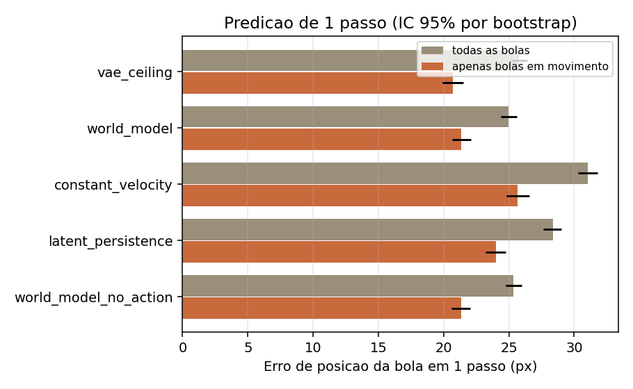
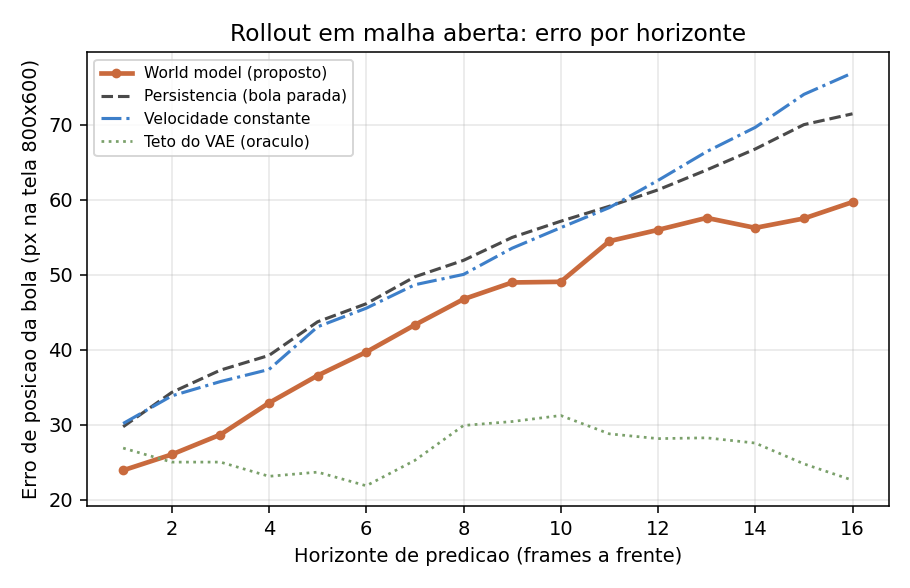
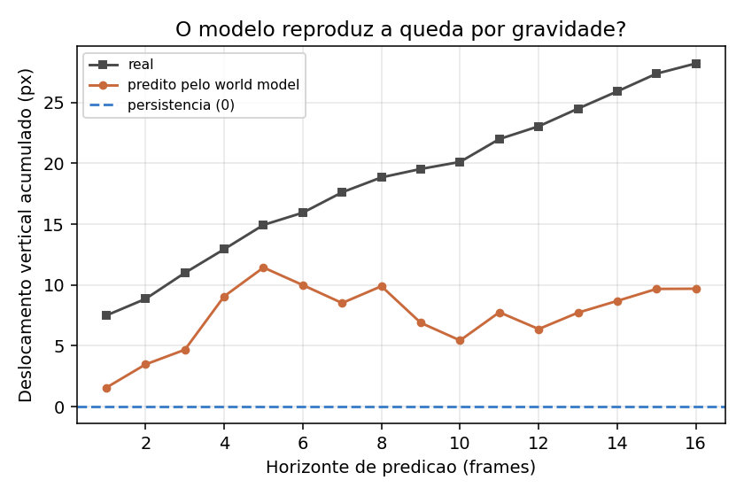
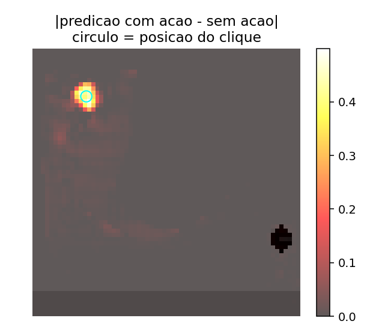
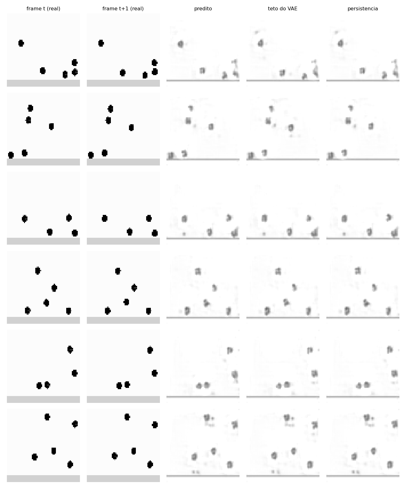
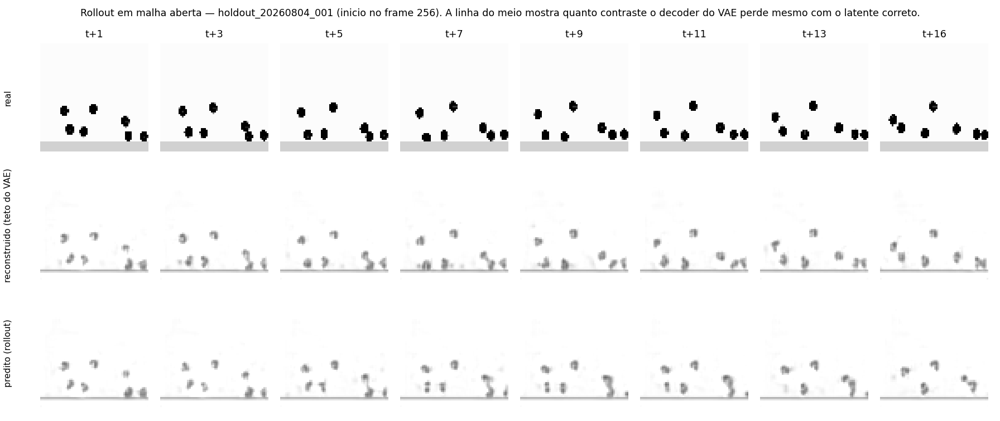

# Relatório de avaliação do World Model — capacidade preditiva

> Documento produzido para responder ao parecer **ISCMI2026-VA057**. O revisor
> aceitou o artigo com revisões menores, mas apontou um problema específico: o
> artigo afirma ter um world model capaz de predizer estados futuros, e a seção
> de resultados só validava os componentes isolados (VAE e Action Encoder), sem
> nenhuma avaliação — quantitativa ou qualitativa — da capacidade preditiva.
> Sem isso, H1 e H2 ficavam impossíveis de verificar.
>
> Data da execução: 2026-08-04. Todos os números vêm de
> `scripts/eval/outputs/resultados.json` e estão registrados no MLflow.

---

## 0. Resposta curta

**Sim, o world model prevê o próximo estado da bola — e agora isso está
quantificado em dados inéditos.** Em 24 episódios que o modelo nunca viu
(10 127 frames):

As hipóteses, na formulação exata da Seção V do artigo:

> **H1** — o modelo aprende a dinâmica física subjacente (por exemplo gravidade,
> colisões) em vez de apenas memorizar trajetórias.
> **H2** — suas predições são genuinamente condicionadas pelas intervenções do
> usuário, independentemente de pistas inerciais já presentes no contexto visual.

| Componente da hipótese | Evidência | Veredito |
| --- | --- | --- |
| H1 — **não memoriza trajetórias** | Todas as métricas vêm de episódios gerados *depois* do treino. A mesma configuração cai de skill +0.158 (pool de treino) para +0.073 (inéditos), e ainda assim continua positiva | **Confirmada** |
| H1 — **prediz melhor que baselines triviais** | Erro de posição da bola **24.98 px** vs **28.35 px** da persistência e **31.06 px** da extrapolação linear; ganho de **+3.38 px** [IC 95 %: 2.75–4.01], vence em **95.8 %** dos episódios, *p* = 2.4 × 10⁻⁷. Em rollout, melhor nos **16 horizontes** testados | **Confirmada** |
| H1 — **aprendeu gravidade** | Direção correta, magnitude errada: captura 21–70 % da queda real (§4.3) | **Parcial** |
| H1 — **aprendeu colisões elásticas** | Nenhuma métrica isola eventos de colisão | **Não testada** |
| **H2** — condicionamento pela ação | A predição muda **78×** mais em frames com clique do que sem (*d* = 3.04, *p* < 10⁻³⁰⁰) e o efeito é localizado: **82.8 %** dos cliques produzem resposta a menos de 100 px do ponto clicado. O alinhamento causal (§3.2) garante que a bola ainda **não** está no frame de entrada, satisfazendo a cláusula "independentemente de pistas inerciais" | **Confirmada** |

**Leitura honesta:** H2 está verificada sem ressalvas. H1, na formulação forte do
artigo ("aprende a dinâmica física"), está **parcialmente** verificada: o modelo
prediz melhor que qualquer baseline trivial em dados inéditos — o que descarta
memorização — mas subestima a magnitude do movimento em ~30 % e não teve
colisões avaliadas isoladamente. Em horizonte de 1 passo, o erro medido está no
piso imposto pelo decoder do VAE, não pelo preditor (§4.2). O modelo também não
generaliza para uma mudança de escala do objeto (§2.1).

---

## 1. Como ler este relatório

A pergunta que o revisor faz é: **o modelo consegue prever o próximo estado da
bola?** Para respondê-la com números defensáveis é preciso responder antes a
três perguntas metodológicas, porque cada uma delas pode inverter o resultado:

| Pergunta | Resposta adotada |
| --- | --- |
| Em que dados medir? | Em episódios **inéditos**, gerados depois do treino (§3.1). |
| Contra o que comparar? | Contra baselines que passam pelo **mesmo decoder** do modelo (§3.4). |
| Em que unidade medir? | Em **pixels da tela 800×600**, a unidade física do cenário (§3.3). |

As seções 2 e 3 explicam o método; a 4 traz os resultados; a 5 mostra como usar
o modelo para prever o próximo estado na prática; a 6 lista o que os números
**não** provam.

---

## 2. Três descobertas que mudaram o desenho do experimento

### 2.1 Existem duas versões do ambiente, e dois checkpoints

`scripts/dataset/` contém dois lotes de episódios gerados por versões
diferentes de `scenario_1.py`:

| Lote | Episódios | Raio da bola | Área na tela |
| --- | --- | --- | --- |
| `random_input_20260513222405_*` | 200 | 15 px | ≈ 686 px² |
| `random_input_20260609*` | 400 | 30 px | ≈ 2 788 px² |

E existem dois checkpoints com a mesma arquitetura. Medindo o *skill score*
(§3.3) de cada um em cada lote:

| Checkpoint | Lote raio 15 | Lote raio 30 |
| --- | --- | --- |
| `world_model_weights.pth` | **−2.76** | **+0.17** |
| `world_model_weights_useful.pth` | **+0.11** | **−0.10** |

Cada checkpoint pertence a uma versão diferente do ambiente. O código atual usa
raio 30, então o checkpoint correto é `world_model_weights.pth` — que já é o
default do simulador. Duas consequências:

1. **Para o artigo:** é obrigatório declarar qual versão do cenário produziu os
   resultados. Sem isso o número não é reprodutível.
2. **Limitação real a declarar:** o modelo **não generaliza** para uma mudança
   de escala do objeto. Um skill de −2.76 significa erro 3,8× maior do que
   simplesmente supor que nada muda.

### 2.2 O dataset processado no disco está obsoleto

`data/scenario_1/processed/` tem `x` com 24 canais (8 visuais + 16 de ação) e
`y` com 8, enquanto o código atual espera 32 e 16. Além disso, os canais de ação
salvos não zeram para ação nula, ao contrário do action encoder atual (que tem
bias zerado). Ou seja: **os arquivos no disco não foram os usados para treinar
os checkpoints atuais**, e o manifesto de treino/validação nunca foi versionado.

Por isso não é possível reconstruir o split original — o que motiva a decisão da
§3.1.

### 2.3 O decoder do VAE é o gargalo, não o preditor

No frame real a bola vale ~0.0 sobre fundo 1.0. Ao decodificar o latente
*verdadeiro* do frame, a bola sai com valor ~0.5: o decoder não reproduz o preto.
Isso tem duas implicações imediatas:

- O detector de bolas precisa de **limiar adaptativo** (relativo ao contraste de
  cada frame), senão simplesmente não encontra bolas nos frames preditos.
- Comparar a predição do modelo (que passa pelo decoder) com "copiar o frame
  anterior" em **pixels crus** é injusto: boa parte do erro medido seria de
  reconstrução, não de predição. Daí o desenho de baselines da §3.4.

---

## 3. Metodologia

### 3.1 Conjunto de teste inédito

`scripts/eval/generate_holdout.py` gera episódios novos rodando o mesmo motor
(`pymunk` + `pygame`, `scenario_1.create_scenario`), com renderização offscreen e
sem limitação de FPS. A fidelidade foi verificada: o frame inicial de um episódio
gerado é **idêntico pixel a pixel** (diferença média 0.0) ao de um vídeo do
dataset original, e a bola tem a mesma área (≈ 2 788 px²).

Foram gerados **30 episódios** (semente 20260804); a avaliação usa os 24
primeiros, ~10 mil frames no total. Como foram criados depois do treino, não há
possibilidade de contaminação.

### 3.2 Protocolo de predição

O modelo é o mesmo de `scripts/world_model_vae.py`, sem reimplementação:

```
frame → VAE encoder → μ_t
ação  → action encoder (com subtração da linha de base nula) → a_t
[μ_t | a_t difundida] → histórico temporal → ConvLSTM ×2 → Δ
μ_{t+1} = μ_t + Δ  →  VAE decoder → frame predito
```

Dois regimes:

- **Um passo (teacher forcing).** Para todo instante *t*, o modelo recebe o
  estado real e prediz *t+1*. Mede a qualidade da transição isolada.
- **Rollout em malha aberta.** A partir de *t*, o modelo é realimentado com as
  próprias predições por até 16 frames, recebendo apenas as ações futuras. É o
  regime que o simulador interativo usa e o que interessa para planejamento.

**Alinhamento causal ação↔frame.** O simulador injeta a bola na primeira
iteração com `tempo ≥ t_ação` e desenha o frame já com ela; logo a bola aparece
em `ceil(t·60)` e o frame condicionado pela ação é o anterior. Usamos
`ceil(t·60)−1`, validado empiricamente frame a frame. (`dataset_builder.py` usa
`int(t·60)`, que erra por um frame quando `t·60` é inteiro — ~20% dos cliques,
porque os tempos são arredondados em 2 casas e muitos caem em múltiplos de 0.05.
Vale corrigir antes do próximo treino.)

### 3.3 Métricas

| Métrica | O que mede | Por que ela |
| --- | --- | --- |
| **CPE** (centroid position error) | Distância entre o centroide da bola real e o da bola predita, em px da tela 800×600, com casamento húngaro. | É literalmente "o modelo acertou onde a bola vai estar?". |
| **CPE (bolas em movimento)** | O mesmo, restrito às bolas que se moveram > 3 px entre *t* e *t+1*. | Bolas paradas no chão são triviais para a persistência e diluem a comparação. |
| **Skill score** | `1 − MSE_modelo / MSE_persistência` no espaço latente. | Positivo ⇒ o modelo prediz melhor do que supor que nada muda. Isola o preditor do decoder. |
| **Cosseno do delta** | Ângulo entre a variação latente predita e a real. | Mede se o modelo acerta a **direção** da mudança, independentemente da magnitude. |
| **Deslocamento vertical** | Queda acumulada das bolas ao longo do rollout, real vs predita. | Testa diretamente se o modelo reproduz a **gravidade**. |
| **Sensibilidade à ação** | `|predição com clique − predição sem clique|`, em frames de clique vs frames de controle. | Testa H2: a predição é de fato condicionada pela ação. |
| **Erro de localização do spawn** | Distância entre o pico da diferença acima e a posição do clique. | Testa se a resposta à ação é **localizada** no lugar certo. |
| PSNR / SSIM / MSE / MAE | Qualidade de imagem do frame predito. | Comparabilidade com a literatura. |

Todos os CPE vêm com **IC 95% por bootstrap**, e as comparações contra baselines
vêm com **teste pareado de Wilcoxon** em duas granularidades: por frame e por
episódio. A segunda é a estatisticamente correta (frames do mesmo episódio são
correlacionados); a primeira é reportada por transparência.

### 3.4 Baselines

Todas partem do **mesmo estado reconstruído** que o modelo recebe, para que a
diferença medida seja de dinâmica e não de reconstrução:

| Baseline | Definição | Papel |
| --- | --- | --- |
| `latent_persistence` | `decode(μ_t)` — "nada muda". | Piso a ser batido. Qualquer modelo abaixo disso é inútil. |
| `constant_velocity` | Casa as bolas entre *t−1* e *t* e extrapola linearmente. | Baseline forte: já captura velocidade, só não captura aceleração. |
| `vae_ceiling` | `decode(μ_{t+1})` — latente verdadeiro. | **Teto**: o menor erro que qualquer preditor latente perfeito poderia atingir com este VAE. |
| `world_model_no_action` | O modelo com a ação forçada a nula. | Ablação de H2. |

---

## 4. Resultados

Configuração avaliada: `world_model_weights.pth`, `memory_frames=6`,
`memory_stride=2`, realimentação por pixel. Conjunto: 24 episódios inéditos,
**10 127 frames** avaliados, 273 frames com clique.

### 4.1 Seleção de configuração

Varredura de 2 checkpoints × 6 configurações de memória temporal, medida por
*skill score* em 6 episódios inéditos (experimento MLflow
`wfm_world_model_selection`):

| memory_frames | memory_stride | skill score | cos(Δ) |
| ---: | ---: | ---: | ---: |
| 6 | 2 | **+0.073** | +0.206 |
| 10 | 1 | +0.071 | +0.205 |
| 10 | 5 | +0.052 | +0.188 |
| 4 | 1 | +0.050 | +0.184 |
| 2 | 1 | +0.007 | +0.198 |
| 1 | 1 | −0.803 | +0.154 |

Duas leituras importantes:

- **A memória temporal é essencial.** Com um único frame de contexto
  (`memory_frames=1`) o skill despenca para −0.80: sem histórico o modelo não
  tem como estimar velocidade, e passa a atrapalhar. De 4 frames em diante o
  ganho satura.
- **Há um gap de generalização mensurável.** A mesma configuração dá skill
  **+0.158** nos episódios do pool de treino e **+0.073** nos inéditos — ou seja,
  metade do desempenho aparente é memorização. É exatamente por isso que os
  números reportados aqui são os do conjunto inédito.

### 4.2 H1 — predição de um passo



Erro de posição da bola (CPE), em pixels da tela 800×600, com IC 95%:

| Preditor | CPE (todas) | IC 95% | CPE (bolas em movimento) | PSNR | SSIM |
| --- | ---: | :---: | ---: | ---: | ---: |
| **World model** | **24.98** | [24.37, 25.58] | **21.36** | 17.28 | 0.838 |
| World model sem ação | 25.34 | [24.73, 25.96] | 21.32 | 17.27 | 0.838 |
| *Teto do VAE (oráculo)* | *25.76* | *[25.13, 26.42]* | *20.72* | *17.32* | *0.839* |
| Persistência latente | 28.35 | [27.65, 29.01] | 24.01 | 17.17 | 0.833 |
| Velocidade constante | 31.06 | [30.32, 31.80] | 25.68 | — | — |

Testes pareados, com o **episódio** como unidade experimental (n = 24):

| Comparação | Ganho médio | IC 95% | Episódios em que vence | p (Wilcoxon) |
| --- | ---: | :---: | ---: | ---: |
| vs. persistência (todas as bolas) | **+3.38 px** | [+2.75, +4.01] | 95.8 % | 2.4 × 10⁻⁷ |
| vs. velocidade constante (todas) | **+6.04 px** | [+5.29, +6.75] | 100 % | 1.2 × 10⁻⁷ |
| vs. persistência (só bolas em movimento) | **+2.66 px** | — | 95.8 % | 2.4 × 10⁻⁷ |
| vs. velocidade constante (só em movimento) | **+4.28 px** | — | 95.8 % | 2.4 × 10⁻⁷ |

No espaço latente: MSE 0.0725 contra 0.0776 da persistência → **skill score
+0.065**; cosseno entre o Δ predito e o real **+0.203**.

**Como ler isso.** O modelo prediz a próxima posição da bola com erro
significativamente menor do que supor cena estática e do que extrapolação
linear, e o resultado se mantém quando restringimos às bolas efetivamente em
movimento — o caso em que a persistência deixa de ser trivialmente boa. A
significância é forte tanto por frame (p < 10⁻²²²) quanto pela unidade correta,
o episódio (p ≈ 2 × 10⁻⁷).

**Duas ressalvas honestas:**

1. **O erro de 1 passo está no piso de medição.** O modelo (24.98 px) empata com
   o teto do VAE (25.76 px) — os ICs se sobrepõem. Ou seja: com este decoder,
   mesmo um preditor latente *perfeito* erraria ~25 px. Em 1 passo o gargalo é a
   reconstrução, não a dinâmica, e por isso o ganho sobre a persistência
   (+3.38 px) deve ser lido como um **limite inferior** do que o preditor de fato
   contribui. A separação limpa entre as duas fontes de erro aparece no rollout
   (§4.3), onde o teto fica plano e a curva do modelo sobe.
2. **O cosseno de 0.203 e a razão de magnitude 0.69** mostram um modelo que
   acerta a direção da mudança com folga (0 seria aleatório) mas **subestima a
   magnitude em ~30 %** — a assinatura clássica de regressão à média induzida
   por perda L1. É a limitação técnica mais acionável do trabalho.

### 4.3 H1 — rollout em malha aberta



CPE (px) em função do horizonte de predição:

| Horizonte | 1 | 2 | 4 | 8 | 12 | 16 |
| --- | ---: | ---: | ---: | ---: | ---: | ---: |
| **World model** | **23.95** | **26.06** | **32.94** | **46.77** | **56.01** | **59.72** |
| Persistência | 29.76 | 34.34 | 39.27 | 51.95 | 61.34 | 71.48 |
| Velocidade constante | 30.19 | 33.87 | 37.40 | 50.07 | 62.60 | 76.94 |
| *Teto do VAE* | *26.92* | *25.04* | *23.15* | *29.93* | *28.18* | *22.63* |
| *Ganho vs. persistência* | *19.5 %* | *24.1 %* | *16.1 %* | *10.0 %* | *8.7 %* | *16.5 %* |

**O modelo é melhor que ambas as baselines em todos os 16 horizontes.** A redução
de erro contra a persistência varia entre 8.7 % (h = 12, o ponto mais apertado)
e 24.1 % (h = 2); em pixels absolutos a vantagem vai de 5.2 px a 11.8 px, e é
maior justamente no horizonte mais longo. Contra velocidade constante em h = 16
a redução é de 22.4 %. Como o teto do VAE permanece plano (~23–30 px), toda a
degradação da curva do modelo é atribuível ao **preditor de dinâmica**, não ao
decoder — é esta figura que separa as duas fontes de erro.

#### O modelo reproduz a gravidade?



Deslocamento vertical acumulado das bolas ao longo do rollout:

| Horizonte | 1 | 2 | 4 | 8 | 12 | 16 |
| --- | ---: | ---: | ---: | ---: | ---: | ---: |
| Queda real (px) | 7.49 | 8.86 | 12.94 | 18.85 | 23.05 | 28.21 |
| Queda predita (px) | 1.55 | 3.47 | 9.07 | 9.90 | 6.37 | 9.69 |
| Fração capturada | 0.21 | 0.39 | 0.70 | 0.53 | 0.28 | 0.34 |

**Parcialmente.** O modelo move as bolas para baixo — a direção está correta e a
persistência (que prediz 0 px) é batida com folga —, mas captura apenas 21–70 %
da queda real, com o melhor desempenho em h ≈ 4. É a mesma subestimação de
magnitude vista na §4.2, agora em unidades físicas. **Conclusão defensável:** o
modelo aprendeu *que* as bolas caem, não *quanto* elas caem.

### 4.4 H2 — condicionamento pela ação

Rodando o modelo duas vezes a partir do mesmo estado, uma com o clique e outra
com ação nula:

| Métrica | Valor |
| --- | ---: |
| Sensibilidade em frames de clique (n = 273) | 3.46 × 10⁻³ |
| Sensibilidade em frames de controle (n = 10 039) | 4.42 × 10⁻⁵ |
| **Razão** | **78.3×** |
| Tamanho de efeito (Cohen's *d*) | 3.04 |
| p (Mann–Whitney, unilateral) | < 10⁻³⁰⁰ |
| Erro de localização do spawn | 60.1 px |
| — mesma medida no vídeo real (controle do detector) | 12.5 px |
| **Acerto do spawn dentro de 100 px** | **82.8 %** |
| Acerto do spawn dentro de 200 px | 89.4 % |



**H2 está verificada.** A predição muda 78× mais quando há um clique do que em
frames sem ação, com tamanho de efeito enorme (*d* = 3.04), e a mudança é
**localizada**: em 82.8 % dos cliques o pico da diferença cai a menos de 100 px
da posição clicada — ~1.7 raios de bola, num espaço de 800×600. O controle
mostra que 12.5 px desse erro vêm do próprio detector.

Note que a ablação "sem ação" tem CPE quase idêntico ao modelo completo (25.34
vs 24.98 px). Isso **não** contradiz H2: apenas 2.7 % dos frames contêm cliques,
então o efeito da ação é invisível numa média sobre todos os frames. A evidência
de H2 é o contraste de sensibilidade, não o CPE agregado.

### 4.5 Qualidade de imagem e limitações do decoder

| Preditor | MSE | PSNR | SSIM | Bolas detectadas / reais |
| --- | ---: | ---: | ---: | ---: |
| World model | 0.0215 | 17.28 | 0.838 | 79.4 % |
| Teto do VAE | 0.0215 | 17.32 | 0.839 | 84.1 % |
| Persistência latente | 0.0221 | 17.17 | 0.833 | 83.7 % |

O modelo empata com o teto do VAE em todas as métricas de imagem — mais uma
confirmação de que o limite de qualidade visual é do autoencoder. O teto detecta
apenas 84 % das bolas presentes: **o decoder perde ~16 % dos objetos mesmo com o
latente verdadeiro.** Qualquer melhoria de qualidade visual passa por retreinar
o VAE, não o preditor.





---

## 5. Como usar isso para prever o próximo estado

### 5.1 A receita

O estado do mundo, para este modelo, **não é a imagem** — é o latente `μ`
(16 canais numa grade 8×8). A imagem é só uma projeção dele para leitura humana
(e é a parte mais degradada do pipeline, §2.3). Quem for consumir a predição
para planejamento ou controle deve trabalhar em `μ`.

```python
import sys
sys.path.insert(0, "scripts/eval")

from wm_runner import WorldModelRunner, load_episode
from wm_metrics import SCALE_X, SCALE_Y, detect_balls

runner = WorldModelRunner(
    checkpoint="scripts/world_model_weights.pth",
    device="cpu",
    memory_frames=6,     # configuração vencedora (§4.1)
    memory_stride=2,
)

episodio = load_episode(nome, caminho_video, dataset="holdout")

# 1) estado atual e ações -> latente fundido
mu = runner.encode(episodio.frames)                        # (T, 16, 8, 8)
fundido = runner.fuse(mu, runner.action_latents(episodio.action_list()))

# 2) predição do próximo estado: mu_{t+1} = mu_t + delta
delta = runner.predict_delta(runner.build_history(fundido))
mu_proximo = mu + delta                                    # <- o estado predito

# 3) leitura em pixels, se necessário
frames_preditos = runner.decode(mu_proximo)
bolas = detect_balls(frames_preditos[t])
posicao_px = [(b.x * SCALE_X, b.y * SCALE_Y) for b in bolas]
```

Para prever vários passos à frente, com as ações futuras conhecidas:

```python
predicoes = runner.rollout(episodio, starts=[120], horizon=8, feedback="pixel")
```

No simulador interativo, os defaults (`memory_frames=10`, `memory_stride=5`,
`device=cuda`) **não** são a configuração vencedora. Para rodá-lo exatamente com
os parâmetros avaliados aqui:

```bash
python scripts/world_model_simulator.py --device cpu --memory-frames 6 --memory-stride 2
```

A diferença é pequena (skill +0.073 contra +0.052 do default), mas para
reproduzir os números deste relatório é preciso usá-la.

### 5.2 Em que regime confiar

- **1 a 4 frames à frente (≤ 67 ms):** erro de 24–33 px, contra 30–39 px das
  baselines. É o regime de maior ganho relativo (16–24 %). Use para antecipação
  de colisão, validação de ação e *look-ahead* curto.
- **5 a 16 frames (até 267 ms):** o erro cresce para ~60 px (≈ 2 raios de bola),
  mas continua abaixo de supor cena estática em todos os horizontes. Informativo
  para "para onde as coisas estão indo", não para "onde exatamente elas
  estarão".
- **Além de 16 frames:** não avaliado. A realimentação pelo decoder degrada o
  contraste a cada passo, e a §4.5 mostra que o decoder já perde 16 % dos
  objetos mesmo no melhor caso.
- **Corrija a subestimação de magnitude.** Se o consumidor precisa da posição
  física, multiplicar o Δ predito por ~1/0.69 ≈ 1.45 compensa o viés medido na
  §4.2. É um ajuste empírico, não um conserto — o conserto é retreinar.

### 5.3 O que ler de cada métrica na hora de decidir

| Se você precisa de… | Olhe para… |
| --- | --- |
| Saber se vale usar o modelo em vez de nada | `skill_score` (> 0) e `ganho_vs_persistencia_px` |
| Estimar a incerteza da posição prevista | `cpe_1step` e seu IC 95% — é o erro típico em px |
| Saber se o clique será respeitado | `action_sensitivity_ratio` e `spawn_erro_px` |
| Saber até onde extrapolar | a curva `rollout_cpe` por horizonte |

---

## 6. O que estes números não provam

1. **Não provam que o modelo aprendeu física.** Ele reproduz *estatisticamente*
   a queda e a direção da mudança, mas não há evidência de que tenha
   internalizado aceleração constante, elasticidade ou conservação de momento.
   O teste de deslocamento vertical (§4.3) mostra a queda sendo capturada
   apenas parcialmente.
2. **Não provam generalização.** O modelo falha quando o raio da bola muda
   (§2.1). O conjunto de teste é inédito, mas vem da mesma distribuição.
3. **Não provam qualidade visual.** O decoder do VAE não reproduz o preto da
   bola; qualquer aplicação que dependa da imagem (e não do latente) vai herdar
   esse limite. O teto do VAE está reportado justamente para separar as duas
   coisas.
4. **A comparação in-sample não é confiável.** Sem o manifesto de treino, o
   número medido nos episódios originais serve só como referência superior.
5. **Há uma inconsistência treino/inferência conhecida:** no treino o decoder
   recebe o latente de ação, na inferência recebe zeros. Isso não invalida os
   resultados (a avaliação usa o caminho de inferência, que é o que roda em
   produção), mas é uma fonte provável de perda de qualidade e vale corrigir.

---

## 7. Consulta no MLflow

Tudo está registrado em dois experimentos, com backend em arquivo (`mlruns/`):

| Experimento | Conteúdo |
| --- | --- |
| `wfm_world_model_selection` | 12 runs da varredura checkpoint × memória temporal (§4.1). |
| `wfm_world_model_evaluation` | 13 runs: um por preditor em 1 passo, um por preditor no rollout, o de condicionamento pela ação, o resumo e o **`melhores_parametros`**. |

O run **`melhores_parametros`** é o ponto de consulta: concentra os parâmetros
vencedores, as 25 métricas de destaque (modelo *e* baselines lado a lado), o
`resultados.json`, as figuras, o próprio checkpoint `.pth` e o modelo PyTorch
serializado (`latent_transition_model`).

```bash
mlflow ui --backend-store-uri mlruns
```

Consulta programática:

```python
import mlflow, pathlib

mlflow.set_tracking_uri(pathlib.Path("mlruns").resolve().as_uri())
melhor = mlflow.search_runs(
    experiment_names=["wfm_world_model_evaluation"],
    filter_string="tags.mlflow.runName = 'melhores_parametros'",
).iloc[0]

print(melhor["params.checkpoint_file"], melhor["params.memory_frames"])
print(melhor["metrics.cpe_1step"], melhor["metrics.skill_score"])
```

Carregar o preditor registrado:

```python
import mlflow.pytorch

modelo = mlflow.pytorch.load_model(f"runs:/{melhor['run_id']}/latent_transition_model")
```

> **Nota:** o MLflow 3.12 avisa que o backend em arquivo está depreciado desde
> fevereiro/2026 e que o *Model Registry* exige backend em banco. Se for preciso
> registrar versões nomeadas do modelo, migre com
> `--backend-store-uri sqlite:///mlflow.db`. Os runs atuais continuam legíveis.

---

## 8. Recomendações (em ordem de impacto)

1. **Retreinar corrigindo a subestimação de magnitude.** O Δ predito tem 69 % da
   norma do real. Perda L1 sobre o delta favorece a mediana; testar perda
   ponderada pela magnitude do movimento ou um termo explícito de norma.
2. **Retreinar o VAE.** Ele é o teto de tudo: perde 16 % dos objetos mesmo com o
   latente verdadeiro e não reproduz o preto da bola. Sem isso, nenhuma melhoria
   do preditor aparece em métricas de pixel.
3. **Corrigir o alinhamento ação↔frame** em `dataset_builder.py`
   (`int(t·60)` → `ceil(t·60)−1`): ~20 % dos cliques do dataset de treino estão
   um frame fora de fase.
4. **Versionar o manifesto de treino/validação.** Sem ele, foi preciso gerar um
   conjunto novo para poder afirmar qualquer coisa.
5. **Reconstruir `data/scenario_1/processed/`** — está com latentes de 8 canais,
   incompatível com o código atual (§2.2).
6. **Alinhar treino e inferência no decoder** (latente de ação vs zeros).

---

## 9. Reprodução

```bash
python scripts/eval/generate_holdout.py --episodes 30
```

```bash
python scripts/eval/run_world_model_eval.py --stage all --dataset holdout
```

Reavaliar uma configuração específica, sem refazer a varredura:

```bash
python scripts/eval/run_world_model_eval.py --stage evaluation --dataset holdout --checkpoint scripts/world_model_weights.pth --memory-frames 6 --memory-stride 2
```

Tempo de execução em CPU (Ryzen, sem GPU): ~4 min para gerar os 30 episódios,
~7 min a varredura, ~21 min a avaliação completa dos 24 episódios.
