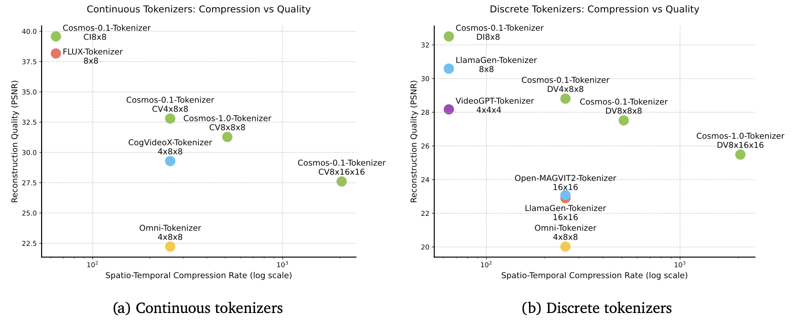

# Cosmos Tokenizer

## Português

A seguir apresentamos trechos do capítulo $5$ do artigo **_Cosmos World Foundation Model Platform for Physical AI_**, interpoladas com comentários clarificando e/ou contextualizando conteúdos de seus parágrafos.

---

Trechos formatados de forma semelhante a esse parágrafo correspondem a insertos do artigo (traduzidos).

> Trechos formatados de forma semelhante a esse parágrafo, são comentários a respeito do parágrafo diretamente acima.

---

### Resumo

O _Cosmos Tokenizer_ é composto por **2 partes**: um **codificador** e um **decodificador**. O **codificador** começa com uma operação _Haar Wavelet 3D_, para comprimir a imagem ou vídeo, seguida de vários blocos compostos por uma camada _Causal ResBlock3D_, camadas _Causal DownSample3D_ e uma camada _Causal SpatioTemporalAttn_. O **decodificador** espelha essa arquitetura, substituindo as camadas de downsample por camadas _Causal UpSample3D_ e, ao final, trocando a _Haar Wavelet 3D_ por sua inversa.

Ambas as partes são treinadas juntas, com supervisão apenas na saída do decodificador. Esses tokenizers funcionam para arquiteturas autoregressivas e de difusão, sendo capazes de tokenizar imagens/vídeos de maneira discreta (para modelos AR) ou contínua (para modelos de difusão).

O _Cosmos Tokenizer_ atinge desempenho superior em menos tempo que outros tokenizers, principalmente devido à sua arquitetura, além de conseguir processar múltiplos tipos de taxas de compressão e operar de forma ubíqua para imagens e vídeos.

### Visão Geral

Tokenizers são blocos fundamentais na construção de modelos modernos em larga escala. Eles transformam dados brutos em representações mais eficientes ao aprender um espaços latentes "bottle-necked" descobertos de maneira não supervisionada. Especificamente, tokenizers visuais mapeiam dados visuais brutos e redundantes em tokens semânticos compactos, o que os torna cruciais para lidar com dados visuais de alta dimensionalidade.

> Mapear os dados brutos (no formato de valores de pixels) para um "espaços latentes bottle-necked" significa que a imagem original — que é muito alta em dimensionalidade (para uma pequena imagem RGB com dimensões $224\times 224 \times 3$ você tem um total de $196.608$ características por imagem) — será comprimida em uma forma menor e mais útil ao aprender uma representação interna comprimida (espaço latente).

> Tudo isso para dizer que as imagens serão comprimidas para uma forma de menor dimensionalidade (tokens) ao passar por um _tokenizer_ que é treinado de forma não supervisionada.

A imagem abaixo ilustra o pipeline de treinamento de tokenização, onde o objetivo é treinar o codificador (encoder) e o decodificador (decoder), de forma que a representação por tokens no gargalo preserve ao máximo a informação visual do input.

Na pipeline, um vídeo de entrada é codificado em tokens, que geralmente são muito mais compactos do que o vídeo de entrada. O decodificador então reconstrói o vídeo original a partir desses tokens. _O treinamento do tokenizer consiste em aprender o codificador e decodificador de modo a preservar ao máximo a informação visual nos tokens_.

Tokenizers existem em dois tipos: contínuos e discretos. Tokenizers contínuos codificam dados visuais em embeddings contínuos latentes, como nos modelos de difusão latente (latent diffusion models) tal como o _Stable Diffusion_ ou o _VideoLDM_. Esses embeddings são adequados para modelos que geram dados ao amostrar de distribuições contínuas. Tokenizers discretos codificam dados visuais em códigos latentes discretos, mapeando-os para índices quantizados, como visto em transformers autorregressivos como o VideoPoet. Essa representação discreta é necessária para modelos como o GPT, que são treinados com _cross-entropy loss_.

> _**Tokenizers contínuos**_: codificam os dados em um espaço vetorial contínuo e de alta dimensionalidade. Eles são usados em modelos de difusão, pois esses modelos geram dados por meio de amostragem em distribuições contínuas. Esses embeddings permitem ao modelo interpolar e reamostrar variações nos dados de base.

> _**Tokenizers discretos**_: codificam dados em códigos latentes discretos, que são quantizados ou mapeados para um conjunto de índices finitos distintos. Esses tokenizers são usados com _modelos autorregressivos_ que geram sequências um token por vez. O artigo cita os _modelos GPT_ e como eles são treinados com cross-entropy loss; essa abordagem requer tokens discretos, pois trata o processo de geração como uma predição sobre um vocabulário fixo, sendo essa função de perda voltada a medir a diferença entre distribuições categóricas previstas e reais.

> A principal diferença entre os dois tipos de tokenizers está na forma como os tokenizers discretos mapeiam os valores de imagem para valores discretos ($\mathbb{N}$), enquanto tokenizers contínuos mapeiam para valores reais ($\mathbb{R}$), permitindo uma maior quantidade de valores no espaço latente (por exemplo, _"[...]espaço vetorial de alta dimensionalidade[...]”_).

> Modelos de difusão aprendem ao reverter um processo gradual de "adicionar ruído" a dados reais. Esse processo gradual é o motivo pelo qual tais modelos dependem de tokens com valores reais ($\mathbb{R}$).

O sucesso dos tokenizers depende, em grande parte, da sua habilidade de fornecer altas taxas de compressão sem comprometer a qualidade da reconstrução visual posterior. Por um lado, uma alta compressão reduz os requisitos de armazenamento e computação. Por outro, uma compressão excessiva pode levar à perda de detalhes visuais essenciais. Esse equilíbrio representa um desafio importante no projeto de tokenizers.

A imagem a seguir ilustra os dois tipos de tokens:

Tokens ao longo das dimensões espaciais ($\frac{H}{S_{HW}} \times \frac{W}{S_{HW}}$) e temporais ($1 + \frac{T}{S_T}$), com um fator de compressão espacial $S_{HW}$ e um fator de compressão temporal $S_T$. O primeiro token temporal representa o primeiro quadro da entrada, possibilitando a tokenização conjunta de imagens ($T=0$) e vídeos ($T>0$) em um espaço latente compartilhado.

> $S_{HW}$ é o _fator de compressão espacial_ usado para comprimir as dimensões espaciais de uma imagem. Essa é uma etapa chave no processo de tokenização espacial, no qual o quadro de entrada é dividido em pequenos blocos ou regiões, cada um dos quais é representado por um ou mais tokens.

> Se a dimensão da imagem original for $224\times 224 \times 3$, e o _fator de compressão espacial_ for 16, a grade de tokens será de $14\times 14$, e cada token conterá informações sobre uma região de $16\times 16$ pixels.

> $S_T$ é o _fator de compressão temporal_, e é usado para reduzir o número de tokens que representam o eixo temporal agrupando quadros. Isso é aplicado no processo de _Tokenização Temporal_, para representar o número de quadros. A adição de $1$ permite ao modelo tratar o quadro inicial como um token especial, dando suporte à tokenização conjunta de imagens e vídeos. Se o processo for aplicado a uma imagem, $T=0$ e a dimensão temporal reduz-se a $1$.

> Se a imagem mencionada acima fizer parte de um vídeo com $32$ quadros, e o _fator de compressão temporal_ tiver valor $4$, o processo de tokenização produzirá 9 tokens temporais: $1$ para o primeiro quadro (adaptabilidade para lidar com imagens), e outros 8, cada um agrupando 4 quadros.

A tabela a seguir ilustra diferentes tokenizers visuais e suas capacidades:

O _Tokenizador Cosmos_ utiliza uma arquitetura leve e computacionalmente eficiente com um mecanismo temporal causal. Especificamente, ele emprega camadas de convolução temporal causal e camadas de atenção temporal causal para preservar a ordem temporal natural dos quadros de vídeo.

> O termo "causal" implica que qualquer predição sobre um determinado quadro ou ponto no tempo é baseada somente nesse quadro e em todos os quadros anteriores, nunca nos futuros. Portanto, "_Convolução Temporal Causal_" significa que a geração de características para um dado quadro utiliza apenas dados do quadro $t$ para trás.

> A mesma ideia aplica-se à "_Atenção Temporal Causal_", onde o tokenizer pondera dinamicamente em quais quadros focar ao tomar decisões sobre o quadro atual.

Os tokenizers são treinados diretamente em imagens de alta resolução e vídeos de longa duração, sem limitar as categorias ou proporções de aspecto. O _Cosmos Tokenizer_ opera em diferentes proporções de aspecto. Ele é agnóstico quanto à duração temporal durante a inferência, sendo capaz de tokenizar além da duração temporal usada durante o treinamento.

Os gráficos abaixo mostram a comparação de desempenho entre o _Cosmos Tokenizer_ e outros tokenizers, evidenciando a sua qualidade superior mesmo em taxas de compressão mais altas:

Claro! Segue abaixo o texto traduzido para o português, com a estrutura Markdown totalmente preservada, e mantendo em inglês apenas os termos técnicos que fazem mais sentido no original:

### Arquitetura

O Cosmos Tokenizer é projetado com uma arquitetura encoder-decoder. Dado um vídeo de entrada $x_{0:T} \in \mathbb{R^{(1 + T) \times H \times W \times 3}}$, com $H,\ W,\ T$ representando a altura, largura e número de quadros, o encoder ($\varepsilon$) tokeniza as entradas em um vídeo de tokens $z_{0:T'} \in \mathbb{R^{(1 + T) \times H \times W \times 3}}$, com um fator de compressão espacial de $s_{H W} = \frac{H}{H'}=\frac{W}{W'}$ e um fator de compressão temporal de $S_T = \frac{T}{T'}$. O decoder ($\mathcal{D}$) então reconstrói o vídeo de entrada a partir desses tokens, resultando no vídeo reconstruído $\hat{x}_{0:T} \in \mathbb{R^{(1 + T) \times H \times W \times 3}}$

$$\hat{x}_{0:T} = \mathcal{D}(\varepsilon(x_{0:T}))$$

> Esta é uma visão geral da arquitetura, onde o encoder codifica uma entrada $x_{0:T}$ em tokens $z_{0:T'}$, e o decoder decodifica esses tokens e produz $\hat{x}_{0:T}$.

Nossa arquitetura emprega um design temporalmente causal, garantindo que cada estágio processe apenas quadros atuais e passados. _Nosso tokenizer opera no wavelet space, onde as entradas são primeiro processadas por uma wavelet transform de 2 níveis_. A wavelet transform mapeia o vídeo de entrada $x_{0:T}$ de forma agrupada para realizar um downsample das entradas por um fator de quatro ao longo das direções $x, y$ e $t$. Os grupos são formados como: $\lbrace x_0, x_{1:4}, x_{5:8}, ..., x_{(T-3):T}\rbrace \rightarrow \lbrace g_0, g_1, g_2, ..., g_{T/4}\rbrace$. Estágios subsequentes do encoder processam esses quadros de forma temporalmente causal como $\lbrace g_0, g_{0:1}. g_{0:2}, ...\rbrace \rightarrow \lbrace \xi_0, \xi_1, \xi_2,...  \rbrace$. Estágios posteriores seguem um esquema similar, produzindo finalmente os tokens $z_{0:T'}$.

> A _**wavelet transform**_ é uma técnica para processamento de sinais em múltiplas escalas e resoluções. Ela difere de transformadas mais tradicionais, como a _Fourier Transform_, que representam dados em termos de ondas senoidais e cossenoidais de frequência fixa, utilizando no lugar oscilações curtas e semelhantes a ondas, que podem ser escaladas e deslocadas. Esta transformada decompõe tanto variações espaciais quanto temporais (ao longo dos quadros), comprimindo e isolando mudanças bruscas em regiões suaves.

> O **_wavelet space_** é a representação de um sinal após passar por uma wavelet transform. Assim, a sentença "_[...]nosso tokenizer opera no wavelet space, onde as entradas são primeiro processadas por uma wavelet transform de 2 níveis[...]_" significa que cada dimensão espacial e temporal é decomposta, extraindo informações tanto de baixa frequência (globais) quanto de alta frequência.

> Durante o processo de aplicação da wavelet transform de 2 níveis, os dados são redimensionados em cada dimensão ($x, y, t$) por um fator de $4$. Assim, cada grupo de $4$ pixels ($x_{t:(t+3)}$) nas 3 dimensões da imagem é representado por um grupo comprimido ($g_i$).

> O tokenizer final utiliza a Haar Wavelet, que é uma das funções wavelet mais simples.

> 
>
> Wavelet Transforms comprimem imagens por meio de decomposição, primeiro em uma aproximação de baixa resolução da imagem original, em seguida com detalhes verticais, horizontais, e diagonais, semelhante ao demonstrado abaixo:

> 

> Resultando em imagens comprimidas como esta:

> 

E uma transformada wavelet de 2 níveis teria uma aparência semelhante à seguinte:

> 

O design causal ajuda a adaptar modelos baseados no tokenizer para aplicações de Physical AI que frequentemente operam em cenários temporalmente causais. A wavelet transform nos permite operar sobre uma representação de vídeo mais compacta que elimina redundâncias na informação de pixel, permitindo que as camadas restantes foquem em compressão mais semântica.

Nossos estágios de encoder são implementados utilizando uma série de residual blocks intercalados com downsampling blocks. Em cada bloco, utilizamos uma convolução 3D fatorada espaço-temporalmente, onde aplicamos primeiro uma convolução 2D com kernel de tamanho $1\times k\times k$ para capturar informações espaciais, seguida por uma convolução temporal com kernel de tamanho $k\times 1\times 1$ para capturar dinâmicas temporais. Utilizamos padding à esquerda de k-1 para garantir causalidade.

> Emprega convolução (2 + 1)D.

Para capturar dependências de longo alcance, utilizamos uma self-attention causal fatorada espaço-temporal com uma global support region. Usamos a função de ativação Swish para não-linearidade. Utilizamos Layer Normalization (LayerNorm) em vez de Group Normalization (GroupNorm), o que evita o aparecimento de grandes magnitudes em regiões específicas do espaço latente ou das saídas reconstruídas. O decoder espelha o encoder, substituindo os downsampling blocks por um upsampling block. A imagem abaixo mostra uma visão geral da arquitetura do Cosmos Tokenizer.

> Global support region para não-linearidade significa que os tokens interagem com todos os outros tokens disponíveis no momento (devido às restrições da arquitetura causal).

> A **_Swish activation function_**, definida por $\operatorname{Swish}^{\beta}(x) = x \cdot sigmoid(\beta x) = \frac{x}{1+e^{-\beta x}}$

> 

A imagem mostra a **arquitetura geral do Cosmos Tokenizer, ilustrando a integração da causalidade temporal com a estrutura encoder-decoder.** A causalidade temporal (à esquerda) processa entradas sequenciais, enquanto o encoder-decoder (à direita) utiliza transformadas wavelet e operações causais para capturar dependências espaciais e temporais nos dados.

> O bloco Haar Wavelet3D realiza o processo mostrado na visualização abaixo para um grupo de 4 valores em cada dimensão:

> 
>
> Tanto o **_ResBlock3D_**, quanto o **_DownSampleBlock3D_** aplicam convoluções (2 + 1)D, com a diferença entre eles sendo a presença de "_skip connections_" para o **_ResBlock3D_**.

> O bloco **_Inverse Haar Wavelet3D_** nada mais é do que a inversão da transformada original, que pega os coeficientes wavelet e reconstrói a imagem (ou vídeo) original.

> O encoder e o decoder são separados do restante da arquitetura do modelo.

Utilizamos a formulação convencional de autoencoder (AE) para modelar o espaço latente do tokenizer contínuo. Para tokenizers discretos, adotamos o Finite-Scalar-Quantization (FSQ) como quantizador do espaço latente. A dimensão latente para os tokenizers contínuos é 16, enquanto para os tokenizers discretos é 6, representando o número de níveis FSQ, que são $(8,8,8,5,5,5)$. Essa configuração corresponde a um vocabulário de tamanho $64.000$.

> O tokenizer contínuo utiliza uma arquitetura Autoencoder, onde uma rede neural comprime os dados de entrada para uma representação latente e depois reconstrói a entrada a partir dessa forma comprimida. A dimensão do espaço latente sendo $16$ significa que cada token é representado por um vetor contínuo de 16 dimensões.

> O tokenizer discreto utiliza Finite-Scalar-Quantization, que mapeia valores contínuos em um conjunto finito de níveis discretos, atribuindo a cada ponto no espaço latente um índice discreto. A dimensão latente no tokenizer discreto ainda é $6$, mas cada dimensão representa mais de um valor. Neste caso, as primeiras $3$ dimensões podem assumir $8$ valores possíveis, e as últimas três podem assumir $5$ valores cada, totalizando $8^3\times 5^3 = 64.000$ possíveis tokens discretos.

### Estratégia de Treinamento

Empregamos uma estratégia de treinamento conjunto alternando mini-batches de imagens e vídeos em uma frequência pré-definida. Supervisionamos apenas a saída final do decoder do nosso tokenizer. Não utilizamos losses auxiliares conectados aos espaços latentes.

> "_[...] mini-batches de imagens e vídeos em uma frequência pré-definida [...]_" significa que o modelo utiliza lotes de imagens e vídeos durante o treinamento, de maneira alternada, em uma frequência pré-estabelecida, ou seja, trocando entre eles a cada $N$ lotes.

> A ideia do treinamento conjunto para imagens e vídeos expõe a rede tanto a dados de um único quadro quanto a dados multi-quadro, tornando seu espaço latente mais apropriado para ambos os tipos de entrada.

> Tanto os tokenizers discretos quanto os contínuos mapeiam dados contínuos para um espaço latente, e a frase "_[...] Não utilizamos losses auxiliares conectados aos espaços latentes [...]_" significa que o treinamento não utiliza losses adicionais para estimular certos comportamentos ou propriedades (como desmembramento, compacidade ou interpretabilidade) nesse espaço latente.

Utilizamos um esquema de treinamento em duas etapas. Na primeira etapa, otimizamos com o _L1 Loss_, que minimiza a diferença RGB pixel a pixel entre o vídeo de entrada e o reconstruído ($\hat{x}_{0:T}$), dada por:

$$\mathcal{L}_1 = ||\hat{x}_{0:T} - x_{0:T}||_1$$

> $\mathcal{L}_1$ loss é outro nome para **_Erro Absoluto Médio_**. Em vez de elevar ao quadrado a diferença entre o valor previsto e o real (como no **_Mean Squared Error_**, ou $\mathcal{L}_2$ loss), toma-se o valor absoluto da diferença entre eles.

> A função é representada em [**_Notação de Einstein_**](https://en.wikipedia.org/wiki/Einstein_notation).

E o perceptual loss, baseado nas features do VGG-19, dado por:

$$\frac{1}{L}\sum_{l=1}^{L} \sum_{t}^{}{ \alpha_l || \mathrm{VGG}_l(\hat{x}_t) - \mathrm{VGG}_l(x_t) ||1}$$

Onde $\mathrm{VGG}_l(\cdot) \in \mathbb{R}^{H\times W\times C}$ são as features extraídas da $l$-ésima camada de uma rede _VGG-19_ pré-treinada, $L$ é o número de camadas consideradas, e $\alpha_l$ é o peso da camada $l$.

> O perceptual loss é uma forma de analisar o quão bem uma imagem está sendo reconstruída, gerada ou aprimorada. Ele compara a representação das imagens no espaço de features em vez da diferença píxel a píxel. Enquanto o $\mathcal{L}_1$ loss mede a diferença entre duas imagens em cada etapa, o perceptual loss mede o quão "distantes" dois mapas de features estão um do outro.

> A função de loss acima determina quão diferente está o mapa de features (calculando o $\mathcal{L}_1$ loss) em uma camada $l$ do modelo VGG-19, entre a imagem real e a imagem gerada nessa camada. Após medir as diferenças absolutas, multiplica-se esse valor pelo peso da camada ($\alpha_l$).

Na segunda etapa, utilizamos a optical flow ($\mathrm{OF}$) loss para tratar a suavidade temporal dos vídeos reconstruídos:

$$\frac{1}{T}\sum_{t=1}^{T}||\mathrm{OF}(\hat{x}_{t}, \hat{x}_{t - 1}) - \mathrm{OF}({x}_{t}, {x}_{t - 1})||_1 + \frac{1}{T}\sum_{t=0}^{T - 1}||\mathrm{OF}(\hat{x}_{t}, \hat{x}_{t - 1}) - \mathrm{OF}({x}_{t}, {x}_{t - 1})||_1$$

> **_Optical Flow_** é o movimento aparente de objetos, superfícies e contornos entre quadros consecutivos de uma sequência de vídeo. Ele cria um campo vetorial onde cada vetor representa o movimento de um pixel de um quadro para o seguinte, ajudando a entender como e onde ocorre o movimento em uma cena.

> Esse loss é utilizado para estimular que o modelo de vídeo preserve os padrões de movimento do vídeo original. $\mathrm{OF}(\hat{x}_{t}, \hat{x}_{t - 1})$ é o optical flow entre os quadros reconstruídos, e $\mathrm{OF}(x_{t}, x_{t - 1})$ é o optical flow entre os quadros reais.

> A função $\mathcal{L}_{Flow}$ soma o $\mathcal{L}_1$ loss entre todos os pares consecutivos de quadros do vídeo reconstruído e do original. Isso penaliza discrepâncias temporais entre os frames reconstruídos e originais.

Além disso, utilizamos o adversarial loss na etapa de fine-tuning para melhorar ainda mais os detalhes da reconstrução, especialmente em taxas de compressão elevadas.

> O adversarial loss é uma técnica empregada em _GANs_, onde uma rede discriminadora tenta distinguir entre imagens reais e geradas.

Treinamos os tokenizers de imagem (CI e DI) em duas taxas de compressão: $8\times 8$ e $16\times 16$. De maneira análoga, treinamos os tokenizers de vídeo (CV e DV) em três taxas de compressão: $4\times 8\times 8$, $8\times 8\times 8$, e $8\times 16\times 16$. Aqui, as taxas de compressão são $H\times W$ para imagens e $T\times H\times W$ para vídeos, onde $T$ é a dimensão temporal, e $H$ e $W$ são as dimensões espaciais.

> As taxas de compressão determinam o quanto da resolução de entrada é reduzida durante a tokenização.

Para os tokenizers de vídeo, criamos duas variantes:

1. **Cosmos-0.1-Tokenizer**: treinado utilizando mini-batches com menor quantidade de frames por vídeo ($49$ frames para CV e $17$ frames para DV).
2. **Cosmos-1.0-Tokenizer**: treinado utilizando mini-batches com maior quantidade de frames por vídeo ($121$ frames para CV e $49$ frames para DV).

Essa abordagem garante flexibilidade no tratamento de diferentes resoluções espaciais e temporais para dados de imagem e vídeo.

### Resultados

Nós avaliamos nossa suíte Cosmos Tokenizer em vários datasets benchmark de imagens e vídeos. Para a avaliação dos image tokenizers, seguimos trabalhos anteriores para avaliar o **MS-COCO 2017** e o **ImageNet-1K**. Utilizamos o subconjunto de validação do **MS-COCO 2017** com $5.000$ imagens, e o subconjunto de validação do **ImageNet-1K** com $50.000$ imagens como benchmark para avaliação de imagens.

**TokenBench**. Para avaliação dos video tokenizers, ainda não existe um benchmark padrão para vídeos de alta resolução e longa duração. Para isso, introduzimos um benchmark chamado _TokenBench_ para cobrir uma ampla variedade de domínios, incluindo manipulação robótica, direção, egocêntrico e vídeos da web, padronizando assim a avaliação. Utilizamos datasets de vídeo existentes que são comumente usados para várias tarefas, incluindo **BDD100K**, **EgoExo-4D**, **BridgeData V2**, e **Panda-70M**. Amostramos aleatoriamente $100$ vídeos de cada dataset e pré-processamos pegando os primeiros $10$ segundos e redimensionando a menor dimensão para $1080$. Para o **Panda-70M**, filtramos manualmente vídeos com conteúdo de baixa qualidade e poucos movimentos. Para o **EgoExo-4D**, selecionamos aleatoriamente $100$ cenas e amostramos um vídeo egocêntrico e um exocêntrico. Isso resulta em um total de $500$ vídeos.

> Imagens **Egocentric** são do ponto de vista da primeira pessoa, enquanto imagens **Exocentric** são de pontos de vista de terceira pessoa.

Além do _TokenBench_, também avaliamos nossos video tokenizers no dataset **DAVIS** em resolução de $1080p$.

**Baselines e métricas de avaliação**. Avaliamos nossos tokenizers com diferentes taxas de compressão para demonstrar sua eficácia para diversas necessidades computacionais. Comparamos cada um desses tokenizers com os state-of-the-art tokenizers de imagem e vídeo. As métricas de avaliação incluem **_Peak Signal-to-Noise Ratio (PSNR)_**, **_Structural Similarity(SSIM)_**, **_reconstruction Fréchet Inception Distance (rFID)_** para imagens e **_reconstruction Fréchet Video Distance (rFVD)_** para vídeos.

> **_Peak Signal-to-Noise Ratio (PSNR)_**: Mede a diferença média entre as imagens/vídeos originais e reconstruídos focando na fidelidade a nível de pixel. Valores mais altos de **PSNR** indicam melhor qualidade e menos distorção (não necessariamente para a percepção humana).
> $$PSNR = 10 \cdot \log_{10} \left(\frac{{MAX}_I^2}{MSE}\right)$$
> Onde $MAX$ é o valor máximo possível de pixel da imagem ($255$ para imagens de $8$ bits).

> **_Structural Similarity Index Measure (SSIM)_**: Mede a similaridade estrutural percebida comparando luminância, contraste e estrutura. Essa métrica está mais alinhada com a visão humana, em comparação ao $PSNR$.
> $$SSIM(x, \hat{x}) = \frac{(2\mu_x\mu_{\hat{x}} + c_1)(2\sigma_{x\hat{x}} + c_2)}{(\mu_x^2 + \mu_{\hat{x}}^2 + c_1)(\sigma_x^2 + \sigma_{\hat{x}}^2 + c_2)}$$
> Onde:
>
> - $\mu_x, \mu_{\hat{x}}$ são as médias dos patches originais e reconstruídos.
> - $\sigma_x^2, \sigma_{\hat{x}}^2$ são as variâncias dos patches.
> - $\sigma_{x\hat{x}}$ é a covariância entre os patches.
> - $c_1, c_2$ são pequenas constantes para estabilizar a divisão.

> **_reconstruction Fréchet Inception Distance (rFID)_**: Mede a similaridade distributiva entre as features abstratas das imagens originais e reconstruídas. Valores mais baixos indicam que as reconstruções são mais estatisticamente similares às imagens reais em espaços de características de alto nível.
> $$rFID(X,Y) = ||\mu_X - \mu_Y||_2^2 + Tr \left(\sum X + \sum Y - 2(\sum X\sum Y)^{1/2}\right)$$
>
> - $X,Y$ são coleções de features das imagens reais e reconstruídas.
> - $\mu_X, \mu_Y$ são as médias dos vetores de features originais e reconstruídos.
> - $\sum X, \sum Y$ são as matrizes de covariância.
> - $Tr$ é o traço da matriz.

> **_reconstruction Fréchet Video Distance (rFVD)_**: Mede o quão próxima está a distribuição dos vídeos reconstruídos dos vídeos reais em espaços de features. Valores mais baixos indicam não só vídeos mais realistas, mas também movimentos e dinâmicas temporais que correspondem aos vídeos originais.
> $$rFVD(X,Y) = ||\mu_X - \mu_Y||_2^2 + Tr \left(\sum X + \sum Y - 2(\sum X\sum Y)^{1/2}\right)$$
>
> - $X,Y$ são coleções de features dos vídeos reais e reconstruídos.
> - $\mu_X, \mu_Y$ são as médias dos vetores de features originais e reconstruídos.
> - $\sum X, \sum Y$ são as matrizes de covariância.
> - $Tr$ é o traço da matriz.

**Resultados quantitativos** Como mostrado nas tabelas ($5,6$), o Cosmos Tokenizer alcança desempenho state-of-the-art em todas as métricas comparadas a trabalhos anteriores tanto no dataset de vídeo _DAVIS_ quanto no _TokenBench_, com uma taxa de compressão espaço-temporal de $4\times 8\times 8$. Além disso, mesmo com taxas de compressão $2\times$ e $8\times$ maiores, o Cosmos Tokenizer frequentemente é comparável ou até melhor do que trabalhos anteriores com taxa de compressão $8\times 8$, como mostrado nas tabelas $7$ e $8$.

Como mostrado nessas tabelas, comparado a trabalhos anteriores, o Cosmos Tokenizer consistentemente alcança resultados de state-of-the-art com taxa de compressão $8\times 8$. Mais importante, numa taxa de compressão $4\times$ maior de $16\times 16$, a qualidade da imagem do Cosmos Tokenizer é frequentemente comparável ou até melhor do que trabalhos anteriores em $8\times 8$.

Como mostrado na tabela $9$, para ambos image e video tokenizers, o Cosmos Tokenizer é de $2\times$ a $12\times$ mais rápido enquanto mantém o menor tamanho de modelo comparado a trabalhos anteriores, demonstrando que o Cosmos Tokenizer tem alta eficiência para codificação e decodificação de conteúdo visual.

---

## English

Below we present excerpts from chapter 5 of the article **_Cosmos World Foundation Model Platform for Physical AI_**, interspersed with comments clarifying and/or contextualizing the content of its paragraphs.

---

Passages formatted similarly to this paragraph correspond to translated excerpts from the article.

> Passages formatted similarly to this paragraph are comments regarding the paragraph directly above.

---

### Summary

The _Cosmos Tokenizer_ is composed by $2 $parts, an **encoder** and a **decoder**. The **encoder** starts with a _Haar Wavelet 3D_ operation, to compress the image or video, then a number of blocks composed by a _Causal ResBlock3D_ layer, _Causal DownSample3D_ layers, and a _Causal SpatioTemporalAttn_ layer. The **decoder** mirrors this architecture, substituting the downsample layers for _Causal UpSample3D_ layers, and in the end substituting the _Haar Wavelet3D_ for its inverse.

Both parts are trained together, with supervision only in the output of the decoder. These tokenizers work for both autoregressive and diffusion architectures, being able to tokenize images/videos in a discrete (for AR models), or continuous manner (for diffusion models).

The _Cosmos Tokenizer_ reaches higher performance in less time than other tokenizers, mostly due to its architecture, while also being able to process multiple types of compression rates, and work ubiquitously for images and videos.

### Overview

Tokenizers are fundamental building blocks of modern large-scale models. They transform raw data into more efficient representations by learning a bottle-necked latent space discovered in an unsupervised manner. Specifically, visual tokenizers map raw and redundant visual data into compact semantic tokens, making them crucial for handling high-dimensional visual data.

> Mapping the raw data (in the format of pixel values) to a "bottle-necked latent space", means that the original image that is very high-dimensional (for a small RGB image of dimensions $224\times 224 \times 3$ you have a total of $196,608$ features per image), will be compressed into a more useful, smaller form by learning an internal compressed representation (latent space).

> All that to say that the images will be compressed to a lower dimensional form (tokens) when passing through a model _"tokenizer"_ that is trained in a unsupervised manner.

The image bellow illustrates the tokenization training pipeline, where the goal is to train the encoder and decoder, so that the bottleneck token representation maximally preserves visual information in the input.

In the pipeline, an input video is encoded into tokens, which are usually much more compact than the input video. The decoder then reconstructs the input video from the tokens. _Tokenizer training is about learning the encoder and decoder to maximally preserve the visual information in the tokens_.

Tokenizers come in two types: continuous and discrete. Continuous tokenizers encode visual data into continuous latent embeddings, as in latent diffusion models like _Stable Diffusion_ or _VideoLDM_. These embeddings are suitable for models that generate data by sampling from continuous distributions. Discrete tokenizers encode visual data into discrete latent codes, mapping them into quantized indices, as seen in autoregressive transformers such as VideoPoet. This discrete representation is necessary for models such as GPT that are trained with the _cross-entropy loss_.

> _**Continuous tokenizers**_: encodes the data into a continuous, high-dimensional vector space. They are used in diffusion models since these models generate data by sampling from continuous distributions. These embeddings allow the model to interpolate and re-sample variations in the underlying data.

> _**Discrete tokenizers**_: encode the data into discrete latent codes, which are quantized or mapped to a set of distinct finite indices. These tokenizers are often used with _autoregressive models_ that generate sequences one token at a time. The paper cites _GPT models_ and how they're trained with cross-entropy loss, this requires discrete tokens because they treat the generation process as prediction over a fixed vocabulary, and due to the nature of this loss function measuring the difference between predicted and true categorical distributions.

> The main difference between the two tokenizers is how discrete tokenizers map image values to discrete values ($\mathbb{N}$), whereas continuous tokenizers map values to real ($\mathbb{R}$) values, allowing for a higher number of values in the latent space (e.g. _"[...]high-dimensional vector space[...]"_).

> Diffusion models learn from reversing gradual "noising" in real data. The gradual process is why diffusion models need real ($\mathbb{R}$) valued tokens.

The success of tokenizers largely relies on their ability to deliver high compression rates without compromising their subsequent visual reconstruction quality. On one hand, high compression reduces storage and computational demands. On the other hand, excessive compression can lead to the loss of essential visual details. This trade-off presents a significant challenge in tokenizer design.

The following image illustrates the two types of tokens:

Tokens along spatial ($\frac{H}{S_{HW}} \times \frac{W}{S_{HW}}$) and temporal ($1 + \frac{T}{S_T}$) dimensions, with a spatial compression factor of $S_{HW}$ and a temporal compression factor of $S_T$. The first temporal token represents the first input frame, enabling joint image ($T=0$) and video ($T>0$) tokenization in a shared latent space.

> $S_{HW}$ is the _spatial compression factor_ used to compress the spatial dimensions of an image. This is a key step in the spatial tokenization process, where the input frame is divided into smaller patches or blocks with each one of these being represented by one or more tokens.

> If the original image's dimension is $224\times 224 \times 3$, and the _spatial compression factor_ was 16, the token grid would be $14\times 14$, and each token would hold information on a patch of $16\times 16$ pixels.

> $S_T$ is the _temporal compression factor_, and its used to reduce the number of tokens representing the temporal axis by grouping frames. This is applied in the _Temporal Tokenization_ process, for representation of the number of frames. The addition of $1$ allows the model to treat the initial frame as a special token to support joint image and video tokenization. If the process applied to an image, $T=0$ and the temporal dimension reduces to $1$.

> If the image mentioned above was part of a video with $32$ frames, and the _temporal compression factor_ had a value of $4$, the tokenization process will produce 9 temporal tokens. $1$ for the first frame (adaptability for handling images), and 8 other tokens each compressing 4 frames.

The following table illustrates different visual Tokenizers and their capabilities:

The _Cosmos Tokenizer_ uses a lightweight and computationally efficient architecture with a temporally causal mechanism. Specifically, it employs causal temporal convolution layers and causal temporal attention layers to preserve the natural temporal order of video frames.

> The term "causal" implies that any predictions on a particular frame or time step are based only on that frame and all previous frames, not on any future ones. Therefore "_Causal Temporal Convolution_" means that the feature generation for a given frame only uses data from frame $t$ and earlier.

> The same idea applies to "_Causal Temporal Attention_", where the tokenizer dynamically weighs which frames to focus on when making decisions about the current frame.

The tokenizers are trained directly on high-resolution images and long-duration videos without limiting the categories or aspect ratios. The Cosmos Tokenizer operates across various aspect ratios. They are temporally length-agnostic during inference, capable of tokenizing beyond the temporal length on which it was trained.

The plots bellow show the comparison in performance between the Cosmos Tokenizer and other ones, and denotes the superior quality even at higher compression rates:

### Architecture

Cosmos Tokenizer is designed as an encoder-decoder architecture. Given an input video $x_{0:T} \in \mathbb{R^{(1 + T) \times H \times W \times 3}}$ with $H,\ W,\ T$ being the height, width, and number of frames, the encoder ($\varepsilon$) tokenizes the inputs into a token video $z_{0:T'} \in \mathbb{R^{(1 + T) \times H \times W \times 3}}$, with a spatial compression factor of $s_{H W} = \frac{H}{H'}=\frac{W}{W'}$ and a temporal compression factor of $S_T = \frac{T}{T'}$. The decoder ($\mathcal{D}$) then reconstructs the input video from these tokens, resulting in the reconstructed video $\hat{x}_{0:T} \in \mathbb{R^{(1 + T) \times H \times W \times 3}}$

$$\hat{x}_{0:T} = \mathcal{D}(\varepsilon(x_{0:T}))$$

> This is an overall view of the architecture, where the encoder encodes an input $x_{0:T}$ to tokens $z_{0:T'}$, and the decoder decodes these tokens and outputs $\hat{x}_{0:T}$.

Our architecture employs a temporally causal design, ensuring that each stage processes only current and past frames. _Our tokenizer operates in the wavelet space, where inputs are first processed by a 2-level wavelet transform_. The wavelet transform maps the input video $x_{0:T}$ in a group-wise manner to downsample the inputs by a factor of four along $x, y,$ and $t$. The groups are formed as: $\lbrace x_0, x_{1:4}, x_{5:8}, ..., x_{(T-3):T}\rbrace \rightarrow \lbrace g_0, g_1, g_2, ..., g_{T/4}\rbrace$. Subsequent encoder stages process the frames in a temporally causal manner as $\lbrace g_0, g_{0:1}. g_{0:2}, ...\rbrace \rightarrow \lbrace \xi_0, \xi_1, \xi_2,...  \rbrace$. Successive encoder stages follow a similar scheme, finally outputting the tokens $z_{0:T'}$.

> The _**wavelet transform**_ is a technique for signal processing at multiple scales and resolutions. It differs from more traditional transforms, such as the _Fourier Transform_ that represents data in terms of fixed-frequency sine and cosine waves, by using short, wave-like oscillations that can be scaled and shifted. This transform will decompose both spatial and temporal changes (across fames), compressing and isolating sharp changes in smooth areas.

> The **_Wavelet space_** is the representation of a signal after it has passed through a wavelet transform. So the sentence "_[...]our tokenizer operates in the wavelet space, where inputs are first processed by a 2-level wavelet transform[...]_", means that each spatial and temporal dimension is decomposed, extracting both low-frequency, global, and high-frequency information

> In the process of passing through the 2-level wavelet transform, the data is downsized in each dimension ($x, y, t$) by a factor of $4$. So every group of $4$ pixels ($x_{t:(t+3)}$) in the $3$ dimensions of the image is represented by a compressed group ($g_i$).

> The final tokenizer uses the _Haar Wavelet_, which is one of the simplest wavelet function.

> 

> Wavelet Transforms compress images through decomposition, firstly with a low resolution approximation of the original image, followed by processing vertical, horizontal, and diagonal details in a manner close to the one shown bellow:

> 

> Resulting in compressed images like this:

> 

> And a 2-level wavelet transform would look something like the following:

> 

The causal design helps adapt models built on top of the tokenizer to downstream Physical AI applications that often operate on the temporal causal setting. the wavelet transform allows us to operate on a more compact video representation that eliminates redundancies in pixel information, allowing the remaining layers to focus on more semantic compression.

Our encoder stages are implemented using a series of residual blocks interleaved with downsampling blocks. In each block, we employ a spatio-temporal factorized 3D convolution, where we first apply a 2D convolution with a kernel size of $1\times k\times k$ to capture spatial information, followed by a temporal convolution with a kernel size of $k\times 1\times 1$ to capture temporal dynamics. We use left padding of k-1 to ensure causality.

> Employs (2 + 1)D convolution.

To capture long-range dependencies, we utilize a spatio-temporal factorized causal self-attention with a global support region. We use the Swish activation function for non-linearity. We leverage Layer Normalization (LayerNorm) instead of Group Normalization (GroupNorm), which prevents large magnitudes from appearing in specific regions of the latent space or reconstructed outputs. The decoder mirrors the encoder replacing the downsampling blocks with an upsampling block. The image bellow depicts an overview of the overall Cosmos Tokenizer architecture.

> Global support region for non linearity means that, tokens interact with all other tokens available at a given time (due to causal architecture restrictions)

> The **_Swish activation function_**, defined by $\operatorname{Swish}^{\beta}(x) = x \cdot sigmoid(\beta x) = \frac{x}{1+e^{-\beta x}}$

> 

The image depicts the **Overall Cosmos Tokenizer architecture illustrating the integration of temporal causality and an encoder-decoder structure.** Temporal causality (left) processes sequential inputs, while the encoder-decoder (right) leverages wavelet transforms and causal operations to capture spatial and temporal dependencies in the data.

> The **_Haar Wavelet3D_** block does the process shown in the visualization bellow to a group of 4 values in each dimension:

> 

> Both the **_ResBlock3D_** and the **_DownSample3D_** apply (2 + 1)D Convolutions with the difference being the skip connections in the **_ResBlock3d_**.

> The **_Inverse Haar Wavelet3D_** is simply the inversion of the original transform, that takes the wavelet coefficients and reconstructs the original image (or video).

> The encoder and decoder are separated by the rest of the model architecture.

We employ the vanilla autoencoder (AE) formulation to model the continuous tokenizer's latent space. For discrete tokenizers, we adopt the Finite-Scalar-Quantization (FSQ) as the latent space quantizer. The latent dimension for the continuous tokenizers is 16, whereas for the discrete tokenizers, it is 6, which represents the number of the FSQ levels, which are $(8,8,8,5,5,5)$. This configuration corresponds to a vocabulary size of $64,000$.

> The continuous tokenizer uses an Autoencoder architecture, where a neural network compresses the input data into a latent representation and then reconstruct the input from this compressed form. The latent space dimension being set by $16$ means each token is represented by a $16$-dimensional continuous vector.

> The discrete tokenizer uses Finite-Scalar-Quantization, that maps continuous values onto a finite set of discrete levels, assigning each point in the latent space to a discrete index. The latent dimension in the discrete tokenizer is still $6$, but each dimension represents more than one value. In this case, the first $3$ dimensions can take $8$ possible values, and the last three can each take $5$ possible values for a total of $8^3\times 5^3 = 64,000$ possible discrete tokens.

### Training Strategy

We employ a joint training strategy by alternating mini-batches of images and videos at a preset frequency. We only supervise the final output of our tokenizer's decoder. We do not use auxiliary losses tapped into the latent spaces.

> "_[...] mini-batches of images and videos at a preset frequency [...]_", means that the model uses batches of both images and videos during training, in an alternating manner, set at a preset frequency, or in other words, switching between the two every $N$ number of batches.

> The idea of joint training for both images and videos, gets the network exposed to both single-framed and multi-framed data, so its latent space becomes more suitable for both types of input data.

> Both the discrete and the continuous tokenizers, map continuous data to a latent space, and the sentence "_[...] We do not use auxiliary losses tapped into the latent spaces [...]_" means that the training does not use any additional losses in order to encourage certain behaviours or properties (such as disentanglement, compactness, or interpretability) in that latent space.

We employ a two-stage training scheme. In the first stage, we optimize with the _L1 Loss_ that minimizes the pixel-wise RGB difference between the input and reconstructed video ($\hat{x}_{0:T}$) given by:

$$\mathcal{L}_1 = ||\hat{x}_{0:T} - x_{0:T}||_1$$

> $\mathcal{L}_1$ loss is another name for **_Mean Absolute Error_**, where instead of squaring the difference between the predicted value and its actual value, in order to make the values positive (as performed in **_Mean Squared Error_**, or $\mathcal{L}_2$ loss), we take the absolute difference between the two values.

> The function is represented in the [**_Einstein Notation_**](https://en.wikipedia.org/wiki/Einstein_notation).

And the perceptual loss based on the VGG-19 features, given by:

$$\frac{1}{L}\sum_{l=1}^{L} \sum_{t}^{}{ \alpha_l || \mathrm{VGG}_l(\hat{x}_t) - \mathrm{VGG}_l(x_t) ||1}$$

Where $\mathrm{VGG}_l(\cdot) \in \mathbb{R}^{H\times W\times C}$ is the features from the $l$-th layer of a pre-trained _VGG-19_ network, $L$ is the number of layers considered, and $\alpha_l$ is the weight of the $l$-th layer.

> A perceptual loss is a way of analysing how well an image is being reconstructed, generated, or enhanced. It compares the feature representations of images rather than the pixel-wise difference. So where a simple $\mathcal{L}_1$ loss measures the pixel difference between two images at a given step, the perceptual loss above, will measure how "far apart" two feature maps are from one another.

> The loss function above, determines how different the feature map (compute the $\mathcal{L}_1$ loss), at a given layer $l$ of the VGG-19 model, between the real image and the generated image at the layer $l$. After measuring the absolute differences, it multiplies that value by the weight of that layer ($\alpha_l$).

In the second stage, we use the optical flow ($\mathrm{OF}$) loss to handle the temporal smoothness of reconstructed videos,

$$\frac{1}{T}\sum_{t=1}^{T}||\mathrm{OF}(\hat{x}_{t}, \hat{x}_{t - 1}) - \mathrm{OF}({x}_{t}, {x}_{t - 1})||_1 + \frac{1}{T}\sum_{t=0}^{T - 1}||\mathrm{OF}(\hat{x}_{t}, \hat{x}_{t - 1}) - \mathrm{OF}({x}_{t}, {x}_{t - 1})||_1$$

> **_Optical Flow_** is the apparent motion of objects, surfaces and edges between consecutive frames in a video sequence. It is a vector field where each vector represents the motion of pixel from one frame to the next. This process, helps understand how and where things move in a scene.

> This loss is used to encourage a video model to preserve the motion patterns present in the original video. $\mathrm{OF}(\hat{x}_{t}, \hat{x}_{t - 1})$ is the optical flow between reconstructed frames $\hat{x}_{t}, \hat{x}_{t - 1}$, and $\mathrm{OF}(x_{t}, x_{t - 1})$ is the optical flow between the actual frames $x_{t}, x_{t - 1}$.

> The function for $\mathcal{L}_{Flow}$ sums the $\mathcal{L}_1$ loss between the frames from $(t=1 \rightarrow t=T)$, and the loss between the frames $(t=0 \rightarrow t=T-1)$. This is done in order to penalise mismatches between reconstructed and original video frames over all consecutive frame pairs.

Additionally, we use adversarial loss in the fine-tuning stage to further enhance reconstruction details, particularly at large compression rates.

> Adversarial loss is a technique used in *GAN*s where a discriminator network tries to distinguish between real and generated images.

We train the image tokenizers (CI and DI) at two compression rates: $8\times 8$ and $16\times 16$. Similarly we train the video tokenizers (CV and DV) at three compression rates: $4\times 8\times 8$, $8\times 8\times 8$, and $8\times 16\times 16$. Here, the compression rates are expressed as $H\times W$ for images and $T\times H\times W$ for videos, where $T$ represents the temporal dimension and $H$ and $W$ represent the spatial dimensions.

> The compression rates determine how much of the input's resolution is reduced during tokenization.

For the video tokenizers, we create two variants:

1. **Cosmos-0.1-Tokenizer**: Trained using mini-batches sampling a smaller number of video frames ($49$ frames for CV and $17$ frames for DV).
2. **Cosmos-1.0-Tokenizer**: Trained using mini-batches sampling a larger number of video frames ($121$ frames for CV and $49$ frames for DV).

This approach ensures flexibility in handling varying temporal and spatial resolutions for image and video data.

### Results

We evaluate our Cosmos Tokenizer suite on various image and video benchmark datasets. For the evaluation of image tokenizers, we follow prior art to evaluate **MS-COCO 2017** and **ImageNet-1K**. We use the **MS-COCO 2017** validation subset of $5,000$ images, and **ImageNet-1K** validation subset of $50,000$ images as image evaluation benchmark.

**TokenBench**. For video tokenizer evaluation, there is not yet a standard benchmark for high-resolution and long-duration videos. To this end, we introduce a benchmark called _TokenBench_ to cover a wide variety of domains, including robotic manipulation, driving, egocentric, and web videos, and standardize the evaluation. We resort to existing video datasets that are commonly used for various tasks, including **BDD100K**, **EgoExo-4D**, **BridgeData V2**, and **Panda-70M**. We randomly sample $100$ videos from each dataset and preprocess them by taking the first $10$ seconds and resizing the short size to $1080$. For **Panda-70M**, we manually filter out the videos with low-quality content and small motions. For **EgoExo-4D** , we randomly pick $100$ scenes and sample one egocentric video and one exocentric video. This results in a total of $500$ videos.

> **Egocentric** images are from first-person viewpoint, whereas **Exocentric** images are from third-person viewpoints.

In addition to _TokenBench_, we also evaluate our video tokenizers on the **DAVIS** dataset at $1080p$ resolution.

**Baselines and evaluation metrics**. We evaluate our tokenizers at various compression rates to showcase their effectiveness for different computational needs. We compare each of these tokenizers with state-of-the-art image and video tokenizers. The evaluation metrics include **_Peak Signal-to-Noise Ratio (PSNR)_**, **_Structural Similarity(SSIM)_**, **_reconstruction Fréchet Inception Distance (rFID)_** for images and **_reconstruction Fréchet Video Distance (rFVD)_** for videos.

> **_Peak Signal-to-Noise Ratio (PSNR)_**: Measure the average difference between the original and reconstructed images/videos with focus on pixel-level fidelity. Higher **PSNR** values imply better quality and less distortion (not necessarily for human vision).
> $$PSNR = 10 \cdot \log_{10} (\frac{{MAX}_I^2}{MSE})$$
> Where $MAX$ is the maximum possible pixel value of the image ($255$ for $8$ bit images).

> **_Structural Similarity Index Measure(SSIM)_**: Measures the perceived structural similarity by comparing luminance, contrast and structure. This metric is better aligned with human vision, compared to $PSNR$.
> $$SSIM(x, \hat{x}) = \frac{(2\mu_x\mu_{\hat{x}} + c_1)(2\sigma_{x\hat{x}} + c_2)}{(\mu_x^2 + \mu_{\hat{x}}^2 + c_1)(\sigma_x^2 + \sigma_{\hat{x}}^2 + c_1)}$$
> Where:
>
> - $\mu_x, \mu_{\hat{x}}$ are means of original and reconstructed patches.
> - $\sigma_x^2, \sigma_{\hat{x}}^2$ are variances of the patches.
> - $\sigma_{x\hat{x}}$ is the covariance between patches.
> - $c_1, c_2$ are small constants for division stabilization.

> **_reconstruction Fréchet Inception Distance (rFID)_**: Measures distributional similarity between the abstract features of the original and reconstructed images. Lower values indicate reconstructions are more statistically similar to real images in high-level feature spaces.
> $$rFID(X,Y) = ||\mu_X - \mu_Y||_2^2 + Tr (\sum X + \sum Y - 2(\sum X\sum Y)^{1/2})$$
>
> - $X,Y$ are collections of features from the real and reconstructed images.
> - $\mu_X, \mu_Y$ are means of original and reconstructed feature vectors.
> - $\sum X, \sum Y$ are covariance matrices.
> - $Tr$ is the matrix trace.

> **_reconstruction Fréchet Video Distance (rFVD)_**: Measures how close the distribution of reconstructed videos is to real videos in feature spaces. Lower values indicate not only more realistic looking videos, but motion an temporal dynamic matching the original videos.
> $$rFVD(X,Y) = ||\mu_X - \mu_Y||_2^2 + Tr (\sum X + \sum Y - 2(\sum X\sum Y)^{1/2})$$
>
> - $X,Y$ are collections of features from the real and reconstructed images.
> - $\mu_X, \mu_Y$ are means of original and reconstructed feature vectors.
> - $\sum X, \sum Y$ are covariance matrices.
> - $Tr$ is the matrix trace.

**Quantitative results** As shown in both tables ($5,6$), Cosmos Tokenizer achieves state-of-the-art performance in all the metrics compared to prior arts on both the _DAVIS_ video dataset and _TokenBench_, with a spatial-temporal compression ratio of $4\times 8\times 8$. Moreover, even with $2\times$ and $8\times$ higher compression ratios, Cosmos Tokenizer is often comparable or even better than prior art at $8\times 8$ compression ratio, as shown in tables $7$, and $8$.

As shown in these tables, compared to prior arts, Cosmos Tokenizer consistently achieves state-of-the-art results with a compression ratio of $8\times 8$. More importantly, at a $4\times$ larger compression ratio of $16\times 16$, the image quality of Cosmos Tokenizer is often comparable or even better than prior art at $8\times 8$ compression ratio.

As shown in table $9$, for both image and video tokenizers, Cosmos Tokenizer is $2\times \ ~ \ 12\times$ faster while maintaining the smallest model size compared to prior arts, showing that Cosmos Tokenizer has high efficiency for encoding and decoding visual content.

---

## Referências | References

- [Cosmos World Foundation Model Platform for Physical AI](https://arxiv.org/abs/2501.03575)

- [What is Wavelet Transform?Fourier vs Wavelet Transform|CWT-DWT|Wavelet Transform in Image Processing](https://www.youtube.com/watch?v=pUty-98Km_0)

- [Discrete tools for virtual sculpture - Scientific Figure on ResearchGate. Available from: https://www.researchgate.net/figure/D-Haar-wavelet-decomposition_fig1_220868824 [accessed 24 Jul 2025]](https://www.researchgate.net/figure/D-Haar-wavelet-decomposition_fig1_220868824)
