# Cosmos Tokenizer

**_Authors / Autores: [@figredos](http://github.com/figredos)_**

## Português

A seguir apresentamos trechos do capítulo $5$ do artigo **_Cosmos World Foundation Model Platform for Physical AI_**, interpoladas com comentários clarificando e/ou contextualizando conteúdos de seus parágrafos.

---

Trechos formatados de forma semelhante a esse parágrafo correspondem a insertos do artigo (traduzidos).

> Trechos formatados de forma semelhante a esse parágrafo, são comentários a respeito do parágrafo diretamente acima.

---

### Resumo

O _Cosmos Tokenizer_ é composto por **2 partes**: um **codificador** e um **decodificador**. O **codificador** começa com uma operação _Haar Wavelet 3D_, para comprimir a imagem ou vídeo, seguida de vários blocos compostos por uma camada _Causal ResBlock3D_, camadas _Causal DownSample3D_ e uma camada _Causal SpatioTemporalAttn_.
O **decodificador** espelha essa arquitetura, substituindo as camadas de downsample por camadas _Causal UpSample3D_ e, ao final, trocando a _Haar Wavelet 3D_ por sua inversa.

Ambas as partes são treinadas juntas, com supervisão apenas na saída do decodificador. Esses tokenizers funcionam para modelos AutoRegressivas e de difusão, sendo capazes de tokenizar imagens/vídeos de maneira discreta (para modelos AR) ou contínua (para modelos de difusão).

O _Cosmos Tokenizer_ atinge desempenho superior em menos tempo que outros tokenizers, principalmente devido à sua arquitetura, além de conseguir processar múltiplos tipos de taxas de compressão e operar de forma ubíqua para imagens e vídeos.

### Visão Geral

Tokenizers são blocos fundamentais na construção de modelos modernos em larga escala. Eles transformam dados brutos em representações mais eficientes ao aprender um espaços latentes "bottle-necked" descobertos de maneira não supervisionada.
Especificamente, tokenizers visuais mapeiam dados visuais brutos e redundantes em tokens semânticos compactos, o que os torna cruciais para lidar com dados visuais de alta dimensionalidade.

> Mapear os dados brutos (no formato de valores de pixels) para um "espaços latentes bottle-necked" significa que a imagem original — que é muito alta em dimensionalidade (para uma pequena imagem RGB com dimensões $224\times 224 \times 3$ você tem um total de $196.608$ características por imagem)
> — será comprimida em uma forma menor e mais útil ao aprender uma representação interna comprimida (espaço latente).
>
> Tudo isso para dizer que as imagens serão comprimidas para uma forma de menor dimensionalidade (tokens) ao passar por um _tokenizer_ que é treinado de forma não supervisionada.

A imagem abaixo ilustra o pipeline de treinamento de tokenização, onde o objetivo é treinar o codificador (encoder) e o decodificador (decoder), de forma que a representação por tokens no gargalo preserve ao máximo a informação visual do input.

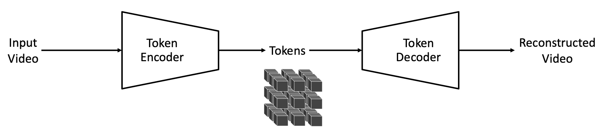

Na pipeline, um vídeo de entrada é codificado em tokens, que geralmente são muito mais compactos do que o vídeo de entrada. O decodificador então reconstrói o vídeo original a partir desses tokens. _O treinamento do tokenizer consiste em aprender o codificador e decodificador de modo a preservar ao máximo a informação visual nos tokens_.

Tokenizers existem em dois tipos: contínuos e discretos. Tokenizers contínuos codificam dados visuais em embeddings contínuos latentes, como nos modelos de difusão latente (latent diffusion models) tal como o _Stable Diffusion_ ou o _VideoLDM_. Esses embeddings são adequados para modelos que geram dados ao amostrar de distribuições contínuas.
Tokenizers discretos codificam dados visuais em códigos latentes discretos, mapeando-os para índices quantizados, como visto em transformers autorregressivos como o VideoPoet. Essa representação discreta é necessária para modelos como o GPT, que são treinados com _cross-entropy loss_.

> _**Tokenizers contínuos**_: codificam os dados em um espaço vetorial contínuo e de alta dimensionalidade. Eles são usados em modelos de difusão, pois esses modelos geram dados por meio de amostragem em distribuições contínuas. Esses embeddings permitem ao modelo interpolar e reamostrar variações nos dados de base.
>
> _**Tokenizers discretos**_: codificam dados em códigos latentes discretos, que são quantizados ou mapeados para um conjunto de índices finitos distintos. Esses tokenizers são usados com _modelos autorregressivos_ que geram sequências um token por vez. O artigo cita os _modelos GPT_ e como eles são treinados com cross-entropy loss;
> essa abordagem requer tokens discretos, pois trata o processo de geração como uma predição sobre um vocabulário fixo, sendo essa função de perda voltada a medir a diferença entre distribuições categóricas previstas e reais.
>
> A principal diferença entre os dois tipos de tokenizers está na forma como os tokenizers discretos mapeiam os valores de imagem para valores discretos ($\mathbb{N}$), enquanto tokenizers contínuos mapeiam para valores reais ($\mathbb{R}$), permitindo uma maior quantidade de valores no espaço latente (por exemplo, _"[...]espaço vetorial de alta dimensionalidade[...]”_).
>
> Modelos de difusão aprendem ao reverter um processo gradual de "adicionar ruído" a dados reais. Esse processo gradual é o motivo pelo qual tais modelos dependem de tokens com valores reais ($\mathbb{R}$).

O sucesso dos tokenizers depende, em grande parte, da sua habilidade de fornecer altas taxas de compressão sem comprometer a qualidade da reconstrução visual posterior. Por um lado, uma alta compressão reduz os requisitos de armazenamento e computação.
Por outro, uma compressão excessiva pode levar à perda de detalhes visuais essenciais. Esse equilíbrio representa um desafio importante no projeto de tokenizers.

A imagem a seguir ilustra os dois tipos de tokens:

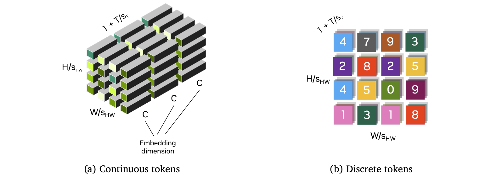
_"Figura S2.1-F1-ptbr — Visualização de Tokenizers contínuos e discretos"_

Tokens ao longo das dimensões espaciais ($\frac{H}{S_{HW}} \times \frac{W}{S_{HW}}$) e temporais ($1 + \frac{T}{S_T}$), com um fator de compressão espacial $S_{HW}$ e um fator de compressão temporal $S_T$. O primeiro token temporal representa o primeiro quadro da entrada, possibilitando a tokenização conjunta de imagens ($T=0$) e vídeos ($T>0$) em um espaço latente compartilhado.

> $S_{HW}$ é o **_fator de compressão espacial_** usado para comprimir as dimensões espaciais de uma imagem. Essa é uma etapa chave no processo de tokenização espacial, no qual o quadro de entrada é dividido em pequenos blocos ou regiões, cada um dos quais é representado por um ou mais tokens.
>
> Se a dimensão da imagem original for $224\times 224 \times 3$, e o _fator de compressão espacial_ for 16, a grade de tokens será de $14\times 14$, e cada token conterá informações sobre uma região de $16\times 16$ pixels.
>
> $S_T$ é o _fator de compressão temporal_, e é usado para reduzir o número de tokens que representam o eixo temporal agrupando quadros. Isso é aplicado no processo de _Tokenização Temporal_, para representar o número de quadros.
> A adição de $1$ permite ao modelo tratar o quadro inicial como um token especial, dando suporte à tokenização conjunta de imagens e vídeos. Se o processo for aplicado a uma imagem, $T=0$ e a dimensão temporal reduz-se a $1$.
>
> Se a imagem mencionada acima fizer parte de um vídeo com $32$ quadros, e o _fator de compressão temporal_ tiver valor $4$, o processo de tokenização produzirá 9 tokens temporais: $1$ para o primeiro quadro (adaptabilidade para lidar com imagens), e outros 8, cada um agrupando 4 quadros.

A tabela a seguir ilustra diferentes tokenizers visuais e suas capacidades:

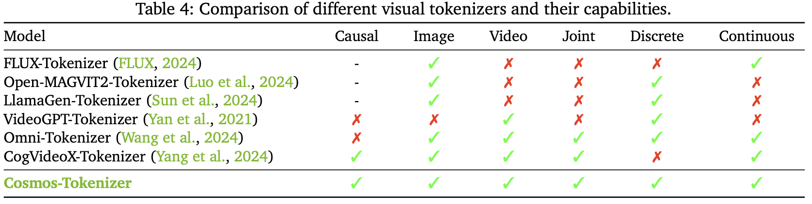
_"Figura S2.2-F2-ptbr — Diferentes Tokenizers e suas capacidades"_

O _Tokenizador Cosmos_ utiliza uma arquitetura leve e computacionalmente eficiente com um mecanismo temporal causal. Especificamente, ele emprega camadas de convolução temporal causal e camadas de atenção temporal causal para preservar a ordem temporal natural dos quadros de vídeo.

> O termo "causal" implica que qualquer predição sobre um determinado quadro ou ponto no tempo é baseada somente nesse quadro e em todos os quadros anteriores, nunca nos futuros. Portanto, "_Convolução Temporal Causal_" significa que a geração de características para um dado quadro utiliza apenas dados do quadro $t$ para trás.
>
> A mesma ideia aplica-se à "_Atenção Temporal Causal_", onde o tokenizer pondera dinamicamente em quais quadros focar ao tomar decisões sobre o quadro atual.

Os tokenizers são treinados diretamente em imagens de alta resolução e vídeos de longa duração, sem limitar as categorias ou proporções de aspecto. O _Cosmos Tokenizer_ opera em diferentes proporções de aspecto. Ele é agnóstico quanto à duração temporal durante a inferência, sendo capaz de tokenizar além da duração temporal usada durante o treinamento.

Os gráficos abaixo mostram a comparação de desempenho entre o _Cosmos Tokenizer_ e outros tokenizers, evidenciando a sua qualidade superior mesmo em taxas de compressão mais altas:

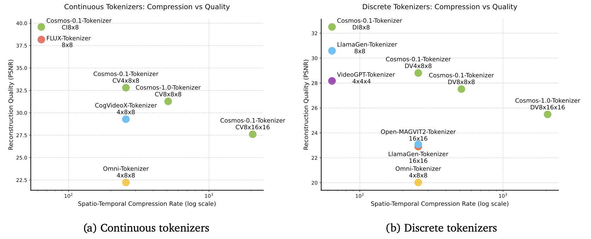
_"Figura S2.2-F3-ptbr — Comparações entre Tokenizers"_

### Arquitetura

O Cosmos Tokenizer é projetado com uma arquitetura encoder-decoder.
Dado um vídeo de entrada $x_{0:T}\in\mathbb{R^{(1+T)\times H\times W\times3}}$, com $H,\ W,\ T$ sendo a altura, largura e número de quadros, o encoder ($\varepsilon$) tokeniza as entradas em um vídeo de tokens $z_{0:T'}\in\mathbb{R^{(1+T)\times H\times W\times3}}$, com um fator de compressão espacial de $s_{H W}=\frac{H}{H'}=\frac{W}{W'}$ e um fator de compressão temporal de $S_T=\frac{T}{T'}$.
O decoder ($\mathcal{D}$) então reconstrói o vídeo de entrada a partir desses tokens, resultando no vídeo reconstruído $\hat{x}_{0:T} \in \mathbb{R^{(1 + T) \times H \times W \times 3}}$

$$\hat{x}_{0:T} = \mathcal{D}(\varepsilon(x_{0:T}))$$

> Esta é uma visão geral da arquitetura, onde o encoder codifica uma entrada $x_{0:T}$ em tokens $z_{0:T'}$, e o decoder decodifica esses tokens e produz $\hat{x}_{0:T}$.

Nossa arquitetura emprega um design temporalmente causal, garantindo que cada estágio processe apenas quadros atuais e passados. _Nosso tokenizer opera no wavelet space, onde as entradas são primeiro processadas por uma wavelet transform de 2 níveis_.
A wavelet transform mapeia o vídeo de entrada $x_{0:T}$ de forma agrupada para realizar um downsample das entradas por um fator de quatro ao longo das direções $x, y$ e $t$.
Os grupos são formados como: $\lbrace x_0, x_{1:4}, x_{5:8}, ..., x_{(T-3):T}\rbrace \rightarrow \lbrace g_0, g_1, g_2, ..., g_{T/4}\rbrace$. Estágios subsequentes do encoder processam esses quadros de forma temporalmente causal como $\lbrace g_0, g_{0:1}. g_{0:2}, ...\rbrace \rightarrow \lbrace \xi_0, \xi_1, \xi_2,...  \rbrace$.
Estágios posteriores seguem um esquema similar, produzindo finalmente os tokens $z_{0:T'}$.

> A _**wavelet transform**_ é uma técnica para processamento de sinais em múltiplas escalas e resoluções. Ela difere de transformadas mais tradicionais, como a _Fourier Transform_, que representam dados em termos de ondas senoidais e cossenoidais de frequência fixa, utilizando no lugar oscilações curtas e semelhantes a ondas, que podem ser escaladas e deslocadas.
> Esta transformada decompõe tanto variações espaciais quanto temporais (ao longo dos quadros), comprimindo e isolando mudanças bruscas em regiões suaves.
>
> O **_wavelet space_** é a representação de um sinal após passar por uma wavelet transform. Assim, a sentença "_[...]nosso tokenizer opera no wavelet space, onde as entradas são primeiro processadas por uma wavelet transform de 2 níveis[...]_" significa que cada dimensão espacial e temporal é decomposta, extraindo informações tanto de baixa frequência (globais) quanto de alta frequência.
>
> Durante o processo de aplicação da wavelet transform de 2 níveis, os dados são redimensionados em cada dimensão ($x, y, t$) por um fator de $4$. Assim, cada grupo de $4$ pixels ($x_{t:(t+3)}$) nas 3 dimensões da imagem é representado por um grupo comprimido ($g_i$).
>
> O tokenizer final utiliza a Haar Wavelet, que é uma das funções wavelet mais simples.
>
> 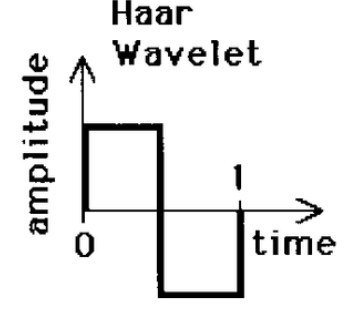
>
> Wavelet Transforms comprimem imagens por meio de decomposição, primeiro em uma aproximação de baixa resolução da imagem original, em seguida com detalhes verticais, horizontais, e diagonais, semelhante ao demonstrado abaixo:
>
> 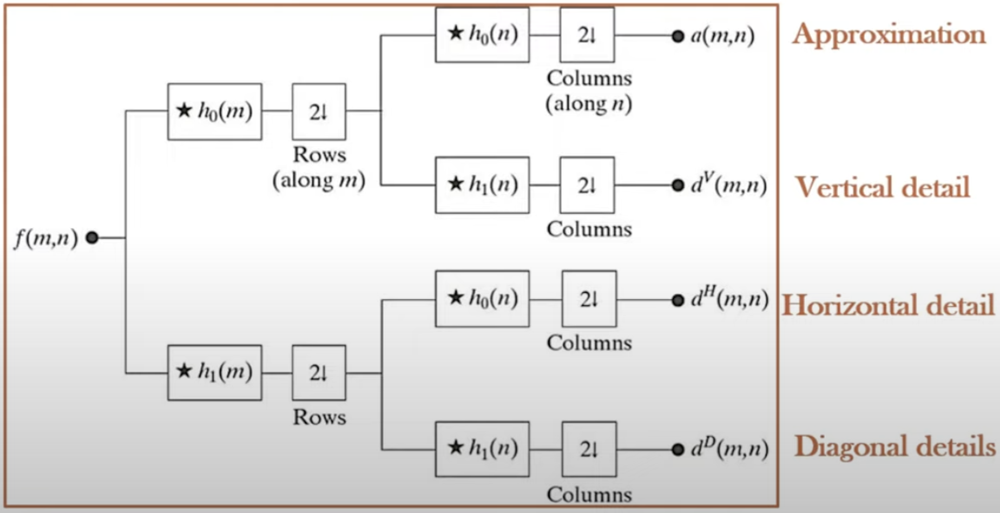
>
> Resultando em imagens comprimidas como esta:
>
> 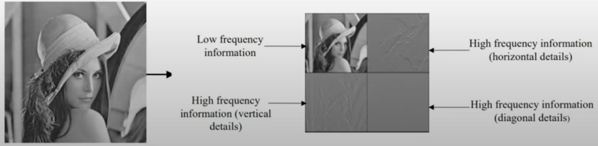

E uma transformada wavelet de 2 níveis teria uma aparência semelhante à seguinte:

> 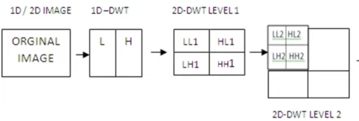

O design causal ajuda a adaptar modelos baseados no tokenizer para aplicações de Physical AI que frequentemente operam em cenários temporalmente causais. A wavelet transform nos permite operar sobre uma representação de vídeo mais compacta que elimina redundâncias na informação de pixel, permitindo que as camadas restantes foquem em compressão mais semântica.

Nossos estágios de encoder são implementados utilizando uma série de residual blocks intercalados com downsampling blocks.
Em cada bloco, utilizamos uma convolução 3D fatorada espaço-temporalmente, onde aplicamos primeiro uma convolução 2D com kernel de tamanho $1\times k\times k$ para capturar informações espaciais, seguida por uma convolução temporal com kernel de tamanho $k\times 1\times 1$ para capturar dinâmicas temporais. Utilizamos padding à esquerda de k-1 para garantir causalidade.

> Emprega convolução (2 + 1)D.

Para capturar dependências de longo alcance, utilizamos uma self-attention causal fatorada espaço-temporal com uma global support region.
Usamos a função de ativação Swish para não-linearidade. Utilizamos Layer Normalization (LayerNorm) em vez de Group Normalization (GroupNorm), o que evita o aparecimento de grandes magnitudes em regiões específicas do espaço latente ou das saídas reconstruídas. O decoder espelha o encoder, substituindo os downsampling blocks por um upsampling block.
A imagem abaixo mostra uma visão geral da arquitetura do Cosmos Tokenizer.

> Global support region para não-linearidade significa que os tokens interagem com todos os outros tokens disponíveis no momento (devido às restrições da arquitetura causal).
>
> A **_Swish activation function_**, definida por $\operatorname{Swish}^{\beta}(x) = x \cdot sigmoid(\beta x) = \frac{x}{1+e^{-\beta x}}$
>
> 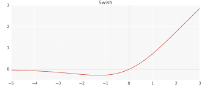

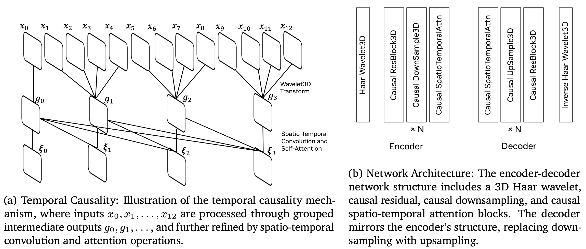

A imagem mostra a **arquitetura geral do Cosmos Tokenizer, ilustrando a integração da causalidade temporal com a estrutura encoder-decoder.** A causalidade temporal (à esquerda) processa entradas sequenciais, enquanto o encoder-decoder (à direita) utiliza transformadas wavelet e operações causais para capturar dependências espaciais e temporais nos dados.

> O bloco Haar Wavelet3D realiza o processo mostrado na visualização abaixo para um grupo de 4 valores em cada dimensão:
>
> 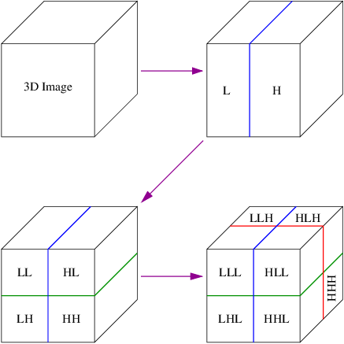
>
> Tanto o **_ResBlock3D_**, quanto o **_DownSampleBlock3D_** aplicam convoluções (2 + 1)D, com a diferença entre eles sendo a presença de "_skip connections_" para o **_ResBlock3D_**.
>
> O bloco **_Inverse Haar Wavelet3D_** nada mais é do que a inversão da transformada original, que pega os coeficientes wavelet e reconstrói a imagem (ou vídeo) original.
>
> O encoder e o decoder são separados do restante da arquitetura do modelo.

Utilizamos a formulação convencional de autoencoder (AE) para modelar o espaço latente do tokenizer contínuo. Para tokenizers discretos, adotamos o Finite-Scalar-Quantization (FSQ) como quantizador do espaço latente.
A dimensão latente para os tokenizers contínuos é 16, enquanto para os tokenizers discretos é 6, representando o número de níveis FSQ, que são $(8,8,8,5,5,5)$. Essa configuração corresponde a um vocabulário de tamanho $64.000$.

> O tokenizer contínuo utiliza uma arquitetura Autoencoder, onde uma rede neural comprime os dados de entrada para uma representação latente e depois reconstrói a entrada a partir dessa forma comprimida. A dimensão do espaço latente sendo $16$ significa que cada token é representado por um vetor contínuo de 16 dimensões.
>
> O tokenizer discreto utiliza Finite-Scalar-Quantization, que mapeia valores contínuos em um conjunto finito de níveis discretos, atribuindo a cada ponto no espaço latente um índice discreto. A dimensão latente no tokenizer discreto ainda é $6$, mas cada dimensão representa mais de um valor.
> Neste caso, as primeiras $3$ dimensões podem assumir $8$ valores possíveis, e as últimas três podem assumir $5$ valores cada, totalizando $8^3\times 5^3 = 64.000$ possíveis tokens discretos.

### Estratégia de Treinamento

Empregamos uma estratégia de treinamento conjunto alternando mini-batches de imagens e vídeos em uma frequência pré-definida. Supervisionamos apenas a saída final do decoder do nosso tokenizer. Não utilizamos losses auxiliares conectados aos espaços latentes.

> "_[...] mini-batches de imagens e vídeos em uma frequência pré-definida [...]_" significa que o modelo utiliza lotes de imagens e vídeos durante o treinamento, de maneira alternada, em uma frequência pré-estabelecida, ou seja, trocando entre eles a cada $N$ lotes.
>
> A ideia do treinamento conjunto para imagens e vídeos expõe a rede tanto a dados de um único quadro quanto a dados multi-quadro, tornando seu espaço latente mais apropriado para ambos os tipos de entrada.
>
> Tanto os tokenizers discretos quanto os contínuos mapeiam dados contínuos para um espaço latente, e a frase "_[...] Não utilizamos losses auxiliares conectados aos espaços latentes [...]_" significa que o treinamento não utiliza losses adicionais para estimular certos comportamentos ou propriedades (como desmembramento, compacidade ou interpretabilidade) nesse espaço latente.

Utilizamos um esquema de treinamento em duas etapas. Na primeira etapa, otimizamos com o _L1 Loss_, que minimiza a diferença RGB pixel a pixel entre o vídeo de entrada e o reconstruído ($\hat{x}_{0:T}$), dada por:

$$\mathcal{L}_1 = ||\hat{x}_{0:T} - x_{0:T}||_1$$

> $\mathcal{L}_1$ loss é outro nome para **_Erro Absoluto Médio_**. Em vez de elevar ao quadrado a diferença entre o valor previsto e o real (como no **_Mean Squared Error_**, ou $\mathcal{L}_2$ loss), toma-se o valor absoluto da diferença entre eles.
>
> A função é representada em [**_Notação de Einstein_**](https://en.wikipedia.org/wiki/Einstein_notation).

E o perceptual loss, baseado nas features do VGG-19, dado por:

$$\frac{1}{L}\sum_{l=1}^{L} \sum_{t}^{}{ \alpha_l || \mathrm{VGG}_l(\hat{x}_t) - \mathrm{VGG}_l(x_t) ||1}$$

Onde $\mathrm{VGG}_l(\cdot) \in \mathbb{R}^{H\times W\times C}$ são as features extraídas da $l$-ésima camada de uma rede **_VGG-19_** pré-treinada, $L$ é o número de camadas consideradas, e $\alpha_l$ é o peso da camada $l$.

> O perceptual loss é uma forma de analisar o quão bem uma imagem está sendo reconstruída, gerada ou aprimorada. Ele compara a representação das imagens no espaço de features em vez da diferença píxel a píxel. Enquanto o $\mathcal{L}_1$ loss mede a diferença entre duas imagens em cada etapa, o perceptual loss mede o quão "distantes" dois mapas de features estão um do outro.
>
> A função de loss acima determina quão diferente está o mapa de features (calculando o $\mathcal{L}_1$ loss) em uma camada $l$ do modelo VGG-19, entre a imagem real e a imagem gerada nessa camada. Após medir as diferenças absolutas, multiplica-se esse valor pelo peso da camada ($\alpha_l$).

Na segunda etapa, utilizamos a optical flow ($\mathrm{OF}$) loss para tratar a suavidade temporal dos vídeos reconstruídos:

$$\frac{1}{T}\sum_{t=1}^{T}||\mathrm{OF}(\hat{x}_{t}, \hat{x}_{t - 1}) - \mathrm{OF}({x}_{t}, {x}_{t - 1})||_1 + \frac{1}{T}\sum_{t=0}^{T - 1}||\mathrm{OF}(\hat{x}_{t}, \hat{x}_{t - 1}) - \mathrm{OF}({x}_{t}, {x}_{t - 1})||_1$$

> **_Optical Flow_** é o movimento aparente de objetos, superfícies e contornos entre quadros consecutivos de uma sequência de vídeo. Ele cria um campo vetorial onde cada vetor representa o movimento de um pixel de um quadro para o seguinte, ajudando a entender como e onde ocorre o movimento em uma cena.
>
> Esse loss é utilizado para estimular que o modelo de vídeo preserve os padrões de movimento do vídeo original. $\mathrm{OF}(\hat{x}_{t}, \hat{x}_{t - 1})$ é o optical flow entre os quadros reconstruídos, e $\mathrm{OF}(x_{t}, x_{t - 1})$ é o optical flow entre os quadros reais.
>
> A função $\mathcal{L}_{Flow}$ soma o $\mathcal{L}_1$ loss entre todos os pares consecutivos de quadros do vídeo reconstruído e do original. Isso penaliza discrepâncias temporais entre os frames reconstruídos e originais.

Além disso, utilizamos o adversarial loss na etapa de fine-tuning para melhorar ainda mais os detalhes da reconstrução, especialmente em taxas de compressão elevadas.

> O adversarial loss é uma técnica empregada em _GANs_, onde uma rede discriminadora tenta distinguir entre imagens reais e geradas.

Treinamos os tokenizers de imagem (CI e DI) em duas taxas de compressão: $8\times 8$ e $16\times 16$. De maneira análoga, treinamos os tokenizers de vídeo (CV e DV) em três taxas de compressão: $4\times 8\times 8$, $8\times 8\times 8$, e $8\times 16\times 16$.
Aqui, as taxas de compressão são $H\times W$ para imagens e $T\times H\times W$ para vídeos, onde $T$ é a dimensão temporal, e $H$ e $W$ são as dimensões espaciais.

> As taxas de compressão determinam o quanto da resolução de entrada é reduzida durante a tokenização.

Para os tokenizers de vídeo, criamos duas variantes:

1. **Cosmos-0.1-Tokenizer**: treinado utilizando mini-batches com menor quantidade de frames por vídeo ($49$ frames para CV e $17$ frames para DV).
2. **Cosmos-1.0-Tokenizer**: treinado utilizando mini-batches com maior quantidade de frames por vídeo ($121$ frames para CV e $49$ frames para DV).

Essa abordagem garante flexibilidade no tratamento de diferentes resoluções espaciais e temporais para dados de imagem e vídeo.

### Resultados

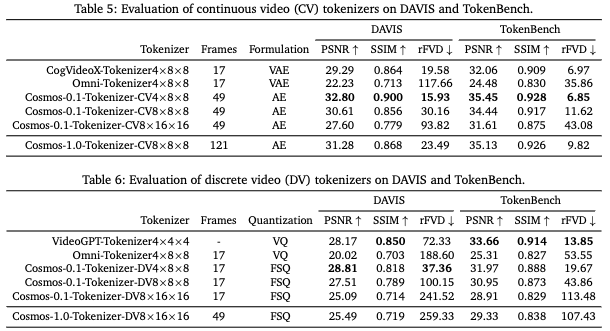
_"Figura S2.2-F4-ptbr — Avaliação 1 de Tokenizers"_

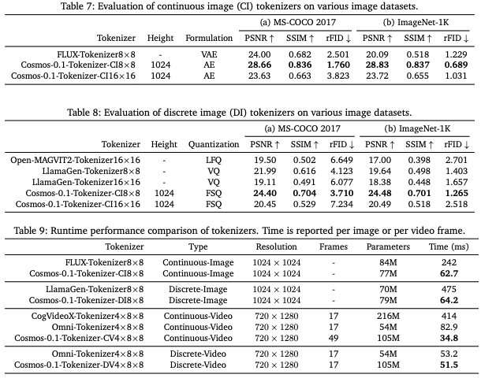
_"Figura S2.2-F5-ptbr — Avaliação 2 de Tokenizers"_

Nós avaliamos nossa suíte Cosmos Tokenizer em vários datasets benchmark de imagens e vídeos. Para a avaliação dos image tokenizers, seguimos trabalhos anteriores para avaliar o **MS-COCO 2017** e o **ImageNet-1K**. Utilizamos o subconjunto de validação do **MS-COCO 2017** com $5.000$ imagens, e o subconjunto de validação do **ImageNet-1K** com $50.000$ imagens como benchmark para avaliação de imagens.

**TokenBench**. Para avaliação dos video tokenizers, ainda não existe um benchmark padrão para vídeos de alta resolução e longa duração. Para isso, introduzimos um benchmark chamado _TokenBench_ para cobrir uma ampla variedade de domínios, incluindo manipulação robótica, direção, egocêntrico e vídeos da web, padronizando assim a avaliação.
Utilizamos datasets de vídeo existentes que são comumente usados para várias tarefas, incluindo **BDD100K**, **EgoExo-4D**, **BridgeData V2**, e **Panda-70M**.
Amostramos aleatoriamente $100$ vídeos de cada dataset e pré-processamos pegando os primeiros $10$ segundos e redimensionando a menor dimensão para $1080$. Para o **Panda-70M**, filtramos manualmente vídeos com conteúdo de baixa qualidade e poucos movimentos. Para o **EgoExo-4D**, selecionamos aleatoriamente $100$ cenas e amostramos um vídeo egocêntrico e um exocêntrico.
Isso resulta em um total de $500$ vídeos.

> Imagens **Egocentric** são do ponto de vista da primeira pessoa, enquanto imagens **Exocentric** são de pontos de vista de terceira pessoa.

Além do _TokenBench_, também avaliamos nossos video tokenizers no dataset **DAVIS** em resolução de $1080p$.

**Baselines e métricas de avaliação**. Avaliamos nossos tokenizers com diferentes taxas de compressão para demonstrar sua eficácia para diversas necessidades computacionais.
Comparamos cada um desses tokenizers com os state-of-the-art tokenizers de imagem e vídeo. As métricas de avaliação incluem **_Peak Signal-to-Noise Ratio (PSNR)_**, **_Structural Similarity(SSIM)_**, **_reconstruction Fréchet Inception Distance (rFID)_** para imagens e **_reconstruction Fréchet Video Distance (rFVD)_** para vídeos.

> **_Peak Signal-to-Noise Ratio (PSNR)_**: Mede a diferença média entre as imagens/vídeos originais e reconstruídos focando na fidelidade a nível de pixel. Valores mais altos de **PSNR** indicam melhor qualidade e menos distorção (não necessariamente para a percepção humana).
> $$PSNR = 10 \cdot \log_{10} \left(\frac{{MAX}_I^2}{MSE}\right)$$
> Onde $MAX$ é o valor máximo possível de pixel da imagem ($255$ para imagens de $8$ bits).
>
> **_Structural Similarity Index Measure (SSIM)_**: Mede a similaridade estrutural percebida comparando luminância, contraste e estrutura. Essa métrica está mais alinhada com a visão humana, em comparação ao $PSNR$.
> $$SSIM(x, \hat{x}) = \frac{(2\mu_x\mu_{\hat{x}} + c_1)(2\sigma_{x\hat{x}} + c_2)}{(\mu_x^2 + \mu_{\hat{x}}^2 + c_1)(\sigma_x^2 + \sigma_{\hat{x}}^2 + c_2)}$$
> Onde:
>
> - $\mu_x, \mu_{\hat{x}}$ são as médias dos patches originais e reconstruídos.
> - $\sigma_x^2, \sigma_{\hat{x}}^2$ são as variâncias dos patches.
> - $\sigma_{x\hat{x}}$ é a covariância entre os patches.
> - $c_1, c_2$ são pequenas constantes para estabilizar a divisão.
>
> **_reconstruction Fréchet Inception Distance (rFID)_**: Mede a similaridade distributiva entre as features abstratas das imagens originais e reconstruídas. Valores mais baixos indicam que as reconstruções são mais estatisticamente similares às imagens reais em espaços de características de alto nível.
> $$rFID(X,Y) = ||\mu_X - \mu_Y||_2^2 + Tr \left(\sum X + \sum Y - 2(\sum X\sum Y)^{1/2}\right)$$
>
> - $X,Y$ são coleções de features das imagens reais e reconstruídas.
> - $\mu_X, \mu_Y$ são as médias dos vetores de features originais e reconstruídos.
> - $\sum X, \sum Y$ são as matrizes de covariância.
> - $Tr$ é o traço da matriz.
>
> **_reconstruction Fréchet Video Distance (rFVD)_**: Mede o quão próxima está a distribuição dos vídeos reconstruídos dos vídeos reais em espaços de features. Valores mais baixos indicam não só vídeos mais realistas, mas também movimentos e dinâmicas temporais que correspondem aos vídeos originais.
> $$rFVD(X,Y) = ||\mu_X - \mu_Y||_2^2 + Tr \left(\sum X + \sum Y - 2(\sum X\sum Y)^{1/2}\right)$$
>
> - $X,Y$ são coleções de features dos vídeos reais e reconstruídos.
> - $\mu_X, \mu_Y$ são as médias dos vetores de features originais e reconstruídos.
> - $\sum X, \sum Y$ são as matrizes de covariância.
> - $Tr$ é o traço da matriz.

**Resultados quantitativos** Como mostrado nas tabelas ($5,6$), o Cosmos Tokenizer alcança desempenho state-of-the-art em todas as métricas comparadas a trabalhos anteriores tanto no dataset de vídeo _DAVIS_ quanto no _TokenBench_, com uma taxa de compressão espaço-temporal de $4\times 8\times 8$.
Além disso, mesmo com taxas de compressão $2\times$ e $8\times$ maiores, o Cosmos Tokenizer frequentemente é comparável ou até melhor do que trabalhos anteriores com taxa de compressão $8\times 8$, como mostrado nas tabelas $7$ e $8$.

Como mostrado nessas tabelas, comparado a trabalhos anteriores, o Cosmos Tokenizer consistentemente alcança resultados de state-of-the-art com taxa de compressão $8\times 8$. Mais importante, numa taxa de compressão $4\times$ maior de $16\times 16$, a qualidade da imagem do Cosmos Tokenizer é frequentemente comparável ou até melhor do que trabalhos anteriores em $8\times 8$.

Como mostrado na tabela $9$, para ambos image e video tokenizers, o Cosmos Tokenizer é de $2\times$ a $12\times$ mais rápido enquanto mantém o menor tamanho de modelo comparado a trabalhos anteriores, demonstrando que o Cosmos Tokenizer tem alta eficiência para codificação e decodificação de conteúdo visual.

---

## Referências | References

- [Cosmos World Foundation Model Platform for Physical AI arXiv:2501.03575](https://arxiv.org/abs/2501.03575)

- [What is Wavelet Transform?Fourier vs Wavelet Transform|CWT-DWT|Wavelet Transform in Image Processing](https://www.youtube.com/watch?v=pUty-98Km_0)

- [Discrete tools for virtual sculpture - Scientific Figure on ResearchGate. Available from: https://www.researchgate.net/figure/D-Haar-wavelet-decomposition_fig1_220868824 [accessed 24 Jul 2025]](https://www.researchgate.net/figure/D-Haar-wavelet-decomposition_fig1_220868824)

- [NVIDIA Lança Plataforma Cosmos World Foundation Model para Acelerar o Desenvolvimento da IA Física](https://blog.nvidia.com.br/blog/nvidia-lanca-plataforma-cosmos-world-foundation-model-para-acelerar-o-desenvolvimento-da-ia-fisica/)

- [Uber Teams Up with NVIDIA to Accelerate Autonomous Mobility](https://investor.uber.com/news-events/news/press-release-details/2025/Uber-Teams-Up-with-NVIDIA-to-Accelerate-Autonomous-Mobility/default.aspx)
