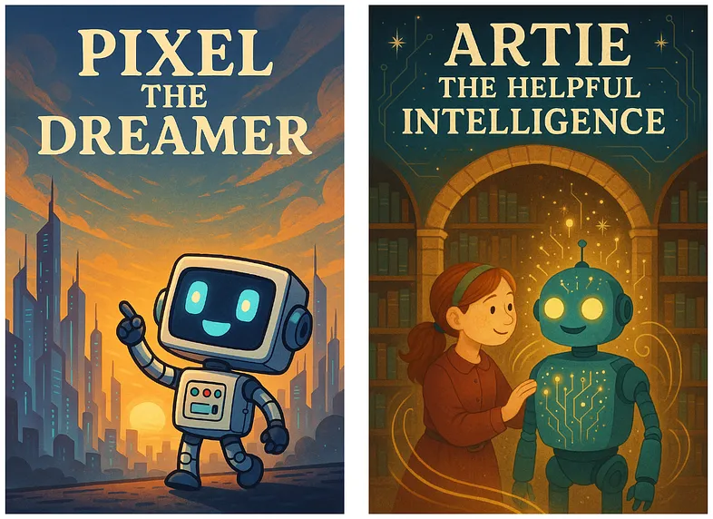

# Data Science Collective - Tokenization

- [Data Science Collective Tokenization](#dsc-tokenization) -[Português](#português) -[Visão Geral](#visao-geral) -[English](#english) -[Overview](#overview) -[Architecture](#architecture) -[Referências](#referências)

## Português

## Visão Geral

## **English**

### **Overview**

Generative AI has profoundly transformed our daily lives in recent years, enabling everything from automated summaries and translations to code generation and even personalized learning support.

The essential “currency” behind this advanced technology is the token. Most models charge based on the number of input tokens you provide and the output tokens they generate.

But what is a token, for the processing of which we pay so much? Gaining a clear understanding of tokens is crucial for building more efficient applications.

Understanding tokens allows for more efficient and timely use of generative AI, such as large language models.

And honestly, who wouldn’t want to save time and money?

So, let’s dive in: What are tokens, how are they generated from text, and what are their key characteristics?

Understanding these basics is the first step toward making the most of generative AI.

### **What is Tokenization?**

Tokenization is the text preprocessing step in NLP tasks that splits the input text into individual sub-words, words, or characters.

A token is the smallest unit of measurement processed by a generative AI model.

During the training process of a generative AI model, these tokens are provided to the model.

The size of a token (one input unit) varies between models. There is no unified tokenization strategy. The developers choose the tokenization strategy that will be applied.

You can get an impression of various tokenization strategies by experimenting with this Hugging Face tokenization project, which visualizes these strategies for popular models.


> The _Tokenizer Playground_ visualizes how a large language model splits text into individual tokens. Here, the sentence “The quick brown fox jumps over the lazy dog.” is divided into 10 tokens, demonstrating the first step in the LLM text processing pipeline.

This means that each model can only be used for inference in combination with the tokenizer it was trained on.

After training, unique tokens are stored in a special set.

This set is called the vocabulary for Large Language Models, and the Cookbook for image and audio generation models.

### **Simple tokenization methods**

The simplest tokenization approaches are word-level tokenization and character-level tokenization.

Word-level tokenization splits the input text by whitespaces and special characters, such as commas, question marks, or exclamation points.

After splitting the text into words, a vocabulary is created from the unique tokens.

In this vocabulary, each token is mapped to an integer.

The vocabulary can be used to transform each sentence into a numerical vector representation.


However, as soon as we want to encode text that is not from the input corpus and contains words not included in the vocabulary, not all words can be tokenized.

These words are referred to as out-of-vocabulary tokens and are represented by a special token, such as <|unk|>.

So “Out-of-vocabulary” is AI’s polite way of saying, “No idea what you just said, but here’s a generic response.”


One way to address this problem is character-level tokenization.

This tokenization strategy processes text at the character level, resulting in a much smaller vocabulary size.

Thus, instead of one token per word, a word is represented by a combination of many tokens.

Unfortunately, this strategy also has its flaws.

Because tokenization is performed at the character level, the tokens lose contextual meaning, which makes it more difficult for the model to learn grammar.

Moreover, this tokenization strategy results in longer sequences.

Zoom image will be displayed


> Character-level tokenization: Every character in “The quick brown fox” is assigned a unique token ID, resulting in longer token sequences but eliminating out-of-vocabulary issues.

This highlights that both tokenization strategies have their problems.

For this reason, models such as ChatGPT use a method that strikes a balance between both — Byte Pair Encoding (BPE), which will be covered in the next post of this series.

For now, let’s deepen this knowledge by building a simple word tokenizer ourselves to better understand how it works.

## **Tokenization in the LLM text generation process**

The relevance of tokenization becomes clear when you see where it is situated in the text generation process of LLMs.

When you pass an input query to an LLM, your text is split into tokens and ingested into the model. These tokens are the essential units you are paying for, and they are subsequently turned into numbers so that the machine can “understand” them.

After an answer has been generated by the LLM, it returns a list of numerical tokens, which are then detokenized so that we humans can understand the output — because unfortunately, we are not as fast as computers at processing numbers.

For these input and output tokens, the LLM providers make us pay. So it makes sense to keep both ends as short as possible, which decreases processing time and saves money.


## **4 Ways to Save Input and Output Tokens**

In the last sections, we learned what tokens are and that we pay for input and output tokens when using models. Hence, the input and output prompts should be as precise as possible.

Saving tokens is the AI equivalent of turning off the lights when you leave the room.


So, to save energy, switch off your light and don’t let your AI workflow run in an infinite loop processing endless tokens, no matter how cheap they are.

Here are three tips on how this goal can be achieved.

**1.Remove Unnecessary Context**
Strip out repetitive instructions, greetings, sign-offs, or irrelevant details. Only include what the model needs to know to generate a high-quality response

**2.Optimize Prompt Engineering**
Use concise and clear instructions. Avoid verbose explanations or unnecessary examples. Carefully designed prompts can reduce input size and guide the model more efficiently.

**3.Set Maximum Output Lengths**
Most LLM APIs allow you to set a maximum token limit for outputs (e.g., _max_tokens_). Adjust this setting to ensure the model’s response isn’t longer than needed.
**4.Chunk Large Tasks**
If you have a large document or task, break it into smaller parts and process them sequentially. This reduces per-request token usage and allows you to reuse context, saving both input and output tokens.

**Implementation of word level tokenizing**
In the following Python code blocks, we will implement word-level tokenization, breaking down every step for a deeper understanding.

The two texts used for this example are fairy tales generated by ChatGPT using the prompt: “Generate a fairy tale about AI.”

The results in my case were “Arti the Useful Intelligence” and “Pixel the Dream.”

Both texts will be tokenized by words in the subsequent lines of code.



> AI fairy tales in tokenization: “Pixel the Dreamer” and “Artie the Helpful Intelligence” are two example texts used for demonstrating word-level tokenization in this tutorial.

You can find the entire Jupyter notebook in the Python [GitHub repo](https://github.com/FLX-20/AI-Explained) for this post series.

**Loading the text files**

First, we load the text from the text file in our Python environment.

```
import re

def open_txt_file(file_path):
    with open(file_path, 'r') as file:
        content = file.read()
    return content
```

The loaded text can be checked by printing out the first 100 characters of both stories.

```
text_1 = open_txt_file('pixel-the-dreamer.txt')
print(text_1[:100] + "...")
```

```
text_2 = open_txt_file('artie-the-helpful-intelligence.txt')
print(text_2[:100] + "...")
```

**Generate vocabulary and reverse vocabulary**
Now, we build our vocabulary including all unique words of the input text.

The vocabulary defines how each word is mapped to an integer value.

This is achieved by first splitting the text by white spaces and special characters using regular expressions.

Depending on the chosen regular expression, white spaces can be considered as a token type or can be completely ignored.

The choice of removing white spaces depends on the application. While the removal of this character type decreases compute resource demands, keeping white spaces is beneficial for processing programming languages.

In some programming languages, these white spaces are essential due to indentation and spacing sensitivity and cannot be ignored.

In the example above, the white spaces are ignored because we are dealing with raw text, which is not indentation sensitive.

You can include white spaces by using this regular expression:

```
r’(\w+|\s+|^\w\s])’
```

Afterwards, remaining white spaces are stripped away from the tokens so that only the word or special character is left.

Moreover, a reverse vocabulary is generated, which is necessary for converting the tokens back into text.

```
def generate_vocab(text):
    chunks = re.split(r'(\w+|[^\w\s])', text)
    unique_tokens = [c for c in chunks if c.strip()]
    encode_vocab = {token: idx for idx, token in enumerate(unique_tokens)}
    decode_vocab = {idx: token for idx, token in enumerate(unique_tokens)}

    return encode_vocab, decode_vocab
```

```
encode_vocab, decode_vocab = generate_vocab(text_1)
```

Let’s take a look at our vocabulary creation.

```
print("Vocabulary (token -> index):")
for idx, token in enumerate(encode_vocab):
    print(f"{idx} -> '{token}'")
```

Overall, our vocabulary consists of 204 unique words.

```
print("Number of unique tokens:", len(encode_vocab))
```

**Tokenizing a text**
Now we are ready to tokenize input texts based on the created vocabulary.

The tokenization process starts similarly to the vocabulary creation process.

The text is split into words and special characters, using the same regular expression as before.

Afterwards, the vocabulary is used to replace each word in the text either with its corresponding number from the vocabulary or the <|unk|> token if the word does not exist in the vocabulary.

In the end, the final tokenized text representation is returned.

```
def encode_text(text, encode_vocab):
    tokens = re.split(r'(\w+|[^\w\s])', text)
    tokens = [t for t in tokens if t.strip()]
    tokens = [encode_vocab.get(token, "<|unk|>") for token in tokens]
    return tokens
```

Let’s test the previous tokenization function on the initial text, which was also used for creating the vocabulary.

```
encoded_text = encode_text(text_1, encode_vocab)
print("Encoded text:", encoded_text)
```

Now, let’s also test the function of the second text, which was not used for the vocabulary generation.

```
encoded_text = encode_text(text_2, encode_vocab)
print("Encoded text:", encoded_text)
```

You can see it happened exactly as we previously predicted. Not all words from the second text are present in the first text, which was used to generate the vocabulary.

This results in many unknown out-of-vocabulary tokens.

Right now, we have two possibilities to solve this problem: We can either use character-level tokenization, or we can add the out-of-vocabulary words to our vocabulary.

Now it’s your turn: Use the knowledge gained in this blog post to implement character-level tokenization to solve the error.

In the next code block, we will follow up by adding the unknown words to the vocabulary.

This is achieved by adding both texts together, separated by the <|endoftext|> token, which indicates to the model that the next text is unrelated to the previous one.

Afterwards, the same functions are reused for generating the token representation of the input text.

```
text_corpus = text_1 + " <|endoftext|> " + text_2
encode_vocab, decode_vocab = generate_vocab(text_corpus)
encoded_text = encode_text(text_2, encode_vocab)
print("Encoded text:", encoded_text)
```

**Detokenization**

In the end, we would like to go back to the original text from the token representation, so that we humans can understand and interpret it.

This is exactly the step that happens after a Large Language Model generates its output. The numerical representations produced by the LLM are converted back by the detokenizer into textual information.

Here, we need the reverse vocabulary, which maps tokens back to words.

The detokenization process is similar to the tokenization process.

You take the numbers from the token list and replace them with the corresponding words from the vocabulary, separated by white space.

These white spaces are removed in front of special characters because they are always attached to a word.

The final list is returned and printed out.

```
def decode_text(tokens, decode_vocab):
    text = ' '.join(decode_vocab.get(idx,'<|unk|>') for idx in tokens)
    text = re.sub(r'\s([?.!,"](?:\s|$))', r'\1', text)
    return text
```

```
decode_text = decode_text(encoded_text, decode_vocab)
print(decode_text)
```

**Conclusion**
In this exploration of tokenization, we uncovered the fundamental building blocks that power modern generative AI systems.

The post highlighted that there are different tokenization strategies, which vary between models.

The two simplest tokenization strategies — word-level and character-level tokenization — were introduced and implemented, with their pros and cons discussed.

The encountered out-of-vocabulary problem of word tokenization, as well as the large token list length of character-level encoding, highlighted that an intermediate solution is needed.

This solution is Byte Pair Encoding (BPE), which is used by almost all modern models.

Due to its high importance for so many current large language models, it will be explored in its own post in the next part of this series.

So, if you are curious to learn more about AI, subscribe to this blog so you don’t miss any step as we demystify Large Language Models together.

## Referências

[The Invisible Building Blocks of AI: What You Need to Know About Tokenization](https://medium.com/data-science-collective/the-invisible-building-blocks-of-ai-what-you-need-to-know-about-tokenization-acadd86a63ba)
