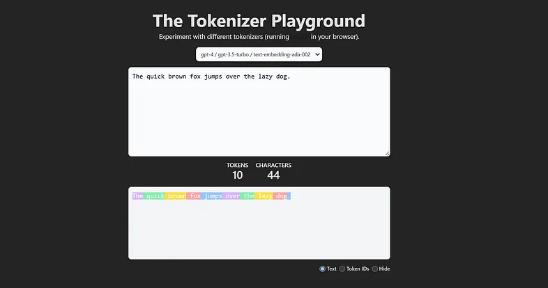
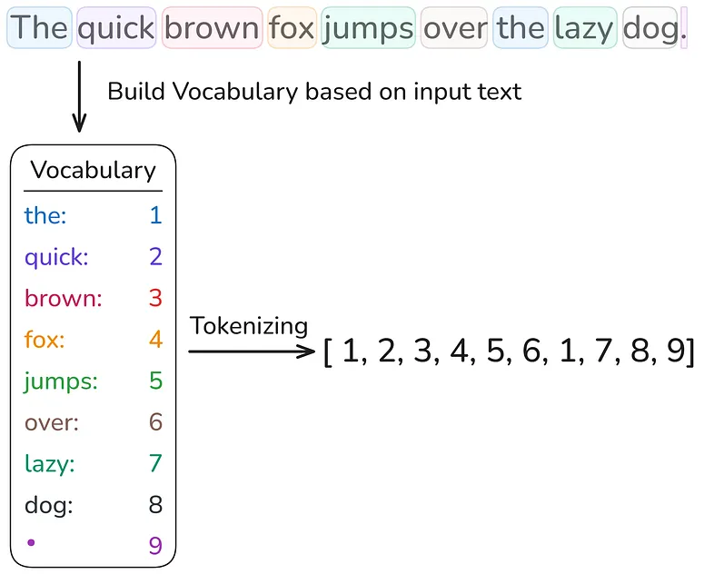
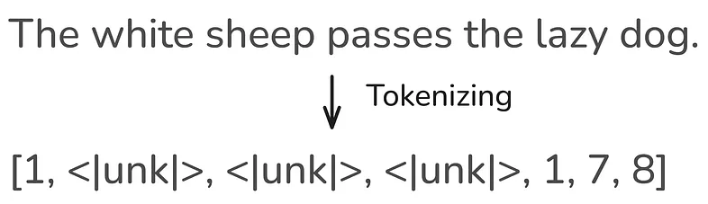
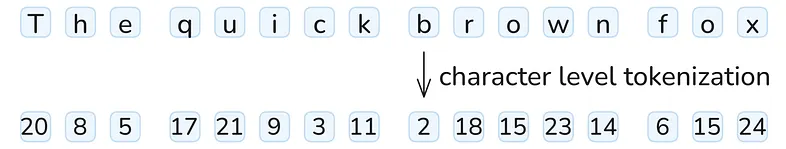
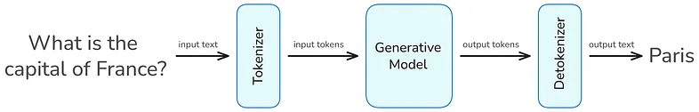
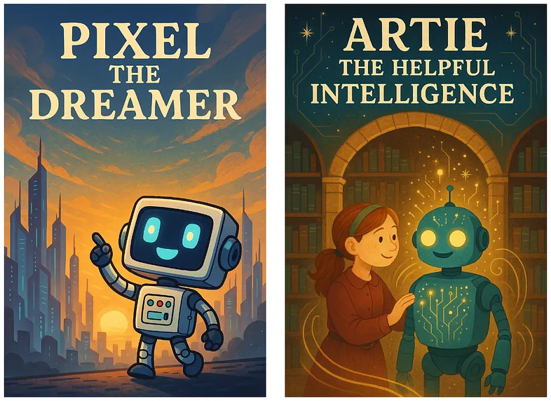

# Data Science Collective - Tokenization

**_Authors / Autores: [@yuri-sl](http://github.com/yuri-sl)_, [@figredos](http://github.com/figredos)**

## Português

### Visão geral

A IA generativa transformou profundamente nosso cotidiano nos últimos anos, possibilitando desde resumos e traduções automatizadas até geração de código e até suporte a aprendizado personalizado. A “moeda” essencial por trás dessa tecnologia avançada é o token. A maioria dos modelos cobra com base no número de tokens de entrada fornecidos e nos tokens de saída que geram.

Mas o que é um token, pelo processamento do qual pagamos tanto? Entender o que são tokens, como são gerados a partir de texto e quais são suas principais características são os primeiros passos para construir aplicações mais eficientes e aproveitar ao máximo a IA generativa.

### O que é Tokenização?

Tokenização é a etapa de pré-processamento de texto em tarefas de PLN que divide o texto de entrada em subpalavras, palavras ou caracteres individuais. Um token é a menor unidade de medida processada por um modelo de IA generativa. Durante o treinamento, esses tokens são fornecidos ao modelo para processamento. O tamanho de um token (uma unidade de entrada) varia entre os modelos. Não há uma estratégia unificada de tokenização; elas são escolhidas pelos desenvolvedores de acordo com a tarefa em questão.

É possível ter uma noção de várias estratégias de tokenização experimentando este projeto de tokenização do Hugging Face, que visualiza essas estratégias para modelos populares.



_O Tokenizer Playground visualiza como um grande modelo de linguagem divide o texto em tokens individuais. Aqui, a frase “The quick brown fox jumps over the lazy dog.” é dividida em 10 tokens, demonstrando a primeira etapa no pipeline de processamento de texto de um LLM._

> Isso significa que cada modelo só pode ser usado para inferência em combinação com o tokenizador no qual foi treinado.

Após o treinamento, tokens únicos são armazenados em um conjunto especial chamado vocabulário para Grandes Modelos de Linguagem, e no Cookbook para modelos de geração de imagem e áudio.

### Métodos simples de tokenização

As abordagens mais simples de tokenização são a tokenização em nível de palavra e a tokenização em nível de caractere.

- **Tokenização em nível de palavra** : divide o texto de entrada por espaços em branco e caracteres especiais, como vírgulas, pontos de interrogação ou pontos de exclamação. Depois de dividir o texto em palavras, cria-se um vocabulário a partir dos tokens únicos, onde cada token é mapeado para um inteiro. O vocabulário pode ser usado para transformar cada sentença em uma representação vetorial numérica.
  - 

No entanto, assim que se deseja codificar texto que não é do corpus de entrada e contém palavras não incluídas no vocabulário, nem todas as palavras podem ser tokenizadas. Essas palavras são chamadas de fora do vocabulário e são representadas por um token especial, como `<|unk|>`. Portanto, “Fora do vocabulário” é a forma educada da IA de dizer: “Não faço ideia do que você acabou de dizer, mas aqui vai uma resposta genérica.”



Uma forma de lidar com esse problema é a tokenização em nível de caractere.

- **Tokenização em nível de caractere**: processa o texto no nível de caracteres, resultando em um tamanho de vocabulário muito menor. Assim, em vez de um token por palavra, uma palavra é representada por uma combinação de muitos tokens.

Infelizmente, essa estratégia também tem suas falhas. Como a tokenização é realizada no nível de caractere, os tokens perdem o significado contextual, o que torna mais difícil para o modelo aprender gramática. Além disso, essa estratégia de tokenização resulta em sequências mais longas.



_Tokenização em nível de caractere: Cada caractere em “The quick brown fox” recebe um ID de token único, resultando em sequências de tokens mais longas, mas eliminando problemas de fora do vocabulário._

Isso evidencia que ambas as estratégias de tokenização têm seus problemas. Por essa razão, modelos como o ChatGPT usam um método que encontra um equilíbrio entre ambas — Byte Pair Encoding (BPE), que será abordado no próximo post desta série.

### Tokenização no processo de geração de texto de LLMs

A relevância da tokenização fica clara quando se vê onde ela se situa no processo de geração de texto dos LLMs.

Ao enviar uma consulta de entrada a um LLM, o texto é dividido em tokens e ingerido pelo modelo. Esses tokens são as unidades essenciais pelas quais se paga, e são subsequentemente transformados em números para que a máquina possa “entendê-los”.

Após a geração de uma resposta pelo LLM, ele retorna uma lista de tokens numéricos, que então são destokenizados para que humanos possam entender a saída — porque, infelizmente, não somos tão rápidos quanto os computadores no processamento de números.

Por esses tokens de entrada e saída, os provedores de LLM nos cobram. Portanto, faz sentido manter ambos os lados o mais curtos possível, o que diminui o tempo de processamento e economiza dinheiro.



### 4 maneiras de economizar tokens de entrada e saída

Economizar tokens é o equivalente, na IA, a apagar as luzes ao sair do cômodo.


Então, para economizar energia, apague sua luz e não deixe seu fluxo de trabalho de IA rodar em um loop infinito processando tokens sem fim, por mais baratos que sejam. Aqui estão três dicas de como atingir esse objetivo.

1.Remove Unnecessary Context
Remova instruções repetitivas, saudações, despedidas ou detalhes irrelevantes. Inclua apenas o que o modelo precisa saber para gerar uma resposta de alta qualidade

2.Optimize Prompt Engineering
Use instruções concisas e claras. Evite explicações verbosas ou exemplos desnecessários. Prompts bem elaborados podem reduzir o tamanho da entrada e guiar o modelo com mais eficiência.

3.Set Maximum Output Lengths
A maioria das APIs de LLM permite definir um limite máximo de tokens para saídas (por exemplo, _max_tokens_). Ajuste essa configuração para garantir que a resposta do modelo não seja mais longa do que o necessário.
4.Chunk Large Tasks
Se houver um documento ou tarefa grande, divida-o em partes menores e processe-as sequencialmente. Isso reduz o uso de tokens por requisição e permite reutilizar contexto, economizando tokens de entrada e de saída.

### Implementação de tokenização word-level

Nos blocos de código Python a seguir, implementaremos a tokenização word-level , detalhando cada etapa para uma compreensão mais profunda. Os dois textos usados neste exemplo são contos de fadas gerados pelo ChatGPT usando o prompt: “Generate a fairy tale about AI”, e os resultados, no meu caso, foram “Arti the Useful Intelligence” e “Pixel the Dream.” Ambos os textos serão tokenizados por palavras nas linhas de código subsequentes.



_Contos de fadas de IA na tokenização: “Pixel the Dreamer” e “Artie the Helpful Intelligence” são dois textos de exemplo usados para demonstrar a tokenização word-level neste tutorial._

É possível encontrar todo o notebook Jupyter no repositório [GitHub de Python](https://github.com/FLX-20/AI-Explained) para esta série de posts.

#### Carregando os arquivos de texto

Primeiro, carregamos o texto do arquivo de texto no nosso ambiente Python.

```python
import re

def open_txt_file(file_path):
    with open(file_path, 'r') as file:
        content = file.read()
    return content
```

O texto carregado pode ser verificado imprimindo os primeiros 100 caracteres de ambas as histórias.

```python
text_1 = open_txt_file('pixel-the-dreamer.txt')
print(text_1[:100] + "...")
```

```python
text_2 = open_txt_file('artie-the-helpful-intelligence.txt')
print(text_2[:100] + "...")
```

#### Gerar vocabulário e vocabulário reverso

Agora, construímos nosso vocabulário incluindo todas as palavras únicas do texto de entrada. O vocabulário define como cada palavra é mapeada para um valor inteiro, e isso é feito primeiro dividindo o texto por espaços em branco e caracteres especiais usando expressões regulares. Dependendo da expressão regular escolhida, espaços em branco podem ser considerados um tipo de token ou podem ser completamente ignorados.

A escolha de remover espaços em branco depende da aplicação. Embora a remoção desse tipo de caractere diminua a demanda por recursos computacionais, manter espaços em branco é benéfico para o processamento de linguagens de programação; em algumas linguagens de programação, esses espaços são essenciais devido à sensibilidade à indentação e ao espaçamento e não podem ser ignorados.

No exemplo acima, os espaços em branco são ignorados porque estamos lidando com texto bruto, que não é sensível à indentação.

É possível incluir espaços em branco usando esta expressão regular:

```python
r'([\w+|\s+|^\w\s])'
```

Em seguida, espaços em branco remanescentes são removidos dos tokens para que apenas a palavra ou o caractere especial permaneça. Além disso, é gerado um vocabulário reverso, necessário para converter os tokens de volta em texto.

```python
def generate_vocab(text):
    chunks = re.split(r'(\w+|[^\w\s])', text)
    unique_tokens = [c for c in chunks if c.strip()]
    encode_vocab = {token: idx for idx, token in enumerate(unique_tokens)}
    decode_vocab = {idx: token for idx, token in enumerate(unique_tokens)}

    return encode_vocab, decode_vocab
```

```python
encode_vocab, decode_vocab = generate_vocab(text_1)
```

Vamos dar uma olhada na criação do nosso vocabulário.

```python
print("Vocabulary (token -> index):")
for idx, token in enumerate(encode_vocab):
    print(f"{idx} -> '{token}'")
```

No total, nosso vocabulário consiste de 204 palavras únicas.

```python
print("Number of unique tokens:", len(encode_vocab))
```

#### Tokenizando um texto

Agora estamos prontos para tokenizar textos de entrada com base no vocabulário criado. O processo de tokenização começa de forma semelhante ao processo de criação do vocabulário, em que o texto é dividido em palavras e caracteres especiais, usando a mesma expressão regular de antes.

Em seguida, o vocabulário é usado para substituir cada palavra no texto por seu número correspondente no vocabulário ou pelo token <|unk|> se a palavra não existir no vocabulário.

Ao final, é retornada a representação final do texto tokenizado.

```python
def encode_text(text, encode_vocab):
    tokens = re.split(r'(\w+|[^\w\s])', text)
    tokens = [t for t in tokens if t.strip()]
    tokens = [encode_vocab.get(token, "<|unk|>") for token in tokens]
    return tokens
```

Vamos testar a função de tokenização anterior no texto inicial, que também foi usado para criar o vocabulário.

```python
encoded_text = encode_text(text_1, encode_vocab)
print("Encoded text:", encoded_text)
```

Agora, vamos também testar a função no segundo texto, que não foi usado para a geração do vocabulário.

```python
encoded_text = encode_text(text_2, encode_vocab)
print("Encoded text:", encoded_text)
```

É possível ver que aconteceu exatamente como previsto anteriormente. Nem todas as palavras do segundo texto estão presentes no primeiro texto, que foi usado para gerar o vocabulário, resultando em muitos tokens desconhecidos fora do vocabulário.

Neste momento, há duas possibilidades para resolver esse problema: Pode-se usar tokenização em nível de caractere ou adicionar as palavras fora do vocabulário ao nosso vocabulário. No próximo bloco de código, seguiremos adicionando as palavras desconhecidas ao vocabulário.

Isso é feito adicionando ambos os textos, separados pelo token `<|endoftext|>`, que indica ao modelo que o próximo texto não está relacionado ao anterior. Em seguida, as mesmas funções são reutilizadas para gerar a representação em tokens do texto de entrada.

```python
text_corpus = text_1 + " <|endoftext|> " + text_2
encode_vocab, decode_vocab = generate_vocab(text_corpus)
encoded_text = encode_text(text_2, encode_vocab)
print("Encoded text:", encoded_text)
```

#### Destokenização

Ao final, queremos voltar ao texto original a partir da representação em tokens, para que possamos entendê-lo e interpretá-lo, o que é exatamente a etapa que ocorre após um Grande Modelo de Linguagem gerar sua saída. As representações numéricas produzidas pelo LLM são convertidas de volta pelo destokenizador em informação textual.

Aqui, é necessário o vocabulário reverso, que mapeia tokens de volta para palavras. O processo de destokenização é semelhante ao de tokenização: pegam-se os números da lista de tokens e eles são substituídos pelas palavras correspondentes do vocabulário, separadas por espaço em branco. Esses espaços são removidos antes de caracteres especiais porque eles estão sempre anexados a uma palavra.

A lista final é retornada e impressa.

```python
def decode_text(tokens, decode_vocab):
    text = ' '.join(decode_vocab.get(idx,'<|unk|>') for idx in tokens)
    text = re.sub(r'\s([?.!,"](?:\s|$))', r'\1', text)
    return text
```

```python
decode_text = decode_text(encoded_text, decode_vocab)
print(decode_text)
```

#### Conclusão

Nesta exploração da tokenização, revelamos os blocos de construção fundamentais que alimentam os sistemas modernos de IA generativa. O post destacou que existem diferentes estratégias de tokenização, que variam entre os modelos.

As duas estratégias mais simples — tokenização word-level e tokenização em nível de caractere — foram introduzidas e implementadas, com seus prós e contras discutidos. O problema de fora do vocabulário encontrado na tokenização por palavras, assim como o grande comprimento da lista de tokens na codificação em nível de caractere, evidenciaram que é necessária uma solução intermediária.

Essa solução é o Byte Pair Encoding (BPE), usado por quase todos os modelos modernos.


## Referências | References

[The Invisible Building Blocks of AI: What You Need to Know About Tokenization](https://medium.com/data-science-collective/the-invisible-building-blocks-of-ai-what-you-need-to-know-about-tokenization-acadd86a63ba)
