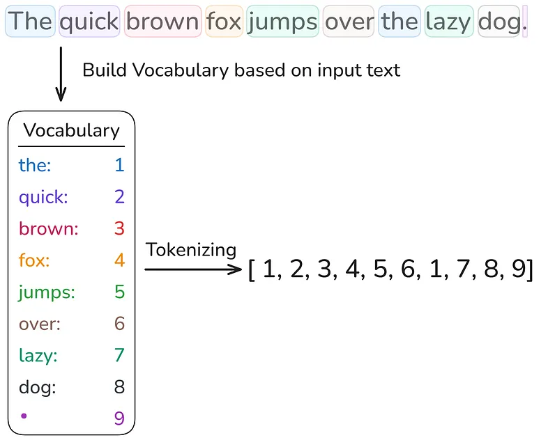
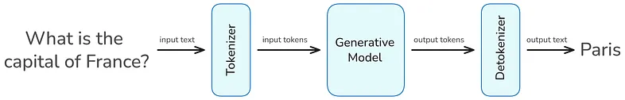

# Data Science Collective - Tokenization

**_Authors / Autores: [@yuri-sl](http://github.com/yuri-sl)_, [@figredos](http://github.com/figredos)**

## Português

### Visão geral

A IA generativa transformou profundamente nosso cotidiano nos últimos anos, possibilitando desde resumos e traduções automatizadas até geração de código e até suporte a aprendizado personalizado. A “moeda” essencial por trás dessa tecnologia avançada é o token. A maioria dos modelos cobra com base no número de tokens de entrada fornecidos e nos tokens de saída que geram.

Mas o que é um token, pelo processamento do qual pagamos tanto? Entender o que são tokens, como são gerados a partir de texto e quais são suas principais características são os primeiros passos para construir aplicações mais eficientes e aproveitar ao máximo a IA generativa.

### O que é Tokenização?

Tokenização é a etapa de pré-processamento de texto em tarefas de PLN que divide o texto de entrada em subpalavras, palavras ou caracteres individuais. Um token é a menor unidade de medida processada por um modelo de IA generativa. Durante o treinamento, esses tokens são fornecidos ao modelo para processamento. O tamanho de um token (uma unidade de entrada) varia entre os modelos. Não há uma estratégia unificada de tokenização; elas são escolhidas pelos desenvolvedores de acordo com a tarefa em questão.

É possível ter uma noção de várias estratégias de tokenização experimentando este projeto de tokenização do Hugging Face, que visualiza essas estratégias para modelos populares.


_O Tokenizer Playground visualiza como um grande modelo de linguagem divide o texto em tokens individuais. Aqui, a frase “The quick brown fox jumps over the lazy dog.” é dividida em 10 tokens, demonstrando a primeira etapa no pipeline de processamento de texto de um LLM._

> Isso significa que cada modelo só pode ser usado para inferência em combinação com o tokenizador no qual foi treinado.

Após o treinamento, tokens únicos são armazenados em um conjunto especial chamado vocabulário para Grandes Modelos de Linguagem, e no Cookbook para modelos de geração de imagem e áudio.

### Métodos simples de tokenização

As abordagens mais simples de tokenização são a tokenização em nível de palavra e a tokenização em nível de caractere.

- **Tokenização em nível de palavra** : divide o texto de entrada por espaços em branco e caracteres especiais, como vírgulas, pontos de interrogação ou pontos de exclamação. Depois de dividir o texto em palavras, cria-se um vocabulário a partir dos tokens únicos, onde cada token é mapeado para um inteiro. O vocabulário pode ser usado para transformar cada sentença em uma representação vetorial numérica.
  - 

No entanto, assim que se deseja codificar texto que não é do corpus de entrada e contém palavras não incluídas no vocabulário, nem todas as palavras podem ser tokenizadas. Essas palavras são chamadas de fora do vocabulário e são representadas por um token especial, como `<|unk|>`. Portanto, “Fora do vocabulário” é a forma educada da IA de dizer: “Não faço ideia do que você acabou de dizer, mas aqui vai uma resposta genérica.”


Uma forma de lidar com esse problema é a tokenização em nível de caractere.

- **Tokenização em nível de caractere**: processa o texto no nível de caracteres, resultando em um tamanho de vocabulário muito menor. Assim, em vez de um token por palavra, uma palavra é representada por uma combinação de muitos tokens.

Infelizmente, essa estratégia também tem suas falhas. Como a tokenização é realizada no nível de caractere, os tokens perdem o significado contextual, o que torna mais difícil para o modelo aprender gramática. Além disso, essa estratégia de tokenização resulta em sequências mais longas.


_Tokenização em nível de caractere: Cada caractere em “The quick brown fox” recebe um ID de token único, resultando em sequências de tokens mais longas, mas eliminando problemas de fora do vocabulário._

Isso evidencia que ambas as estratégias de tokenização têm seus problemas. Por essa razão, modelos como o ChatGPT usam um método que encontra um equilíbrio entre ambas — Byte Pair Encoding (BPE), que será abordado no próximo post desta série.

### Tokenização no processo de geração de texto de LLMs

A relevância da tokenização fica clara quando se vê onde ela se situa no processo de geração de texto dos LLMs.

Ao enviar uma consulta de entrada a um LLM, o texto é dividido em tokens e ingerido pelo modelo. Esses tokens são as unidades essenciais pelas quais se paga, e são subsequentemente transformados em números para que a máquina possa “entendê-los”.

Após a geração de uma resposta pelo LLM, ele retorna uma lista de tokens numéricos, que então são destokenizados para que humanos possam entender a saída — porque, infelizmente, não somos tão rápidos quanto os computadores no processamento de números.

Por esses tokens de entrada e saída, os provedores de LLM nos cobram. Portanto, faz sentido manter ambos os lados o mais curtos possível, o que diminui o tempo de processamento e economiza dinheiro.



### 4 maneiras de economizar tokens de entrada e saída

Economizar tokens é o equivalente, na IA, a apagar as luzes ao sair do cômodo.


Então, para economizar energia, apague sua luz e não deixe seu fluxo de trabalho de IA rodar em um loop infinito processando tokens sem fim, por mais baratos que sejam. Aqui estão três dicas de como atingir esse objetivo.

1.Remove Unnecessary Context
Remova instruções repetitivas, saudações, despedidas ou detalhes irrelevantes. Inclua apenas o que o modelo precisa saber para gerar uma resposta de alta qualidade

2.Optimize Prompt Engineering
Use instruções concisas e claras. Evite explicações verbosas ou exemplos desnecessários. Prompts bem elaborados podem reduzir o tamanho da entrada e guiar o modelo com mais eficiência.

3.Set Maximum Output Lengths
A maioria das APIs de LLM permite definir um limite máximo de tokens para saídas (por exemplo, _max_tokens_). Ajuste essa configuração para garantir que a resposta do modelo não seja mais longa do que o necessário.
4.Chunk Large Tasks
Se houver um documento ou tarefa grande, divida-o em partes menores e processe-as sequencialmente. Isso reduz o uso de tokens por requisição e permite reutilizar contexto, economizando tokens de entrada e de saída.

### Implementação de tokenização word-level

Nos blocos de código Python a seguir, implementaremos a tokenização word-level , detalhando cada etapa para uma compreensão mais profunda. Os dois textos usados neste exemplo são contos de fadas gerados pelo ChatGPT usando o prompt: “Generate a fairy tale about AI”, e os resultados, no meu caso, foram “Arti the Useful Intelligence” e “Pixel the Dream.” Ambos os textos serão tokenizados por palavras nas linhas de código subsequentes.


_Contos de fadas de IA na tokenização: “Pixel the Dreamer” e “Artie the Helpful Intelligence” são dois textos de exemplo usados para demonstrar a tokenização word-level neste tutorial._

É possível encontrar todo o notebook Jupyter no repositório [GitHub de Python](https://github.com/FLX-20/AI-Explained) para esta série de posts.

#### Carregando os arquivos de texto

Primeiro, carregamos o texto do arquivo de texto no nosso ambiente Python.

```python
import re

def open_txt_file(file_path):
    with open(file_path, 'r') as file:
        content = file.read()
    return content
```

O texto carregado pode ser verificado imprimindo os primeiros 100 caracteres de ambas as histórias.

```python
text_1 = open_txt_file('pixel-the-dreamer.txt')
print(text_1[:100] + "...")
```

```python
text_2 = open_txt_file('artie-the-helpful-intelligence.txt')
print(text_2[:100] + "...")
```

#### Gerar vocabulário e vocabulário reverso

Agora, construímos nosso vocabulário incluindo todas as palavras únicas do texto de entrada. O vocabulário define como cada palavra é mapeada para um valor inteiro, e isso é feito primeiro dividindo o texto por espaços em branco e caracteres especiais usando expressões regulares. Dependendo da expressão regular escolhida, espaços em branco podem ser considerados um tipo de token ou podem ser completamente ignorados.

A escolha de remover espaços em branco depende da aplicação. Embora a remoção desse tipo de caractere diminua a demanda por recursos computacionais, manter espaços em branco é benéfico para o processamento de linguagens de programação; em algumas linguagens de programação, esses espaços são essenciais devido à sensibilidade à indentação e ao espaçamento e não podem ser ignorados.

No exemplo acima, os espaços em branco são ignorados porque estamos lidando com texto bruto, que não é sensível à indentação.

É possível incluir espaços em branco usando esta expressão regular:

```python
r'([\w+|\s+|^\w\s])'
```

Em seguida, espaços em branco remanescentes são removidos dos tokens para que apenas a palavra ou o caractere especial permaneça. Além disso, é gerado um vocabulário reverso, necessário para converter os tokens de volta em texto.

```python
def generate_vocab(text):
    chunks = re.split(r'(\w+|[^\w\s])', text)
    unique_tokens = [c for c in chunks if c.strip()]
    encode_vocab = {token: idx for idx, token in enumerate(unique_tokens)}
    decode_vocab = {idx: token for idx, token in enumerate(unique_tokens)}

    return encode_vocab, decode_vocab
```

```python
encode_vocab, decode_vocab = generate_vocab(text_1)
```

Vamos dar uma olhada na criação do nosso vocabulário.

```python
print("Vocabulary (token -> index):")
for idx, token in enumerate(encode_vocab):
    print(f"{idx} -> '{token}'")
```

No total, nosso vocabulário consiste de 204 palavras únicas.

```python
print("Number of unique tokens:", len(encode_vocab))
```

#### Tokenizando um texto

Agora estamos prontos para tokenizar textos de entrada com base no vocabulário criado. O processo de tokenização começa de forma semelhante ao processo de criação do vocabulário, em que o texto é dividido em palavras e caracteres especiais, usando a mesma expressão regular de antes.

Em seguida, o vocabulário é usado para substituir cada palavra no texto por seu número correspondente no vocabulário ou pelo token <|unk|> se a palavra não existir no vocabulário.

Ao final, é retornada a representação final do texto tokenizado.

```python
def encode_text(text, encode_vocab):
    tokens = re.split(r'(\w+|[^\w\s])', text)
    tokens = [t for t in tokens if t.strip()]
    tokens = [encode_vocab.get(token, "<|unk|>") for token in tokens]
    return tokens
```

Vamos testar a função de tokenização anterior no texto inicial, que também foi usado para criar o vocabulário.

```python
encoded_text = encode_text(text_1, encode_vocab)
print("Encoded text:", encoded_text)
```

Agora, vamos também testar a função no segundo texto, que não foi usado para a geração do vocabulário.

```python
encoded_text = encode_text(text_2, encode_vocab)
print("Encoded text:", encoded_text)
```

É possível ver que aconteceu exatamente como previsto anteriormente. Nem todas as palavras do segundo texto estão presentes no primeiro texto, que foi usado para gerar o vocabulário, resultando em muitos tokens desconhecidos fora do vocabulário.

Neste momento, há duas possibilidades para resolver esse problema: Pode-se usar tokenização em nível de caractere ou adicionar as palavras fora do vocabulário ao nosso vocabulário. No próximo bloco de código, seguiremos adicionando as palavras desconhecidas ao vocabulário.

Isso é feito adicionando ambos os textos, separados pelo token `<|endoftext|>`, que indica ao modelo que o próximo texto não está relacionado ao anterior. Em seguida, as mesmas funções são reutilizadas para gerar a representação em tokens do texto de entrada.

```python
text_corpus = text_1 + " <|endoftext|> " + text_2
encode_vocab, decode_vocab = generate_vocab(text_corpus)
encoded_text = encode_text(text_2, encode_vocab)
print("Encoded text:", encoded_text)
```

#### Destokenização

Ao final, queremos voltar ao texto original a partir da representação em tokens, para que possamos entendê-lo e interpretá-lo, o que é exatamente a etapa que ocorre após um Grande Modelo de Linguagem gerar sua saída. As representações numéricas produzidas pelo LLM são convertidas de volta pelo destokenizador em informação textual.

Aqui, é necessário o vocabulário reverso, que mapeia tokens de volta para palavras. O processo de destokenização é semelhante ao de tokenização: pegam-se os números da lista de tokens e eles são substituídos pelas palavras correspondentes do vocabulário, separadas por espaço em branco. Esses espaços são removidos antes de caracteres especiais porque eles estão sempre anexados a uma palavra.

A lista final é retornada e impressa.

```python
def decode_text(tokens, decode_vocab):
    text = ' '.join(decode_vocab.get(idx,'<|unk|>') for idx in tokens)
    text = re.sub(r'\s([?.!,"](?:\s|$))', r'\1', text)
    return text
```

```python
decode_text = decode_text(encoded_text, decode_vocab)
print(decode_text)
```

#### Conclusão

Nesta exploração da tokenização, revelamos os blocos de construção fundamentais que alimentam os sistemas modernos de IA generativa. O post destacou que existem diferentes estratégias de tokenização, que variam entre os modelos.

As duas estratégias mais simples — tokenização word-level e tokenização em nível de caractere — foram introduzidas e implementadas, com seus prós e contras discutidos. O problema de fora do vocabulário encontrado na tokenização por palavras, assim como o grande comprimento da lista de tokens na codificação em nível de caractere, evidenciaram que é necessária uma solução intermediária.

Essa solução é o Byte Pair Encoding (BPE), usado por quase todos os modelos modernos.

## English

### Overview

Generative AI has profoundly transformed our daily lives in recent years, enabling everything from automated summaries and translations to code generation and even personalized learning support. The essential “currency” behind this advanced technology is the token. Most models charge based on the number of input tokens you provide and the output tokens they generate.

But what is a token, for the processing of which we pay so much? Understanding what are tokens, how are they generated from text, and what are their key characteristics, are the first steps toward building more efficient applications, and -making the most of generative AI.

### What is Tokenization?

Tokenization is the text preprocessing step in NLP tasks that splits the input text into individual sub-words, words, or characters. A token is the smallest unit of measurement processed by a generative AI model. During its training, these tokens are provided to the model for processing. The size of a token (one input unit) varies between models. There is no unified tokenization strategy, they are chosen by developers according to the task at hand.

You can get an impression of various tokenization strategies by experimenting with this Hugging Face tokenization project, which visualizes these strategies for popular models.


_The **Tokenizer Playground** visualizes how a large language model splits text into individual tokens. Here, the sentence “The quick brown fox jumps over the lazy dog.” is divided into 10 tokens, demonstrating the first step in the LLM text processing pipeline._

> This means that each model can only be used for inference in combination with the tokenizer it was trained on.

After training, unique tokens are stored in a special set called the vocabulary for Large Language Models, and the Cookbook for image and audio generation models.

### Simple tokenization methods

The simplest tokenization approaches are word-level tokenization and character-level tokenization.

- **Word-level tokenization**: splits the input text by whitespaces and special characters, such as commas, question marks, or exclamation points. After splitting the text into words, a vocabulary is created from the unique tokens, where each token is mapped to an integer. The vocabulary can be used to transform each sentence into a numerical vector representation.
  - 

However, as soon as we want to encode text that is not from the input corpus and contains words not included in the vocabulary, not all words can be tokenized. These words are referred to as out-of-vocabulary tokens and are represented by a special token, such as `<|unk|>`. So “Out-of-vocabulary” is AI’s polite way of saying, “No idea what you just said, but here’s a generic response.”


One way to address this problem is character-level tokenization.

- **Character-level tokenization**: processes text at the character level, resulting in a much smaller vocabulary size. Thus, instead of one token per word, a word is represented by a combination of many tokens.

Unfortunately, this strategy also has its flaws. Because tokenization is performed at the character level, the tokens lose contextual meaning, which makes it more difficult for the model to learn grammar. Moreover, this tokenization strategy results in longer sequences.


_Character-level tokenization: Every character in “The quick brown fox” is assigned a unique token ID, resulting in longer token sequences but eliminating out-of-vocabulary issues._

This highlights that both tokenization strategies have their problems. For this reason, models such as ChatGPT use a method that strikes a balance between both — Byte Pair Encoding (BPE), which will be covered in the next post of this series.

### Tokenization in the LLM text generation process

The relevance of tokenization becomes clear when you see where it is situated in the text generation process of LLMs.

When you pass an input query to an LLM, your text is split into tokens and ingested into the model. These tokens are the essential units you are paying for, and they are subsequently turned into numbers so that the machine can “understand” them.

After an answer has been generated by the LLM, it returns a list of numerical tokens, which are then detokenized so that we humans can understand the output — because unfortunately, we are not as fast as computers at processing numbers.

For these input and output tokens, the LLM providers make us pay. So it makes sense to keep both ends as short as possible, which decreases processing time and saves money.


### 4 Ways to Save Input and Output Tokens

Saving tokens is the AI equivalent of turning off the lights when you leave the room.


So, to save energy, switch off your light and don’t let your AI workflow run in an infinite loop processing endless tokens, no matter how cheap they are. Here are three tips on how this goal can be achieved.

**1.Remove Unnecessary Context**
Strip out repetitive instructions, greetings, sign-offs, or irrelevant details. Only include what the model needs to know to generate a high-quality response

**2.Optimize Prompt Engineering**
Use concise and clear instructions. Avoid verbose explanations or unnecessary examples. Carefully designed prompts can reduce input size and guide the model more efficiently.

**3.Set Maximum Output Lengths**
Most LLM APIs allow you to set a maximum token limit for outputs (e.g., _max_tokens_). Adjust this setting to ensure the model’s response isn’t longer than needed.
**4.Chunk Large Tasks**
If you have a large document or task, break it into smaller parts and process them sequentially. This reduces per-request token usage and allows you to reuse context, saving both input and output tokens.

### Implementation of word level tokenizing

In the following Python code blocks, we will implement word-level tokenization, breaking down every step for a deeper understanding. The two texts used for this example are fairy tales generated by ChatGPT using the prompt: “Generate a fairy tale about AI”, and the results in my case were “Arti the Useful Intelligence” and “Pixel the Dream.” Both texts will be tokenized by words in the subsequent lines of code.


_AI fairy tales in tokenization: “Pixel the Dreamer” and “Artie the Helpful Intelligence” are two example texts used for demonstrating word-level tokenization in this tutorial._

You can find the entire Jupyter notebook in the Python [GitHub repo](https://github.com/FLX-20/AI-Explained) for this post series.

#### Loading the text files

First, we load the text from the text file in our Python environment.

```python
import re

def open_txt_file(file_path):
    with open(file_path, 'r') as file:
        content = file.read()
    return content
```

The loaded text can be checked by printing out the first 100 characters of both stories.

```python
text_1 = open_txt_file('pixel-the-dreamer.txt')
print(text_1[:100] + "...")
```

```python
text_2 = open_txt_file('artie-the-helpful-intelligence.txt')
print(text_2[:100] + "...")
```

#### Generate vocabulary and reverse vocabulary

Now, we build our vocabulary including all unique words of the input text. The vocabulary defines how each word is mapped to an integer value, and is achieved by first splitting the text by white spaces and special characters using regular expressions. Depending on the chosen regular expression, white spaces can be considered as a token type or can be completely ignored.

The choice of removing white spaces depends on the application. While the removal of this character type decreases compute resource demands, keeping white spaces is beneficial for processing programming languages, in some programming languages, these white spaces are essential due to indentation and spacing sensitivity and cannot be ignored.

In the example above, the white spaces are ignored because we are dealing with raw text, which is not indentation sensitive.

You can include white spaces by using this regular expression:

```python
r'([\w+|\s+|^\w\s])'
```

Afterwards, remaining white spaces are stripped away from the tokens so that only the word or special character is left. Moreover, a reverse vocabulary is generated, which is necessary for converting the tokens back into text.

```python
def generate_vocab(text):
    chunks = re.split(r'(\w+|[^\w\s])', text)
    unique_tokens = [c for c in chunks if c.strip()]
    encode_vocab = {token: idx for idx, token in enumerate(unique_tokens)}
    decode_vocab = {idx: token for idx, token in enumerate(unique_tokens)}

    return encode_vocab, decode_vocab
```

```python
encode_vocab, decode_vocab = generate_vocab(text_1)
```

Let’s take a look at our vocabulary creation.

```python
print("Vocabulary (token -> index):")
for idx, token in enumerate(encode_vocab):
    print(f"{idx} -> '{token}'")
```

Overall, our vocabulary consists of 204 unique words.

```python
print("Number of unique tokens:", len(encode_vocab))
```

#### Tokenizing a text

Now we are ready to tokenize input texts based on the created vocabulary. The tokenization process starts similarly to the vocabulary creation process, where the text is split into words and special characters, using the same regular expression as before.

Afterwards, the vocabulary is used to replace each word in the text either with its corresponding number from the vocabulary or the <|unk|> token if the word does not exist in the vocabulary.

In the end, the final tokenized text representation is returned.

```python
def encode_text(text, encode_vocab):
    tokens = re.split(r'(\w+|[^\w\s])', text)
    tokens = [t for t in tokens if t.strip()]
    tokens = [encode_vocab.get(token, "<|unk|>") for token in tokens]
    return tokens
```

Let’s test the previous tokenization function on the initial text, which was also used for creating the vocabulary.

```python
encoded_text = encode_text(text_1, encode_vocab)
print("Encoded text:", encoded_text)
```

Now, let’s also test the function of the second text, which was not used for the vocabulary generation.

```python
encoded_text = encode_text(text_2, encode_vocab)
print("Encoded text:", encoded_text)
```

You can see it happened exactly as we previously predicted. Not all words from the second text are present in the first text, which was used to generate the vocabulary, resulting in many unknown out-of-vocabulary tokens.

Right now, we have two possibilities to solve this problem: We can either use character-level tokenization, or we can add the out-of-vocabulary words to our vocabulary. In the next code block, we will follow up by adding the unknown words to the vocabulary.

This is achieved by adding both texts together, separated by the `<|endoftext|>` token, which indicates to the model that the next text is unrelated to the previous one. Afterwards, the same functions are reused for generating the token representation of the input text.

```python
text_corpus = text_1 + " <|endoftext|> " + text_2
encode_vocab, decode_vocab = generate_vocab(text_corpus)
encoded_text = encode_text(text_2, encode_vocab)
print("Encoded text:", encoded_text)
```

#### Detokenization

In the end, we would like to go back to the original text from the token representation, so that we humans can understand and interpret it, which is exactly the step that happens after a Large Language Model generates its output. The numerical representations produced by the LLM are converted back by the detokenizer into textual information.

Here, we need the reverse vocabulary, which maps tokens back to words. The detokenization process is similar to the tokenization process, you take the numbers from the token list and replace them with the corresponding words from the vocabulary, separated by white space. These white spaces are removed in front of special characters because they are always attached to a word.

The final list is returned and printed out.

```python
def decode_text(tokens, decode_vocab):
    text = ' '.join(decode_vocab.get(idx,'<|unk|>') for idx in tokens)
    text = re.sub(r'\s([?.!,"](?:\s|$))', r'\1', text)
    return text
```

```python
decode_text = decode_text(encoded_text, decode_vocab)
print(decode_text)
```

#### Conclusion

In this exploration of tokenization, we uncovered the fundamental building blocks that power modern generative AI systems. The post highlighted that there are different tokenization strategies, which vary between models.

The two simplest tokenization strategies — word-level and character-level tokenization — were introduced and implemented, with their pros and cons discussed. The encountered out-of-vocabulary problem of word tokenization, as well as the large token list length of character-level encoding, highlighted that an intermediate solution is needed.

This solution is Byte Pair Encoding (BPE), which is used by almost all modern models.

## Referências | References

[The Invisible Building Blocks of AI: What You Need to Know About Tokenization](https://medium.com/data-science-collective/the-invisible-building-blocks-of-ai-what-you-need-to-know-about-tokenization-acadd86a63ba)
