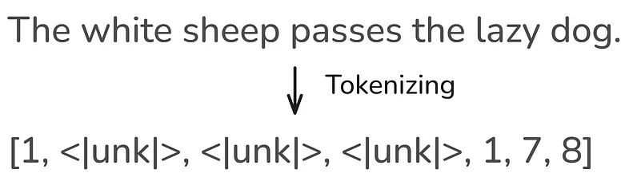

# Data Science Collective - Tokenization

## Português

### Visão Geral

A IA generativa transformou profundamente nosso cotidiano nos últimos anos, possibilitando desde resumos e traduções automáticos até geração de código e até mesmo apoio ao aprendizado personalizado.

A “moeda” essencial por trás dessa tecnologia avançada é o token. A maioria dos modelos cobra com base no número de tokens de entrada que você fornece e nos tokens de saída que eles geram.

Mas o que é um token, pelo qual pagamos tanto para ser processado? Compreender claramente o conceito de token é fundamental para construir aplicações mais eficientes.

Entender os tokens permite um uso mais eficiente e oportuno da IA generativa, como os grandes modelos de linguagem.

E, honestamente, quem não gostaria de economizar tempo e dinheiro?

Então, vamos ao que interessa: o que são tokens, como são gerados a partir do texto e quais são suas principais características?

Compreender esses fundamentos é o primeiro passo para tirar o máximo proveito da IA generativa.

### O que é Tokenização?

Tokenização é a etapa de pré-processamento de texto em tarefas de PLN que divide o texto de entrada em subpalavras, palavras ou caracteres individuais.

Um token é a menor unidade de medida processada por um modelo de IA generativa.

Durante o treinamento de um modelo de IA generativa, esses tokens são fornecidos ao modelo.

O tamanho de um token (uma unidade de entrada) varia entre modelos. Não existe uma estratégia de tokenização unificada. Os desenvolvedores escolhem a estratégia de tokenização a ser aplicada.

Você pode ter uma noção de várias estratégias de tokenização ao experimentar este projeto de tokenização da Hugging Face, que visualiza essas estratégias para modelos populares.

![Tokenizer Playground](images/dscImages/tokenizer _Tokenizer Playground_ visualiza como um grande modelo de linguagem divide o texto em tokens individuais. Aqui, a frase “The quick brown fox jumps over the lazy dog.” é dividida em 10 tokens, demonstrando o primeiro passo do pipeline de processamento de texto do LLM.

Isso significa que cada modelo só pode ser usado para inferência em conjunto com o tokenizador com o qual foi treinado.

Após o treinamento, tokens únicos são armazenados em um conjunto especial.

Esse conjunto é chamado de vocabulário para grandes modelos de linguagem e de Cookbook para modelos de geração de imagem e áudio.

### Métodos Simples de Tokenização

As abordagens mais simples de tokenização são a tokenização em nível de palavra e em nível de caractere.

A tokenização em nível de palavra divide o texto de entrada por espaços em branco e caracteres especiais, como vírgulas, pontos de interrogação ou pontos de exclamação.

Após dividir o texto em palavras, é criado um vocabulário com os tokens únicos.

Nesse vocabulário, cada token é mapeado para um valor inteiro.

O vocabulário pode ser usado para transformar cada frase em uma representação vetorial numérica.

![Word Level Tokenization](images/dscImages/wordLevelTokenization, assim que queremos codificar um texto que não faz parte do corpus de entrada e contém palavras não incluídas no vocabulário, nem todas as palavras podem ser tokenizadas.

Essas palavras são referidas como tokens fora do vocabulário e representadas por um token especial, como .

Portanto, “Fora do vocabulário” é a forma educada da IA de dizer: “Não faço ideia do que você disse, mas aqui está uma resposta genérica.”

![Handling Unknown Words](images/dscImages/handlingUnknownWordsToken de lidar com esse problema é a tokenização em nível de caractere.

Essa estratégia processa o texto em nível de caractere, resultando em um vocabulário muito menor.

Assim, em vez de um token por palavra, uma palavra é representada por uma combinação de vários tokens.

Infelizmente, essa estratégia também tem suas falhas.

Como a tokenização é feita a nível de caractere, os tokens perdem o significado contextual, o que dificulta o aprendizado de gramática pelo modelo.

Além disso, essa estratégia resulta em sequências mais longas.

A imagem pode ser ampliada

, que será abordado no próximo post desta série.

Por enquanto, vamos aprofundar esse conhecimento construindo um tokenizador de palavras simples para entender melhor como ele funciona.

### Tokenização no Processo de Geração de Texto de LLMs

A relevância da tokenização fica clara quando vemos onde ela se situa no processo de geração de texto dos LLMs.

Ao passar uma entrada para um LLM, seu texto é dividido em tokens e ingerido pelo modelo. Esses tokens são as unidades essenciais pelo qual você paga, transformadas em números para que a máquina possa “compreendê-los”.

Após gerar uma resposta, o LLM retorna uma lista de tokens numéricos, que então são destokenizados para que possamos compreender — pois, infelizmente, não somos tão rápidos quanto as máquinas para processar números.

Para esses tokens de entrada e saída, os fornecedores de LLM nos cobram. Portanto, faz sentido manter ambos os lados o mais curtos possível, o que reduz o tempo de processamento e economiza dinheiro.

![Text Gen Pipeline](images/dscImages/textGenerationPipeline.webpiras de Economizar Tokens de Entrada e Saída

Nas últimas seções, aprendemos o que são tokens e que pagamos por tokens de entrada e saída ao usar modelos. Portanto, os prompts de entrada e saída devem ser o mais precisos possível.

Economizar tokens é o equivalente na IA a apagar as luzes ao sair do ambiente.

. Ajuste essa configuração para garantir que a resposta do modelo não seja mais longa do que o necessário.

**4. Divida Grandes Tarefas em Partes**
Se você tiver um documento ou tarefa grande, divida-o em partes menores e processe-as sequencialmente. Isso reduz o uso de tokens por requisição e permite reutilizar contexto, economizando tokens de entrada e saída.

### Implementação de Tokenização a Nível de Palavra

Nos blocos de código Python a seguir, vamos implementar a tokenização por palavras, detalhando cada etapa para um entendimento mais profundo.

Os dois textos usados neste exemplo são contos de fadas gerados pelo ChatGPT com o prompt: “Crie um conto de fadas sobre IA.”

Os resultados, no meu caso, foram “Arti a Inteligência Útil” e “Pixel o Sonhador”.

Ambos os textos serão tokenizados por palavra nas linhas de código a seguir.

 desta série de posts.

#### Carregando os Arquivos de Texto

Primeiro, carregamos o texto do arquivo para o ambiente Python.

```python
import re

def open_txt_file(file_path):
    with open(file_path, 'r') as file:
        content = file.read()
    return content
```

O texto carregado pode ser verificado imprimindo os primeiros 100 caracteres de cada história.

```python
text_1 = open_txt_file('pixel-the-dreamer.txt')
print(text_1[:100] + "...")
```

```python
text_2 = open_txt_file('artie-the-helpful-intelligence.txt')
print(text_2[:100] + "...")
```

#### Gerando Vocabulário e Vocabulário Reverso

Agora, construímos nosso vocabulário, incluindo todas as palavras únicas do texto de entrada.

O vocabulário define como cada palavra é mapeada para um valor inteiro.

Isso é feito primeiramente dividindo o texto usando espaços em branco e caracteres especiais com expressões regulares.

Dependendo da expressão regular escolhida, espaços em branco podem ser considerados um tipo de token ou ignorados completamente.

A escolha de remover espaços em branco depende da aplicação. Embora a remoção reduza o uso de recursos computacionais, mantê-los é benéfico para processar linguagens de programação.

Em algumas linguagens, esses espaços são essenciais devido à sensibilidade à indentação e espaçamento e não podem ser ignorados.

No exemplo acima, espaços em branco são ignorados porque lidamos com texto bruto, sem sensibilidade à indentação.

Você pode incluir espaços em branco usando esta expressão regular:

```python
r'([\w+|\s+|^\w\s])'
```

Após isso, espaços em branco restantes são removidos dos tokens, restando apenas a palavra ou caractere especial.

Além disso, é gerado o vocabulário reverso, necessário para reconverter os tokens em texto.

```python
def generate_vocab(text):
    chunks = re.split(r'(\w+|[^\w\s])', text)
    unique_tokens = [c for c in chunks if c.strip()]
    encode_vocab = {token: idx for idx, token in enumerate(unique_tokens)}
    decode_vocab = {idx: token for idx, token in enumerate(unique_tokens)}

    return encode_vocab, decode_vocab
```

```python
encode_vocab, decode_vocab = generate_vocab(text_1)
```

Vamos ver como fica a criação do nosso vocabulário.

```python
print("Vocabulário (token -> índice):")
for idx, token in enumerate(encode_vocab):
    print(f"{idx} -> '{token}'")
```

No total, nosso vocabulário consiste em 204 palavras únicas.

```python
print("Número de tokens únicos:", len(encode_vocab))
```

#### Tokenizando um Texto

Agora estamos prontos para tokenizar textos de entrada baseado no vocabulário criado.

O processo de tokenização começa semelhante ao de criação do vocabulário.

O texto é dividido em palavras e caracteres especiais usando a mesma expressão regular anterior.

Depois, o vocabulário é usado para substituir cada palavra do texto pelo número correspondente do vocabulário ou pelo token caso a palavra não exista no vocabulário.

Ao final, a representação do texto tokenizado é retornada.

```python
def encode_text(text, encode_vocab):
    tokens = re.split(r'(\w+|[^\w\s])', text)
    tokens = [t for t in tokens if t.strip()]
    tokens = [encode_vocab.get(token, "") for token in tokens]
    return tokens
```

Vamos testar a função de tokenização no texto inicial, usado para criar o vocabulário.

```python
encoded_text = encode_text(text_1, encode_vocab)
print("Texto codificado:", encoded_text)
```

Agora, vamos testar também na função do segundo texto, não utilizado para gerar o vocabulário.

```python
encoded_text = encode_text(text_2, encode_vocab)
print("Texto codificado:", encoded_text)
```

Como previsto, nem todas as palavras do segundo texto estão presentes no vocabulário criado com o primeiro texto.

Isso resulta em muitos tokens desconhecidos (out-of-vocabulary).

Temos agora duas alternativas para resolver esse problema: usar tokenização a nível de caractere ou adicionar as palavras desconhecidas ao nosso vocabulário.

Sua vez: use o conhecimento adquirido neste post para implementar a tokenização em nível de caractere e resolver o erro.

No próximo código, vamos adicionar as palavras desconhecidas ao vocabulário.

Fazemos isso somando os dois textos, separados pelo token , que indica ao modelo que o próximo texto é independente do anterior.

Depois, as mesmas funções são reutilizadas para gerar a representação tokenizada do texto de entrada.

```python
text_corpus = text_1 + "  " + text_2
encode_vocab, decode_vocab = generate_vocab(text_corpus)
encoded_text = encode_text(text_2, encode_vocab)
print("Texto codificado:", encoded_text)
```

#### Detokenização

Ao final, queremos retornar ao texto original a partir da representação em tokens, para que possamos compreender e interpretar.

Esse é exatamente o passo realizado após o LLM gerar sua saída. As representações numéricas produzidas pelo modelo são então convertidas de volta pelo detokenizador em texto.

Aqui, precisamos do vocabulário reverso, que mapeia os tokens de volta para as palavras.

O processo de detokenização é semelhante ao da tokenização.

Basta pegar os números na lista de tokens e substituí-los pelas palavras do vocabulário, separados por espaço.

Esses espaços são removidos antes de caracteres especiais porque, nesses casos, tais caracteres estão sempre ligados a uma palavra.

A lista final é retornada e impressa.

```python
def decode_text(tokens, decode_vocab):
    text = ' '.join(decode_vocab.get(idx,'') for idx in tokens)
    text = re.sub(r'\s([?.!,"](?:\s|$))', r'\1', text)
    return text
```

```python
decode_text = decode_text(encoded_text, decode_vocab)
print(decode_text)
```

#### Conclusão

Nesta exploração da tokenização, descobrimos os blocos fundamentais que movem os sistemas modernos de IA generativa.

O post destacou que existem diferentes estratégias de tokenização, que variam entre modelos.

As duas mais simples — por palavra e por caractere — foram apresentadas e implementadas, discutindo suas vantagens e desvantagens.

O problema de fora do vocabulário na tokenização por palavra e a extensão das listas de tokens na codificação por caractere mostraram que uma solução intermediária é necessária.

Essa solução é o Byte Pair Encoding (BPE), utilizada em quase todos os modelos modernos.

## English

### Overview

Generative AI has profoundly transformed our daily lives in recent years, enabling everything from automated summaries and translations to code generation and even personalized learning support.

The essential “currency” behind this advanced technology is the token. Most models charge based on the number of input tokens you provide and the output tokens they generate.

But what is a token, for the processing of which we pay so much? Gaining a clear understanding of tokens is crucial for building more efficient applications.

Understanding tokens allows for more efficient and timely use of generative AI, such as large language models.

And honestly, who wouldn’t want to save time and money?

So, let’s dive in: What are tokens, how are they generated from text, and what are their key characteristics?

Understanding these basics is the first step toward making the most of generative AI.

### What is Tokenization?

Tokenization is the text preprocessing step in NLP tasks that splits the input text into individual sub-words, words, or characters.

A token is the smallest unit of measurement processed by a generative AI model.

During the training process of a generative AI model, these tokens are provided to the model.

The size of a token (one input unit) varies between models. There is no unified tokenization strategy. The developers choose the tokenization strategy that will be applied.

You can get an impression of various tokenization strategies by experimenting with this Hugging Face tokenization project, which visualizes these strategies for popular models.


> The _Tokenizer Playground_ visualizes how a large language model splits text into individual tokens. Here, the sentence “The quick brown fox jumps over the lazy dog.” is divided into 10 tokens, demonstrating the first step in the LLM text processing pipeline.

This means that each model can only be used for inference in combination with the tokenizer it was trained on.

After training, unique tokens are stored in a special set.

This set is called the vocabulary for Large Language Models, and the Cookbook for image and audio generation models.

### Simple tokenization methods

The simplest tokenization approaches are word-level tokenization and character-level tokenization.

Word-level tokenization splits the input text by whitespaces and special characters, such as commas, question marks, or exclamation points.

After splitting the text into words, a vocabulary is created from the unique tokens.

In this vocabulary, each token is mapped to an integer.

The vocabulary can be used to transform each sentence into a numerical vector representation.


However, as soon as we want to encode text that is not from the input corpus and contains words not included in the vocabulary, not all words can be tokenized.

These words are referred to as out-of-vocabulary tokens and are represented by a special token, such as <|unk|>.

So “Out-of-vocabulary” is AI’s polite way of saying, “No idea what you just said, but here’s a generic response.”



One way to address this problem is character-level tokenization.

This tokenization strategy processes text at the character level, resulting in a much smaller vocabulary size.

Thus, instead of one token per word, a word is represented by a combination of many tokens.

Unfortunately, this strategy also has its flaws.

Because tokenization is performed at the character level, the tokens lose contextual meaning, which makes it more difficult for the model to learn grammar.

Moreover, this tokenization strategy results in longer sequences.

Zoom image will be displayed


> Character-level tokenization: Every character in “The quick brown fox” is assigned a unique token ID, resulting in longer token sequences but eliminating out-of-vocabulary issues.

This highlights that both tokenization strategies have their problems.

For this reason, models such as ChatGPT use a method that strikes a balance between both — Byte Pair Encoding (BPE), which will be covered in the next post of this series.

For now, let’s deepen this knowledge by building a simple word tokenizer ourselves to better understand how it works.

### Tokenization in the LLM text generation process

The relevance of tokenization becomes clear when you see where it is situated in the text generation process of LLMs.

When you pass an input query to an LLM, your text is split into tokens and ingested into the model. These tokens are the essential units you are paying for, and they are subsequently turned into numbers so that the machine can “understand” them.

After an answer has been generated by the LLM, it returns a list of numerical tokens, which are then detokenized so that we humans can understand the output — because unfortunately, we are not as fast as computers at processing numbers.

For these input and output tokens, the LLM providers make us pay. So it makes sense to keep both ends as short as possible, which decreases processing time and saves money.


### 4 Ways to Save Input and Output Tokens

In the last sections, we learned what tokens are and that we pay for input and output tokens when using models. Hence, the input and output prompts should be as precise as possible.

Saving tokens is the AI equivalent of turning off the lights when you leave the room.


So, to save energy, switch off your light and don’t let your AI workflow run in an infinite loop processing endless tokens, no matter how cheap they are.

Here are three tips on how this goal can be achieved.

**1.Remove Unnecessary Context**
Strip out repetitive instructions, greetings, sign-offs, or irrelevant details. Only include what the model needs to know to generate a high-quality response

**2.Optimize Prompt Engineering**
Use concise and clear instructions. Avoid verbose explanations or unnecessary examples. Carefully designed prompts can reduce input size and guide the model more efficiently.

**3.Set Maximum Output Lengths**
Most LLM APIs allow you to set a maximum token limit for outputs (e.g., _max_tokens_). Adjust this setting to ensure the model’s response isn’t longer than needed.
**4.Chunk Large Tasks**
If you have a large document or task, break it into smaller parts and process them sequentially. This reduces per-request token usage and allows you to reuse context, saving both input and output tokens.

### Implementation of word level tokenizing

In the following Python code blocks, we will implement word-level tokenization, breaking down every step for a deeper understanding.

The two texts used for this example are fairy tales generated by ChatGPT using the prompt: “Generate a fairy tale about AI.”

The results in my case were “Arti the Useful Intelligence” and “Pixel the Dream.”

Both texts will be tokenized by words in the subsequent lines of code.


> AI fairy tales in tokenization: “Pixel the Dreamer” and “Artie the Helpful Intelligence” are two example texts used for demonstrating word-level tokenization in this tutorial.

You can find the entire Jupyter notebook in the Python [GitHub repo](https://github.com/FLX-20/AI-Explained) for this post series.

#### Loading the text files

First, we load the text from the text file in our Python environment.

```python
import re

def open_txt_file(file_path):
    with open(file_path, 'r') as file:
        content = file.read()
    return content
```

The loaded text can be checked by printing out the first 100 characters of both stories.

```python
text_1 = open_txt_file('pixel-the-dreamer.txt')
print(text_1[:100] + "...")
```

```python
text_2 = open_txt_file('artie-the-helpful-intelligence.txt')
print(text_2[:100] + "...")
```

#### Generate vocabulary and reverse vocabulary

Now, we build our vocabulary including all unique words of the input text.

The vocabulary defines how each word is mapped to an integer value.

This is achieved by first splitting the text by white spaces and special characters using regular expressions.

Depending on the chosen regular expression, white spaces can be considered as a token type or can be completely ignored.

The choice of removing white spaces depends on the application. While the removal of this character type decreases compute resource demands, keeping white spaces is beneficial for processing programming languages.

In some programming languages, these white spaces are essential due to indentation and spacing sensitivity and cannot be ignored.

In the example above, the white spaces are ignored because we are dealing with raw text, which is not indentation sensitive.

You can include white spaces by using this regular expression:

```python
r'([\w+|\s+|^\w\s])'
```

Afterwards, remaining white spaces are stripped away from the tokens so that only the word or special character is left.

Moreover, a reverse vocabulary is generated, which is necessary for converting the tokens back into text.

```python
def generate_vocab(text):
    chunks = re.split(r'(\w+|[^\w\s])', text)
    unique_tokens = [c for c in chunks if c.strip()]
    encode_vocab = {token: idx for idx, token in enumerate(unique_tokens)}
    decode_vocab = {idx: token for idx, token in enumerate(unique_tokens)}

    return encode_vocab, decode_vocab
```

```python
encode_vocab, decode_vocab = generate_vocab(text_1)
```

Let’s take a look at our vocabulary creation.

```python
print("Vocabulary (token -> index):")
for idx, token in enumerate(encode_vocab):
    print(f"{idx} -> '{token}'")
```

Overall, our vocabulary consists of 204 unique words.

```python
print("Number of unique tokens:", len(encode_vocab))
```

#### Tokenizing a text

Now we are ready to tokenize input texts based on the created vocabulary.

The tokenization process starts similarly to the vocabulary creation process.

The text is split into words and special characters, using the same regular expression as before.

Afterwards, the vocabulary is used to replace each word in the text either with its corresponding number from the vocabulary or the <|unk|> token if the word does not exist in the vocabulary.

In the end, the final tokenized text representation is returned.

```python
def encode_text(text, encode_vocab):
    tokens = re.split(r'(\w+|[^\w\s])', text)
    tokens = [t for t in tokens if t.strip()]
    tokens = [encode_vocab.get(token, "<|unk|>") for token in tokens]
    return tokens
```

Let’s test the previous tokenization function on the initial text, which was also used for creating the vocabulary.

```python
encoded_text = encode_text(text_1, encode_vocab)
print("Encoded text:", encoded_text)
```

Now, let’s also test the function of the second text, which was not used for the vocabulary generation.

```python
encoded_text = encode_text(text_2, encode_vocab)
print("Encoded text:", encoded_text)
```

You can see it happened exactly as we previously predicted. Not all words from the second text are present in the first text, which was used to generate the vocabulary.

This results in many unknown out-of-vocabulary tokens.

Right now, we have two possibilities to solve this problem: We can either use character-level tokenization, or we can add the out-of-vocabulary words to our vocabulary.

In the next code block, we will follow up by adding the unknown words to the vocabulary.

This is achieved by adding both texts together, separated by the <|endoftext|> token, which indicates to the model that the next text is unrelated to the previous one.

Afterwards, the same functions are reused for generating the token representation of the input text.

```python
text_corpus = text_1 + " <|endoftext|> " + text_2
encode_vocab, decode_vocab = generate_vocab(text_corpus)
encoded_text = encode_text(text_2, encode_vocab)
print("Encoded text:", encoded_text)
```

#### Detokenization

In the end, we would like to go back to the original text from the token representation, so that we humans can understand and interpret it.

This is exactly the step that happens after a Large Language Model generates its output. The numerical representations produced by the LLM are converted back by the detokenizer into textual information.

Here, we need the reverse vocabulary, which maps tokens back to words.

The detokenization process is similar to the tokenization process.

You take the numbers from the token list and replace them with the corresponding words from the vocabulary, separated by white space.

These white spaces are removed in front of special characters because they are always attached to a word.

The final list is returned and printed out.

```python
def decode_text(tokens, decode_vocab):
    text = ' '.join(decode_vocab.get(idx,'<|unk|>') for idx in tokens)
    text = re.sub(r'\s([?.!,"](?:\s|$))', r'\1', text)
    return text
```

```python
decode_text = decode_text(encoded_text, decode_vocab)
print(decode_text)
```

#### Conclusion

In this exploration of tokenization, we uncovered the fundamental building blocks that power modern generative AI systems.

The post highlighted that there are different tokenization strategies, which vary between models.

The two simplest tokenization strategies — word-level and character-level tokenization — were introduced and implemented, with their pros and cons discussed.

The encountered out-of-vocabulary problem of word tokenization, as well as the large token list length of character-level encoding, highlighted that an intermediate solution is needed.

This solution is Byte Pair Encoding (BPE), which is used by almost all modern models.

## Referências | References

[The Invisible Building Blocks of AI: What You Need to Know About Tokenization](https://medium.com/data-science-collective/the-invisible-building-blocks-of-ai-what-you-need-to-know-about-tokenization-acadd86a63ba)
